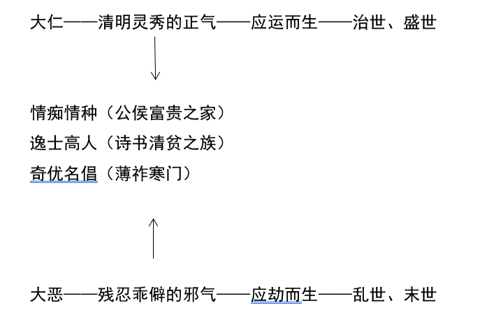

# “正邪两赋”说

 

《红楼梦》是诞生在中华帝制晚期、中华传统文化登峰造极、最成熟的或者是盛极而衰的一个关键时期的伟大作品。了解《红楼梦》就要回到时代背景、当代的文化土壤，假如脱离这个背景，我们就很容易望文生义、以今律古、会想当然耳，而一部这么庞大复杂的作品，你要选择印证自己的成见的情节实在是太容易了，可是我觉得这样子事情已经做了太久、太多，我们不想再这样继续做下去就，就好像我们自己不希望被那些认识我，无论深浅的朋友们误会一样。那么我们是不是也应该尽量不要去误会任何一个对象：包含《红楼梦》在内。《红楼梦》现在虽然距今只有250多年，可是这中间其实恐怕有2000多年的文化断层，这样巨大的文化鸿沟该怎么样跨越和衔接，以便我们真正进入到《红楼梦》本身的世界，这当然是一个高难度的挑战。

因为实在是太高难度了，大多数人不愿意去做。现代读者总是找自己的投射，把自己内心受伤的小孩去投射在林黛玉身上，对不对？把那个拒绝长大的心态投射到贾宝玉身上，对不对？然后反封建、反礼教就是《红楼梦》的宗旨，对不对？这就是我们最常见的阅读结果，我完全不想这样做，我们可能会有一点甘冒大不韪：真正抛开我们自己的价值观，以及这个时代意识形态，进入到一个可能截然不同，虽然有些共通的人性，但是，在行为或者是表现上有很大不同的这样的一个200多年前的乾隆时期，怎样才能够越来越动态的逼近他们？我想这个是一个我们现在已经经过一百年的白话文学运动，经过了100多年的这种文化巨大的调整之后也许可以客观面对的重大的问题。就是像钱穆先生所说：“我们对于传统要由温情和敬意。”（《国史大纲》）

他的成名作《国史大纲》开宗明义很重要的一个对读者的要求，他觉得我们这个时代，读历史就是全部要从里面找到祖宗的罪过，全部要找过去历史害我们现在被殖民、被焚烧（圆明园）、被践踏，以至于我们沦丧至此的民族自信心，我们都通通都推诿给古人，都是传统文化的错，传统文化就是糟粕，是阻碍进步的罪恶。钱穆先生老早就已经受不了这样子的一个看法，所以他觉得他写《国史大纲》就是希望来平衡这样一个现代人的无知与嚣张：全部推卸责任给古人。难道我们自己没有错吗？我们自己真的够用功吗？我们自己真的是努力在超越自我吗？还有你到底对传统了解多少？如果你了解的是零，你抱着恶意的传统，这到底意义在哪里？然后全部都是古人的错，这实在太奇怪了的一件事情。

《国史大纲》的作者的前言留下来的那样的一个非常沉痛的期望，我确实感受非常深刻。我总觉得也许可以开始契合同样在这个花果飘零的时代，依然这样的深刻了解传统有多么深厚，多么伟大，多么博大精深的这样的硕果仅存的知识分子，他们内心中那么洁白、那么宏大、那么坦荡的一个认识，我想我们大概来到现在了解、同时去衔接的时刻，所以从新来面对《红楼梦》与传统文化是很有意义的。我们应该也可以不必面对像过去几十年那样在政治的干扰之下所遭遇到的魔障或者困境，这些外在附加阻挡我们去好好认识传统的这些因素应该可以慢慢的淡化了。所以我想我们可以开始真的有一个好的时机来重新看待《红楼梦》的真实的面貌，以及他要告诉我们那个时代可以有多么伟大，多么美好的文化内涵。其实，到今天都依然还有现代性。

那么每一个时代一定有优点和缺点，我们这个时代人是太无知而狂妄，总觉得我们是最进步的，我们就是好像历史5000年的发展的境界，我觉得这是一个非常可笑的自信，但是没有办法。当群众变成一个时代的主流的时候，“两个臭皮匠就会胜过一个诸葛亮”。庶民大众并对一个高标准的学问和人格的自我要求的同时，庶民的主流让我们怎么好好地去契合正统文化里面精英阶层所承担的一个广博的大传统。这是我们现代也要遇到的一个重大问题，文化价值不是靠投票决定的，不是靠网络上面谁的声音、哪一群人声音比较大而决定的，相反的是传统的精英文化永远都是非常的少数。所以借此的我要跟各位分享一个数据。那个数据是曹雪芹以及他所在的那个阶层在整个当代以及在传统的各个时代里，他们占据的都是非常小的一个比例。光绪三十年，接近民国，经历了英法联军、历经八国联军，很多人也在变法图强，很多人也开始想学习西方怎么样让自己的国家更壮大？于是许许多多的各式各样的建设，其中就包含的教育，因此女子学堂也很早就已经设立了。那么在这样的一个认识之，在努力地推动教育的情况之下，光绪30年识字率的普查。叫做普查就表示他其实不可能很精确，这是第一个，第二个，什么叫做识字率？用什么标准来进行这样的一个调查呢？原来所谓的识字率指的就是你认识字就可以，也就是说看得懂账本、能够粗读一些简单的书籍，这个都算识字率。识字率不是能够读懂孔孟、能够创作。在这样一个很低的门槛之下，光绪30年已经有了推广教育的努力，同时又把识字率的标准定到这么的低的状况之下，当时所做的一个识字率的普查，得到的期望值只有1%。

我们把时代往前推，推到《红楼梦》所在的这个乾隆时期，甚至能推到唐宋时期，识字率就可想而知那是一定更低。识字率如果更严格来看的话，那么你要能够写得出文言文，文言文要受过很精密的训练，不是识字率可以办得到的。那么如果用这样的标准来衡量，曹雪芹这一类的人所属的那样的一个文化精英恐怕连千分之一都不到。换句话说，可能是千万分之一，那么你就要面对一个事实，就是这样的千万分之一的正统精英分子背后含纳的大传统是多么的博大精深，是非我们现在人所能想象。

我们现代人学的东西太多，至少曹雪芹不用学微积分，不用学数学，他不用学英文等等。我的意思他是百分之百地活在那个精英正统的大传统的，叫做什么，包含什么，这不是我们今天可以想当然尔的。

在如此的状况之下，那么我们到底该怎么样好好的面对传统的古典作品，这真的是我们现代人不应该很狂妄、毫无装备就自认为可以读懂的地方，但是好像我们都很自信。一篇文章，拿来就可以开始分析，也不管自己有没有受过好的文学批评的训练，也不管我们是不是有人家的基础、知识背景，我们就可以大张旗鼓说：他在说什么，他在反封建反礼教，这种现象真的太普遍了。而且数十年来变成主流，以至于保障可以这么狂妄轻率地进行古典作品的分析。那我想这个情况由来已久，可是由来已久不一定就是正确的。历史也证明，我们太多时候可能都流行了一两百年的主流看法，最后是被推翻的这种情况也不为少见。所以我们要回到这个曹雪芹的心灵跟他的时代，你就不能够用你的知见去接近他。

要回到这个中华文化大传统，那真是一个非常庞大而辛苦的工作，那没有关系，学者就是该做这个工作的，那么读者就应该要开放心灵，并且要努力跟上脚步，否则我们就永远停留在一个非常粗浅的、不负责任的阅读状况之下，我们把这个1%撵出来，其实1%还是一个最粗略的数据，要进入到曹雪芹、李白、杜甫、苏东坡这一类人的心灵恐怕你得用万分之十万分之一非常少数的、又非常文化集中的、特殊的精英阶层来认识他们，你就应该要努力地把自我丢掉。

这个是我一直非常希望无论我们是在做什么分析、探讨都应该要有的。我们也不应该随便的去扭曲我们的朋友，你真的认识你的朋友吗？我想只要你们多几年的经验、多几分的敏感，可能就会常常发现、非常的惊讶地发现原来你的朋友还有这一面，原来你的朋友有所意识不到的那个面相，我想这样的经验应该处处可见。所以不要想当然耳、不要理所当然，是待人处事上应该要具备的一个基本态度。第二，意大利小说家、文学批评家叫做艾柯（《玫瑰的名字》）。他在一篇文章里就有提到一段话，我觉得很值得作为我们现代人读《红楼梦》，尤其要来谈传统文化的时候应该要有的一个基本认知。“读者当然有权利可以去自由地使用文本。”你当然可以依照你的目的、你的需要，去使用任何一段文本。但是他认为“如果你是一个有责任心的读者，你就应该要去尊重这个作品和作者背后的那个语言状态。”语言状态的背后就是文化系统，语言当然是跟文化结合在一起，甚至语言就是文化的整个内涵的一个最直接最重要的载体。“一个敏锐而有责任心的读者他必须尊重而且必须要了解这个作品背后的语言体系，那么你不应该任意使用文本，而是应该要诠释文本。”诠释文本和使用文本是不一样的，我们都做一个敏锐而有责任心的读者，有责任了解真正的意思是什么？而不是随意的挪用。我们要做诠释文本的时候就要把自己丢掉。你自己一点都不重要，无论你喜欢什么、我不喜欢什么、你支持什么、反对什么，这个在你诠释一个文本的时候，这些都是最不重要的地方。但是偏偏我们每个人都把自己的好恶、是非看的非常重要。这就是一个很颠倒的令人感慨的人性本能，但是你一定要超越人性本能，不超越本能你就会被本能所控制，然后你永远就只会停留在本能的层次，结果就是自我耽误。好真的大部分的读者不知道当他这样很痛快使用文本，他不知道他唯一能耽误的其实是他自己。《红楼梦》不愁永远有一些人真的愿意好好的走进他的世界的，只要我们的时代多走一些年华，让一些少数的心灵去发现这一点的重要性，伟大的经典终究不会被埋没的。这一代又一代不负责任的、没有敏感的、任意使用文本的读者终究也会在《红楼梦》诠释史中变成微不足道的尘埃。

我想人生很短要变成尘埃或者是鸿毛，还是能够真正在这个你的人生之旅留下一些很踏实、很珍贵的东西，那都是每一个人自己应该要去面对、也要去认识到的一个重大课题。

希望大家对我们接下来这一年的课程有一个基本的认识，我们要做的工作是去把承担着那样一个博大精深的正统大文化的、极少数的、万分之一的那些才子文人所思、所想、所写、所实践的经历严苛的历史淘汰留到现在的文学作品，我们要以诠释文本的态度和做法很辛苦的走进这些十万分之一的人的心灵，让另一个大概已经中断很久也甚至被轻视、被扭曲的文化大传统内在精髓得以彰显一二分。

我期望大家在面对我们接下来诠释文本所得到的成果，那么也该有一个心理准备，那就是我绝不讲中听的话，我不想取悦、迎合这个时代的价值观。这些都是我们在面对《红楼梦》的时候的首先要拿掉的东西。当你抱着你觉得是整个人类文明发展到极致的最重要的文明成果，觉得《红楼梦》是一部伟大的作品，都应该要超越时代，应该要符合最先进的文明的成就的时候，那恐怕根本就会走错了方向，传统的伟大，不在于，他反对他的时代，而是他本来就蕴含永恒的人生课题，而这些伟大的心灵也提出了永恒而有普遍价值的解答。我要找的是这样的东西，你不应该要勉强古人为我们现代的人去奋斗，因此为了我们去在他的当代反对他的时代。

我们应该调整面对我们这个时代理所当然的价值观的一些基本态度，现代人的这些什么自由、平等、民主个人主义这些信念都只不过是两三百年前从欧洲的文化内部所产生出来的一些意识形态和价值观，然后随着他们的扩张现在变成全球的普适的价值观，但是它不过就是人类5000年文明里在各种的实验里中现在正在实验的一种形态而已。只是因为是现在实验的一种，所以理所当然就以为所有的人类追求的终极目标。也许再过五十年、一百年，我们又会被另外一种价值形态给推翻。这个就是我们现代人很严重忽略掉的一点，因为我们活着、我们拥有话语权，我们就觉得我们是人类进步的终极境界。

人类的历史是在动态发展，而且很有可能有曲折、甚至有倒退。且让我们虽然站在历史的现代，不要自以为我们就可以代表全人类去发抒唯一的价值标准。

你可以认识到一个态度，我们唯一的工作就是应该尽量正确的去了解古人在想什么，应该丢掉自己价值观。

接受我接下来这一年所会提到的曹雪芹包含传统文化思想的价值观。即便你觉得迂腐，我也会把迂腐讲的尽量深入一点，不代表我支持这样一种价值。作为一个读者、一个好的研究者，你应该把自我和对象分开，尽量客观地看对象在想什么？就像艾柯所说：“做一个敏锐而有责任心的读者。”要敏锐的把握了解在这个作品背后的语言系统、文化系统。

作者在塑造贾宝玉的人格内涵，是在这个文化大传统吸收到的各式各样的传统学说成果，同时阐述了后天怎样参与了人格的建构的问题。曹雪芹的其实也想已经深入到专家的这一种境界。他就透过了他的凝视、丰富的观察和体验对人何以为人提出深入的解读。（欧丽娟《〈红楼梦〉“正邪两赋”说的历史渊源与思想内涵——以气论为中心的先天禀赋观》）（第二回，冷子兴演说荣国府）

詹维克（W.P.Jencks）：在人的智力发展中，遗传因素所占比例高达45%，环境因素35%，剩下的20%是遗传和环境相互作用的结果。主体心理学特别强调主体能动性在人的成长与发展中的作用。教育、环境也一样与主体能动性一起构成主体发展的三维结构模式。人格心理学（性格心理学）的“互动论”，个人的心理历程和行为反应主要是由个人因素和环境因素互相作用与配合后所产生的特殊结果。（行为学派人就是环境决定论。）现代心理学家发现，个人的成长一定程度是决定论的。先天的禀赋形成一个人的独立的、自在自主的内在系统，而且这个系统携带着遗传密码使得个体会沿着预先决定道路或序列发展，然而这种个体的定位又不能自外于后天环境所造成的进一步分化，所以说行为主义者，一个人为什么会这样活动的原因归因于环境。先天对人的影响有哪些？

基因会影响到人的道德，也会影响到成功与否。

英国科学家研究表明，人能够成功，后天因素并非大于先天因素，许多的已出人头地的人格特质，例如你的决心、社交能力、自制力、总是给予明确的目标集中力量去奋斗，恐怕都只是源自基因遗传。人能否成功，基因的影响比你的生活方式来的大。尤其是自制力，实际上是潜藏在人的DNA里面的。人的决心和毅力大致也取决于遗传。拒绝放弃的人，逐梦落实的机会要大于轻言放弃的人，拒绝放弃就是决心和毅力决定的。过去的研究总以为一个人能否成功，家庭和环境扮演很重要的角色，但是最新研究显示，基因的影响比以往人认为大多了。

《人格心理学》：40%-50%的人格特征的差异是受到遗传决定的。

《红楼梦》也意识到遗传或者基因（先天禀赋）的对人的形成有一定的作用性。

曹雪芹和脂砚斋一致认为人有很鲜明的先天禀赋，是一个人很神秘的天赋来源，甚至是家族血缘所带给人的遗传基因。（专有术语：“天性”、“根源”、“天分”“胎里带来的”等）先天论和后天论是《红楼梦》人物性格认识论的建构的关键环节。第二回，小说家曹雪芹和脂砚斋就大量使用了与先天性格有关的语汇：天性、天生成、生来就、本性、天分、根源、从胎里带来的等等。他们深刻地认识到人就是有某一种决定性的基因的作用。人物的先天性格在先秦时代、汉代就有。

天命谓之性。（《中庸》）

生之谓性。（告子）

生之所以然者谓之性。（《荀子》）

性，人之所以受以生者也。（王充）

**“天生”、“天生成”：**

第五回，《红楼梦曲˙乐中悲》

幸生来英豪阔大宽宏量，从未将儿女私情，略萦心上。

第五回，《红楼梦曲˙世难容》

气质美如兰，才华阜比仙。天生成孤癖人皆罕。

第九回，

宝玉又是天生成惯能作小服低，赔身下气，性情体贴，话语缠绵。

甘露水灌溉绛珠草，博爱。

第二十二回，

贾政因不见贾兰，便问：“怎么不见兰哥儿？”地下女人们忙进里间问李氏，李氏起身笑着回道：“他说方才老爷并没叫他去，他不肯来。”女人们回复了贾政，众人都笑说：“天生**的牛心拐孤**！”

贾兰的孤傲性格，太奇怪的人格特性。

第二十八回，

林妹妹是内症，先天生的弱，所以禁不住一点儿风寒。

神话里的绛珠仙草的柔弱，修成女体，终日阴雨离恨天外，饮灌愁海水，食蜜青果。

第三十九回，

那刘姥姥虽是个村野人，却生来的**有些见识**，况且年纪老了，世情上经历过的，见头一个贾母高兴，第二见这些哥儿姐儿都爱听，便没了说的也编出些话来讲。

第五十六回，

天生下来有着一种刁钻古怪的脾气

第七十四回，

惜春虽然年幼，却天生成一种百折不回的廉介孤独僻性

第六十五回，

这尤三姐天生**脾气不堪**，仗着自己风流标致，偏要打扮的出色，另式做出许多万人不及的淫情浪态来。

遇到爱的人，付出多大的努力抗拒自己的天性，是多么宏伟的事业。程乙本抵消了人物的复杂性，所以要看庚辰本。

第八十回，

宝玉天生性怯，不敢近狰狞神鬼之像。

宝玉的所叛逆的行为在私下进行的。金钏和宝玉的事发，宝玉溜了。

**“本性”、“天性”：**

第十九回，王熙凤

本性要强，不肯落人褒贬。

第二十二回，

黛玉本性懒与人共，不肯多语。

第三十七回，

迎春惜春本性懒于诗词

第四十九回，

那宝琴年轻心热，且本性聪敏，自幼读书识字。

第五回，宝玉

自天性所禀来的一片愚拙偏僻，视姊妹兄弟皆如一意，并无亲疏远近之别。

贾宝玉泛爱众，博爱的精神是天生的。

第十七回，

贵妃崇节尚检，天性恶繁悦朴。

第三十一回，

林黛玉天性喜散不喜聚。

第四十一回，妙玉

黛玉知他天性怪僻，不好多话，亦不好多坐，吃过茶，便约着宝钗出来。

第七十八回，贾政

起初天性也是个诗酒放诞之人。

诗酒放诞：李白。

第十七回，

贾政笑道：“我自幼于花鸟山水题咏上就平平。如今上了年纪，且案牍劳烦，于这怡情悦性的文章更生疏了。纵拟出来，也不免迂腐古板，反使花柳园亭因而减色，反没意思。”

贾政认为自己的笔，对于大观园是一支黑笔，会让大观园的景色减色。贾政拥有以非凡的能力，就是客观地看待自己。（男性更容易客观地看待自己。）

第七十六回，

黛玉道：“……实和你说罢：这两个字，还是我拟的呢。因那年试宝玉，宝玉拟了，也有改的，也有删的，也有尚未拟的。这是后来我们大家把**这没有名色的**也都拟出来了，**注了出处**，写了这房屋的坐落，一并带进去与**大姐姐**（元春）瞧了。他又带出来，命给**舅舅**（贾政）瞧过。**谁知舅舅倒喜欢起来**，又说：‘早知这样，**那日**（第十七回那一天）该就叫他姊妹一并拟了，岂不有趣。’**所以凡我拟的，一字不改都用了。**（说明贾政最欣赏林黛玉）如今就往[凹晶馆](https://baike.so.com/doc/6479567-6693270.html)去看看。”

第七十八回，宝玉

天性聪敏，且素喜好些杂书

第八十回，

薛蟠是天性得陇望蜀的

**“天分”，“从胎里带来的”：**

第五回，

那仙姑知他天分高明、性情颖慧，恐泄露天机，便掩了卷册。

第五回，

警幻道：“非也。淫虽一理，意则有别。如世之好淫者，不过悦容貌，喜歌舞，调笑无厌，云雨无时，恨不能天下之美女供我片时之趣兴：此皆**皮肤滥淫之蠢物**耳。如尔则天分**中生成**一段痴情，吾辈推之为‘意淫’。惟‘意淫’二字，可心会而不可口传，可神通而不能语达。汝今独得此二字，在闺阁中虽可为良友，却于世道中未免迂阔怪诡，百口嘲谤，万目睚眦。……”

第十七回，

众人听了，赞道：“是极！二世兄天分高，才情远，不似我们读腐了书的。”

第四回，甄英莲

他眉心中原有米粒大的一点胭脂㾵，从胎里带来的。

第七回，

还亏了一个和尚，专治无名的病症，因请他看了。他说我这是从胎里带来的一股热毒，幸而我**先天**壮还不相干，要是吃凡药是不中用的。

第七十八回，

想必原是个丫头错投了胎不成？

**脂批的总结：**

**天性：**

第二十回，脂批：

此时却在幼时，虽微露其疑忌，见得人各禀天真之性。

第七回，脂批：

今又到颦儿一段，却又将阿颦天性从骨中一写，方知亦系颦儿正传。

第五回，“宝钗却浑然不觉。”脂批：

这还是天性，后文中则是又加学力了。

第二十二回，“宝钗原不妄言轻动，便此时亦是坦然自若”，脂批：

*瞧他写宝钗*，真是又曾经严父慈母之明训，又是世府千金，自己又天性从礼合节，前三人之长并归一身。前三人向有捏作之态，故唯宝钗一人作坦然自若，亦不见逾规越矩也。

儒家中最高的人格境界：“从心所欲而不逾矩。”

养成一个人的性格与阶级相关。“贵族就是贵族，平民就是平民。”

根源、根基：

第一回，“情性贤淑，深明礼义”脂批：

八字正是写日后之香菱，见其根源不凡。

第一回，“甄士隐禀性恬淡，不以功名为念，每日只以观花种竹、酌酒吟诗为乐”脂批：

*总写香菱根基*，原与正十二钗无异。

第十六回，凤姐：“香菱的模样儿好还是末则，其为人行事，又比别的女孩子不同，温柔安静，差不多儿的主子姑娘还跟不上他呢。”脂批：

何曾不是主子姑娘？盖卿不知来历也，作者必用阿凤一赞，方知莲卿尊重不虚。

第四十八回，脂砚斋批语：

细想*香菱*之为人也，*根基*不让迎探，容貌不让凤秦，端雅不让纨钗，风流不让湘黛，贤惠不让袭平。所惜者幼年罹祸，命运乖蹇，致为侧室，且曾读书，不能与林湘辈并驰于海棠之社耳。然此一人岂可不入园哉。故欲令入园，终无可入之隙，筹画再四，欲令入园必呆兄远行后方可。

“根源”、“根基”解释了家世阶级与家庭基因等等有关，解释香菱为什么天生有的独特性。

天分：

第五回，脂批：

*贵公子不怒而反退*，却是宝玉天外中一段情痴。贵公子岂容人如此厌弃，反不怒而反欲退，实实写尽宝玉天分中一段情痴来。若是薛阿呆至此闻是语则警幻之辈共成齑粉矣。

第十三回，脂批：

天分中自然所赋之性如此，非因色所感也。

第二十二回，脂批：

此书中如此等文章，多多不能枚举，机括神思自从天分而有。

赞美小说家的天分。

本性：

第五回，脂批：

这可是宝玉本性真情。

胎里带来：

第四回，脂批：

*宝钗之热*，黛玉*之怯*，悉从胎中带来。今英莲有痣，其人可知矣。

胭脂㾵是香菱的根源与根基的具体化，外显于面目上可辨识的印记。

小说家和脂砚斋意识到人的存在某一种无可纠结，但是又可以辨识的天赋的性质。

|      | 天性 | 天生  天生成 | 生来 | 本性 | 天分 | 根源  根基 | 从胎里带来 |
| ---- | ---- | ------------ | ---- | ---- | ---- | ---------- | ---------- |
| 文本 | 7    | 8            | 2    | 4    | 3    |            | 3          |
| 脂批 | 4    | 1            |      | 1    | 3    | 3          | 1          |

神话也等同于对小说中的人物的**先天禀赋的另类诠释**。

第一回，

终日游于离恨天外，饥则食蜜青果为膳，渴则饮灌愁海水为汤。只因尚未酬报灌溉之德，故甚至五内郁结着一段缠绵不尽之意。

林黛玉先天就有一种哀愁、离恨，也是她的先天禀赋。脂批：

饮食之名奇甚，出身履历更奇甚，写黛玉来历，自与别个不同。

第三回，

众人见黛玉年纪虽小，其举止言谈不俗，身体面庞虽怯弱不胜，却有一段风流态度，便知他有不足之症。

“风流”呼应第五回的“风流袅娜”（天上的可卿）。

六朝时“风流”含义：如风的流动，林黛玉行动“弱柳扶风”。

《红楼梦》先天禀赋的理论：“正邪两赋”，是对人物先天禀赋的最深刻、复杂的说明。周汝昌认为第二回的气论（正邪两赋）《红楼梦》的纲领。

正邪两赋是延续也是对传统的气论的集大成。

第二回冷子兴演说荣国府就是用传统庞大的气论对个体的才性问题很清楚的给予学理上的支持。第三十一回，史湘云和翠缕之间论到阴阳这一段。

第二回，

冷子兴：“……将来色鬼无疑了。”

雨村罕然厉色道：“非也！可惜你们不知道这人的来历，大约政老前辈也错以淫魔色鬼看待了。若非多读书识事，加以致知格物之功、悟道参玄之力者，不能知也。”

贾雨村，小人儒。

这一日偶至郭外，意欲赏鉴那村野风光。信步至一山环水漩、茂林修竹之处，隐隐有座庙宇，门巷倾颓，墙垣朽败。有额题曰：“智通寺”。门旁又有一副旧破的对联云：

身后有馀忘缩手，眼前无路想回头。

雨村看了，因想道：“这两句文虽甚浅，其意则深。也曾游过些名山大刹，倒不曾见过这话头，其中想必有个翻过筋斗来的亦未可知，何不进去试试。”走入看时，只有一个龙钟老僧在那里煮粥。雨村见了，便不在意；及至问他两句话，那老僧既聋且昏，又齿落舌钝，所答非所问。雨村不耐烦，仍走出来。

“智通”：有智慧，通往人间的道理。

“身后有馀忘缩手，眼前无路想回头”：人心的不知足，无止尽的追寻，要适可而止。（“刚刚好，才是最好。”）

“文虽甚浅，其意则深”：有资质、有禀赋。（翻过筋斗来，孙悟空，也在悟道。）

“龙钟老僧”：贾雨村还是没有彻底觉悟，陷溺在世俗里。“齿落舌钝”：啮缺；“既聋且昏”：浑沌的道体，“七孔凿而浑沌死”。

 历经跌宕，贾雨村是最后的一位悟道者。

 续书，第一百二十回，

 这一日空空道人又从青埂峰前经过，见那补天未用之石仍在那里，上面字迹依然如旧，又从头的细细看了一遍，见后面偈文后又历叙了多少收缘结果的话头，便点头叹道：“我从前见石兄这段奇文，原说可以闻世传奇，所以曾经抄录，但未见返本还原。不知何时复有此段佳话，方知石兄下凡一次，磨出光明，修成圆觉，也可谓无复遗憾了。只怕年深日久，字迹模糊，反有舛错，不如我再抄录一番，寻个世上清闲无事的人，托他传遍，知道奇而不奇，俗而不俗，真而不真，假而不假。或者尘梦劳人，聊倩鸟呼归去；山灵好客，更从石化飞来，亦未可知。”想毕，便又抄了，仍袖至那繁华昌盛的地方，遍寻了一番，不是建功立业之人，即系餬口谋衣之辈，那有闲情更去和石头饶舌。直寻到**急流津觉迷渡口**，草庵中睡着一个人，因想他必是闲人，便要将这抄录的《石头记》给他看看。那知那人再叫不醒。空空道人复又使劲拉他，才慢慢的开眼坐起。便接来草草一看，仍旧掷下道：“这事我已亲见尽知。你这抄录的尚无舛错，我只指与你一个人，托他传去，便可归结这一新鲜公案了。”空空道人忙问何人，那人道：“你须待某年某月某日某时到一个悼红轩中，有个曹雪芹先生，只说贾雨村言，托他如此如此。”说毕，仍旧睡下了。

急流津：暗示人世汹涌波涛，世俗的洪流，所有的人葬身于其中。旁边有一个渡口，是让有缘人，有特殊禀赋的人可以急流津中超拔而出，就能登上智慧的彼岸，不被世俗淹没。觉迷渡口：领略到世俗的迷惘，见证这个故事的盛衰炎凉上下起伏的贾雨村，终究要从这个急流津里面超身而出。

如此这般的贾雨村确实可以担当得起，又有“多读书识事，加以致知格物之功、悟道参玄之力”的人，来解说宝玉这种非常独特先天禀赋的一位代言人。

“正邪两赋”理论中传统文化的气论的来源以及归结的这种人格特质是什么？

第二回，

天地生人，除大仁大恶，馀者皆无大异。

三个等级的人：“大仁”、“大恶”、“余者”。从孔子理论中隐含的“性分三等”： “唯上智与下愚不移。”（《论语˙阳货》）

若大仁者则应运而生，大恶者则应劫而生，运生世治，劫生世危。尧、舜、禹、汤、文、武、周、召、孔、孟、董（董仲舒）、韩（韩愈）、周（周敦颐）、程（程颐）、张（张载）、朱（朱熹），皆应运而生者；蚩尤、共工、桀、纣、始皇、王莽、曹操、桓温、安禄山、秦桧等，皆应劫而生者。

“大仁”与“大恶”牵动了整个世界的状态。韩愈，古文运动，“文起八代之衰，道济天下之溺”（苏轼《潮州韩文公庙碑》）。韩愈的地位在宋代理学的有升有降，曹雪芹接受了宋朝道统系统。最后四位都是来自宋代的理学家，程朱理学，却被明代的追求自我发展思想批得体无完肤，明代的风气是从本能上的放任，将人性价值降到最低文明代表追个性自由的思潮，不是文化的进步，是文化的堕落。明代没有一个思想家被曹雪芹所青睐，明代的思想流派：阳明心学、泰州学派，曹雪芹没有将其放在“大仁”的行列。晚明的流派到后期有很严重的流弊，在清朝基本被肃清，康熙就是重要的力量，曹雪芹家族走向了程朱理学的流派。明代的思想家不被曹雪芹肯定及追求。

《圣祖仁皇帝御纂》（御纂朱子全书·序言）：

（朱熹）文章言谈中，全是天地之正气、宇宙之大道。

大恶者，依照华夏文明的传统。蚩尤，蚩，丑。尤其最丑。顾恺之：“四体妍蚩，本无关妙处，传神写照，正在阿堵中。”阿堵，六朝时南方的方言，“这个”；阿堵加上物，就指钱。蚩尤：可能是失败后，被政治和历史污名化。共工、桀都是政治失败的人。大仁者、大恶者列到宋代，正邪两赋者列到明代，明代没有大仁者，也没有大恶者。

大仁者修治天下，大恶者扰乱天下。清明灵秀，天地之正气，仁者之所秉也；残忍乖僻，天地之邪气，恶者之所秉也。

气，是从先秦以来的宇宙论、人性论的基本概念。

今当祚永运隆之日，太平无为之世，清明灵秀之气所秉者，上自朝廷，下至草野，比比皆是。

颂扬皇权、歌功颂德。

所馀之秀气漫无所归，遂为甘露、为和风，洽然溉及四海。

正气（秀气）带给世界的是风调雨顺。

彼残忍乖邪之气，不能荡溢于光天化日之下，遂凝结充塞于深沟大壑之中。偶因风荡，或被云摧，略有摇动感发之意，一丝半缕误而逸出者，值灵秀之气适过，正不容邪，邪复妒正，两不相下，如风水雷电，地中既遇，既不能消，又不能让，必致搏击掀发。既然发泄，那邪气亦必赋之于人，发泄一尽始散。

正气与邪气面对有三个结果：正气化解邪气，邪气化解正气，两者互相消耗殆尽，曹雪芹提出这种结果，赋之于人，找个媒介。处于极端的矛盾状态，不是健全、均衡的人格，在一个失去平衡的情况下。

假使或男或女偶秉此气而生者，上则不能为仁人为君子，下亦不能为大凶大恶。置之万万人之中，其聪俊灵秀之气，则在万万人之上；其乖僻邪谬不近人情之态，又在万万人之下。

万万人：性三品的中人，“余者皆无大异”的余者。

若生于公侯富贵之家，则为情痴情种。若生于诗书清贫之族，则为逸士高人。纵然生于薄祚寒门，甚至为奇优，为名倡，亦断不至为走卒健仆，甘遭庸夫驱制。

| 正邪两气 | 公侯富贵之家 | 情痴情种 |
| -------- | ------------ | -------- |
| 正邪两气 | 诗书清贫之族 | 逸士高人 |
| 正邪两气 | 薄祚寒门     | 奇优名倡 |

后天的人格塑造与环境息息相关的。

思想渊源探讨：

周汝昌认为这一段论述具有宋代的朱熹（气禀说）、明代的吕坤（三气运：综合、偏重、驳杂）的思想渊源。不同于吕坤，曹雪芹是对驳杂的这一类人抱着敬仰与赞美以及欣赏的，在正邪两赋的各种系列里面，作为统帅《红楼梦》的思想纲领，因为正邪两赋的人都是风流脱俗、狂放落拓，具有才貌性灵的悲剧性人物。

气禀说、三气运实际上都与贾雨村的话不大相关，实际上综合、偏重、驳杂是在传统的性三品的三类人里的。

曹雪芹没有赞美正邪两赋的这一类人，也没有把他们当成风流脱俗、狂放落拓，具有才貌性灵的正面人物来看待。他只是想了解这些人，对这样复杂的人有多少的了解，反而褒贬不是太重要的。

探讨这一类人的复杂性，不只包含贾宝玉。

雨村听了笑道：“可知我言不谬。你我方才所说的这几个人，只怕都是那正邪两赋而来一路之人，未可知也。”

可见贾府众人是非一般人。

正邪两赋这样的人不在大仁者（传统倡导的）行列，可见不是传统价值观所肯定的，因此对正邪两赋的人不是极力的肯定的，而是充满了兴趣，希望有个理论能涵盖。

**正邪两赋是传统气论的继承或者是变创**（变化、创造）。

气论是中国古代的自然观，在春秋时代，“气”被用来说明世界的秩序和普遍的联系。到战国时代，“气”逐渐发展成被看成化生万物的元素和本源。越到后来气论学说越庞大，在各式各样的思想学派中被运用，包括两汉、魏晋、隋唐、宋、明的哲学家，乃至到清代，都没有脱离气论。中国古代的哲学及很少有谈论“人”的时候，不会去谈“天”，“人”与“天”有一个贯通的关系，讲“天”的时候就更少有人不去谈“气”，因此，用“气”来谈“人”就很自然而然了，形成一个内在脉络，于是将“气”与“性”结合来谈这基本是在中国的传统思想里源远流长的。

正邪两赋的理论有援引了那些传统的思想资源？

若非多读书识事，加以致知格物之功、悟道参玄之力者，不能知也。

魏晋的才性论直接的体现：“人伦见识”。刘劭的《人物志》：探讨人性及其原因。

盖人物之本，出乎其性，情性之理，**甚微而玄**，非圣人之察，*其*孰能究之哉？（刘劭《人物志》）

正邪两赋的理论继承魏晋人物品鉴传统。人物的鉴识：性格的鉴别、才性的分类，通常这两类同时涵盖，汉末之后开始出现这类语词，对人的构成有了很高的兴趣，论述相当精微。

才性分类：

第七十八回，《红楼梦》回应、继承魏晋的才性论。

故相物以配才，苟非其人，恶乃滥乎？始信上帝委托权衡，可谓至洽至协，庶不负其所秉赋也。

晴雯脾气火爆（性），织工高超（才），使其天性禀赋不虚付。

第三十一回，

翠缕道：“他们那边有棵石榴，接连四五枝，真是楼子上起楼子，这也难为他长。”湘云道：“花草也是和人一样，气脉充足，长的就好。”

贾家的气脉充足，贾家封妃，在四大家族中更高一层。

天地间都赋**阴阳**二气所生，或正或邪，或奇或怪，千变万化，都是阴阳顺逆；就是一生出来人人罕见的，究竟道理还是一样。……这阴阳不过是个气罢了。器物赋了，才成形质。譬如天是阳，地就是阴；水是阴，火就是阳；日是阳，月就是阴。

存在之所以能形成形体，是由“气”来构成，气的聚散构成形物的终始，也就是生命的生与死。

“人之生，气之聚也；聚则为生，散则为气，若生死为徒，吾又何患！故万物一也。……通天下一气耳。”（《庄子˙知北游》）

“气”从哪里来？

战国时期楚地出土竹简中的一段话：

气是自生，恒莫生气，气是自生自作。《恒先》

其并不单一的存在，有正有邪，有阴有阳。

“气”主要是甲骨《卜辞》里提到的“风”，还有其他的各式各样的要素，例如土的精灵。“气”作为生命主要的元素，到了战国时期应该已经确立了。“气”的生命观就认为人不但在肉体里充满“气”（正邪两性：继承绵延于扩大），连抽象的精神、魂魄、心灵也都是“气”的作用（如：生气、脾气等）。

有日本学者认为：这样的“气”就具有精神生理的概念。这样的“气”就像是欧洲文艺复兴的精神（spirit）以及与精神有关的体液。

禀气的存在就会影响人的存在。

第七十七回，宝玉所说：

孔子庙前之桧，坟前之草，诸葛祠前之柏，岳武穆坟前之松。……世乱则萎，世治则荣。

曹雪芹的创作背后有一个非常一致的思想体系在支持着书写人、事、物，思想根据就包含了一种从《易经》而来的气化宇宙论，把整个世界视为一个有机的整体，人与草木是可以有一种联动的互相影响。

李约瑟（Joseph Needham，1900-1995）：中国古代的宇宙观基本上是一个有机体论，这个有机体论认为万物的存在都要依赖整个宇宙的有机体，而成为整个有机体构成的一部分，这些部分之间彼此相互作用，这个相互作用不同于一些机械性的刺激，之所以会成为这个宇宙的一部分，彼此发生相互的作用，而是出于一种神秘的共鸣。

宝玉叹道：“不但草木，凡天下之物，皆是有情有理的，也和人一样，得了知己，便极有灵验的。”

第三十五回，

看见燕子，就和燕子说话，河里看见了鱼，就和鱼儿说话，见了星星月亮，不是长吁短叹的，就是咕咕哝哝的。

非常精彩的“齐物”胸怀。（印第安人文化也有这一面，古老而原始的面对天地的态度，原始思想常见的。）

万物有灵论：

克雷特（Albertus C. Kruijt，1869-1949）：（透过印度尼西亚民俗学、人类学研究）我们必须在原始社会的进化中划分两个连续的阶段：一个就是人格化的“灵”，会赋予每个人、每个物，包含植物、动物、石头、星球、武器或所有的用具，存在物有一个个别性，这个个别性是有一个人格化的“灵”让你有独特的灵性。在之前还有一个没有人格化的“灵”的存在，它是到处渗透，到处弥漫，这样的“气”会遍及宇宙，会让所有被它遇到的对象产生灵性，这个“灵”广布在天地之间，在人和物发生作用，而且赋给他们生命，这是一个更早的阶段。

最初的“灵”相当于中国文化的“气”。

贾雨村的那一段论述中：

“正气”的空间位置是：

上自朝廷，下至草野，比比皆是。……为甘露、为和风，洽然溉及四海。

“邪气”空间位置是：

遂凝结充塞于深沟大壑之中

深沟大壑在空间的地理位置比较低下的地方。传统的气位观影响得来的，空间相也被赋予贵贱，称之为“贵贱贤愚的空间体现”，当古人在用“气”解释一个存在物的生命现象之余，同时也给它一个好与坏，高与下生命的价值判断，这也通常会对应的它所处的空间性。

传统的“气”的概念和它所属的空间位置产生直接对应，“气”一方面会有清和浊，也有高与下的互相对应，这样的一种对应关系常与人的道德才性贤愚、贵贱的不同阶级，甚至与仁与恶的道德价值，还有国家的治与乱直接产生非常一直相对关系，正与邪大约相当于阳（昜）和阴（侌）。阴：云覆日。在《诗经》《尚书》等里将阴阳作为地理位置来使用，不在仅仅是光的情况（阳：山南水北；阴：山北水南）。本来南与北，后来就是天上与地下。

*清阳者薄靡而为天*，重浊者凝滞而为地。（《淮南子》）

*元气初分*，*轻清阳*为天，重浊阴为地。（《说文解字》）

动植物也被阴阳产生了这样的对应。

本受气于天者，是动物含灵之属；天体运动，*含灵之*物亦运动，是亲附于上。*本受气于*地者是植物，无识之属；地体凝滞，植物亦不移动，是亲附于下。（孔颖达疏《周易正义》）

第三十一回，

天是阳，地就是阴；水是阴，火就是阳；日是阳，月就是阴，……比如那一个树叶儿，还分阴阳呢：向上朝阳的就是阳，背阴覆下的就是阴了。”翠缕听了，点头笑道：“原来这么着，我可明白了。只是咱们这手里的扇子，怎么是阴，怎么是阳呢？”湘云道：“这边正面就为阳，那反面就为阴。”……湘云道：“走兽飞禽，雄为阳，雌为阴；牝为阴，牡为阳：怎么没有呢。”

与人的阶级也可产生对应。

翠缕道：“人家说主子为阳，奴才为阴，我连这个大道理也不懂得？”

先秦时代宋玉《风赋》，

王曰："夫风者，天地之气，溥畅而至，不择贵贱高下而加焉。今子独以为寡人之风，岂有说乎？"宋玉对曰："臣闻于师：枳句来巢，空穴来风。其所托者然，则风气殊焉。"

王曰："夫风始安生哉？"宋玉对曰："夫风生于地，起于青苹之末。侵淫溪谷，盛怒于土囊之口。缘泰山之阿，舞于松柏之下，飘忽淜滂，激飏熛怒。耾耾雷声，回穴错迕。蹶石伐木，梢杀林莽。至其将衰也，被丽披离，冲孔动楗，眴焕粲烂，离散转移。故其清凉雄风，则飘举升降。乘凌高城，入于深宫。邸华叶而振气，徘徊于桂椒之间，翱翔于激水之上。将击芙蓉之精。猎蕙草，离秦蘅，概新夷，被荑杨，回穴冲陵，萧条众芳。然后徜徉中庭，北上玉堂，跻于罗帏，经于洞房，乃得为大王之风也。故其风中人状，直憯凄惏栗，清凉增欷。清清泠泠，愈病析酲，发明耳目，宁体便人。**此所谓大王之雄风也**。"

王曰："善哉论事！夫庶人之风，岂可闻乎？"宋玉对曰："夫庶人之风，塕然起于穷巷之间，堀堁扬尘，勃郁烦冤，冲孔袭门。动沙堁，吹死灰，骇溷浊，扬腐馀，邪薄入瓮牖，至于室庐。故其风中人状，直憞溷郁邑，殴温致湿，中心惨怛，生病造热。中唇为胗，得目为蔑，啖齰嗽获，死生不卒。**此所谓庶人之雌风也**。

| 阳   | 天   | 上   | 日   | 尊   | 火   | 动   | 清   | 轻   | 雄   | 正   | 主   | 仁   |
| ---- | ---- | ---- | ---- | ---- | ---- | ---- | ---- | ---- | ---- | ---- | ---- | ---- |
| 阴   | 地   | 下   | 月   | 卑   | 水   | 静   | 浊   | 重   | 雌   | 反   | 奴   | 恶   |

袁准《才性论》：

凡万物生于天地之间，有美有恶，物何故美，清气之所生也，物何故恶，浊气之所施也，……贤不肖者，人之性也。

正邪两赋是有别于传统的“性分三等”的别开一路，是曹雪芹创造出来的前所未有的第四种独特的人类存在样态。

唯上智与下愚不移。（《论语·阳货》）

中人以上，可以语上也；中人以下，不可以语上也。（《论语·雍也》）

三等人：上、中、下的人。到了汉代的儒者董仲舒确立了性分三等说，“圣人之性”“中民之性”“斗宵之性”。王充也说人性分为三品。吕坤的理论，就是性分三等的一个流传，“驳杂之气”就是中民之气。

曹雪芹挪用了中医病气的看法、道教终末论（以气解释）。“圣人之性（大仁、中正之气）”“中民之性”“斗宵之性”。

上有所好，下必甚焉。康熙皇帝对程朱理学的态度是极力推崇，那么曹家呢？

（朱熹）文章言谈中，全是天地之正气、宇宙之大道。《圣祖仁皇帝御纂》（御纂朱子全书·序言）

朕读其书，察其理，非此不能知天人相与之奥，非此不能治万邦于衽席，非此不能仁心仁政施于天下，非此不能外内为一家。

  程朱理学是曹家的家学规范。

《辛卯三月二十六日闻珍儿殇书此忍恸兼示四姪

寄西轩诸友三首》之二

曹寅

予仲多遗息，成材在四三。

承家望犹子，努力作奇男。

**经义谈何易，程朱理必探。**

殷勤慰衰朽，素发满朝簪。

诗歌具有很强的社会功能，兼具互相交流的功能，不是纯文学的艺术。

经义、程朱作为曹家的传家的法宝。曹雪芹浸淫家学，深慕祖风。

在《红楼梦》到处都在歌咏皇权、君德，程朱理学是他的思想主轴。反程朱理学，不等于反理学。理学的范围很大。《红楼梦》没有反理学，也没有反程朱理学。

第五十六回，

宝钗笑道：“真真膏粱纨袴之谈！你们虽是千金，原不知道这些事，但只你们也都念过书，识过字的，竟没看见过**朱夫子有一篇《不自弃文》的不成**？”探春笑道：“虽看过，不过是勉人自励，虚比浮词，那里都真有的？”宝钗道：“**朱子都有虚比浮词了？那句句都是有的**。你才办了两天时事，就利欲熏心，**把朱子都看虚浮了**。你再出去见了那些利弊大事，**越发连孔子也看虚了呢**！”探春笑道：“你这样**一个通人**，竟没看见姬子书？当日姬子有云：‘登利禄之场，处运筹之界者，窃尧舜之词，背孔孟之道。’”宝钗笑道：“底下一句呢？”探春笑道：“如今断章取意；念出底下一句，我自己骂我自己不成？”宝钗道：“天下没有不可用的东西，既可用，便值钱。难为你是个聪明人，这大节目正事竟没经历。”李纨笑道：“叫人家来了，又不说正事，你们且对讲学问！”宝钗道：“学问中便是正事。若不拿学问提着，便都流入市俗去了。”

朱熹的理学是她们比较认可的。（“使之以权，动之以利，再无不尽职的了。”）

二人在论道过程中，探春一直屈居下风。在论道过程中，探春层次境界比较低，另一方面是采用的是断章取义的手法。整个论述过程中，有朱子的作品，成为自己的思想指导。探春认为朱子的话是“虚比浮词”，也是利欲熏心的状况之下，这是他们在谈论的时候的价值核心。

宝钗是儒家信徒，但是也能欣赏隐藏在戏剧中具有出世美学幻灭美学风格。宝钗（通人）能对许多的思想能给予一定的包容。例如，杜甫是儒家信徒，但是也曾作过这样的诗：“漠漠世界黑，驱车争夺繁。惟有摩尼珠，可照浊水源。”《红楼梦》中的人物都是很复杂的。

贾宝玉的烧书可能是他年少无知做的叛逆之举，在私底下的离经叛道。《红楼梦》是一部忏悔录。

第一回，

背父兄教育之恩，负师友规谈之德，以致今日一技无成、半生潦倒之罪，编述一集，以告天下。

大仁者，中正之气。

吕坤：“一曰中正之气……人得之而为圣为贤。”

大仁者行列中，除了贾雨村列举的人物之外，还有贾宝玉第七十七回，提到：

孔子庙前之桧，坟前之草，诸葛祠前之柏，岳武穆坟前之松。

所以，大仁者行列中还有诸葛亮、岳飞等人。

大仁者的贡献不再只是思想上面的，还可以包含文治武功 ，对国家、对社会有大贡献的人就可以归类为大仁者。加入诸葛亮、岳飞可以让大仁的面向更完整，这些人都是对知识、政治、军事都是攸关“大我”的国家民族的伟大贡献，都有崇高的道德气节，因此他们展现出来的道德气节（一辈子“鞠躬尽瘁，死而后已”）所以会成为文化的以及国家的擎天之柱。为人者因如是“为天地立心，为生民立命，为往圣继绝学，为万世开太平”（张载《近思录拾遗》），虽不能至，心向往之。（中民的自我要求、自我期许。）

大恶者，斗筲之性。吕坤，《去伪齐集·说天》：

二曰偏重之气……人得之而为愚为恶。

余者皆无大异。也可中人、中民。

第五回，警幻仙子所说：

馀者庸常之辈，无册可录。

也相当于吕坤的：

三曰驳杂之气……人得之而为蚩为庸。

周汝昌先生把驳杂之气认为是正邪两赋，其实不然。

因此，除了这三种人之外，创造了新的一种正邪两赋者，对人的理解与塑造，矛盾统一的。因为后天环境的影响，分为三个类型。

正邪两赋者是在正统文化中一种病态的异类，不是反封建、反礼教的英雄。

正邪交争，不能互相化解、消弭，组成一个微妙的状态，是一种“**夹持磨轧的异常物**”。

气的运作以传统来讲有两种形态：

天地万物中有一种共鸣的关系：**同气相求**。

《易经·乾卦》：

*同声相应**，同气相求。水流湿，火就燥*。云从龙，风从虎。圣人作而万物睹。本乎天者，亲上；本乎地者亲下。则各从其类也。

《吕氏春秋》：

类同相召，气同则合。

到了汉代，《淮南子·览冥训》：

阴阳同气相动也。

《春秋繁露》（董仲舒）：

美事召美类，恶事召恶类，类之相应而起也。如马鸣则马应之，牛鸣则牛应之，帝王之将兴也，其美祥亦先见；其将亡也，妖孽亦先见。

天将阴雨，人之病故为之先动，是阴相应而起也。天将欲阴雨，又使人欲睡卧者，阴气也。有忧亦使人卧者，是阴相求也；有喜者，使人不欲卧者，是阳相索也。阳阴之气，因可以以类相益损也。

另外一种是**气交变化**。

阳，对刚，阴，对柔，刚柔始交。

《礼记》：

地气上齐，天气下降。阴阳相摩，天地相荡，鼓之以雷霆，奋之以风雨，动之以四时，暖之以日月，而百化兴焉。

气交变化，以阳气为主，在与阴气交汇的过程中彼此冲击产生一种动力，是一种生命的力量（雷霆、风雨），刺激出生命出现，欣欣向荣。

传统的气交变化是正面的原因在哪里？

王夫之《张子蒙注》：

阴阳二气充满太虚，此外更无他物，亦无间隙，天之象，地之形，皆其所范围也。气化者，气之化也。阴阳具于太虚絪缊中，其一阴一阳，或动或静，相与摩荡。……飞潜动植，各自成其条理而不安。

正邪两气不是气交变化的一种，而是第三种。

《红楼梦》中的正邪两气是一种很奇怪的状态，双方彼此遭遇，二者纠结在一起，在纠结过程中不可能转变对方，也没有产生什么动力，始终维持着彼此冲突的状态，唯一的化解就是双方在缠斗里同归于尽。

《慎子》：

阴气凝聚，阳在内者不得出，则凝搏而为雷。阳在外者而不得入，则周旋六合而为风。阴与阳夹持则摩轧有光而为电。

雷、电、光就是在阴阳二气彼此夹持、彼此摩轧积团的状况下所产生。《淮南子·天文训》：

阴阳相薄，感而为雷，激而为霆，乱而为雾。

第二回，

……两不相下；如风水雷电地中既遇，……必致搏击掀发。既然发泄，那邪气亦必赋之于人，发泄一尽始散。

曹雪芹援引的不是造形生命来源的气交变化，而是会产生雷电、雷霆、冰雹的二气的团积、搏击的特殊状态，雷霆不会很久，电光一闪而逝，利器只会短暂存在，而它所形成的气的状态就是比较少见的赋形在人类的世界里，就会形成正邪两赋。

第三十一回，

天地间都赋阴阳二气所生，或正或邪，或奇或怪，千变万化，都是阴阳顺逆；多少一生出来人人罕见的，究竟道理还是一样。

《朱子语类》：

多少一生出来，人罕见的就奇：……皆是**气之杂糅乖戾**所生。……如家语云：‘山之怪叫做夔魍魉，水之怪曰龙罔象，土之怪羵羊。’皆是气之杂揉乖戾所生，亦非理之所无也，专以为无则不可。

贾宝玉的产生原因就是气之杂糅乖戾，宝玉就是“人之怪”。（相应于自然界就是风雨雷电。）

第二回，

置之千万人之中，其聪俊灵秀之气，则在千万人之上；其乖僻邪谬不近人情之态，又在千万人之下。

甄宝玉：

其暴虐浮躁，顽劣憨痴，种种异常。

异常物：无法归类。

医家的疾病观：病气观。

神瑛侍者，赤瑕宫。（脂砚斋：瑕，玉有病。）

《黄帝内经·素问》

*夫自古通天者*，生之本，本于阴阳。天地之间，六合之内，其气九州、九窍、五藏、十二节，皆通乎天气。其生五，其气三。数犯此者，则邪气伤人，此寿命之本也。 

*百病生于气*也，怒则气上，喜则气缓，悲则气消，恐则气下，寒则气收，炅则气泄，惊则气乱，劳则气耗，思则气结。

曹雪芹的中医造诣：

第四十五回，

宝钗道：“昨儿我看你那药方上，人参肉桂觉得太多了，虽说**益气**补神，也不宜太热。依我说：先以平肝健胃为要。肝火一平，不能克土，胃气无病，饮食就可以养人了。每日早起，拿上等燕窝一两、冰糖五钱，用银铞子熬出粥来，要吃惯了，比药还强，最是滋阴补气的。”

平肝健胃，胃气是比较重要的。胃气，营气，卫气，荣气。

第八十回，

“哥儿若问我的膏药，说来话长，其中底细，一言难尽：共药一百二十味，君臣相际，宾客得宜，温凉兼用，贵贱殊方。内则调元补气，开胃口，养荣卫，宁神安志，去寒去暑，化食化痰；外则和血脉，舒筋络，去死肌，生新肉，去风散毒。其效如神，贴过便知。”

李杲《脾胃论》

胃气者，谷气者，荣气也，运气也，生气也，清气也，卫气也，阳气也。

人参养荣丸：人参养荣汤（十全大补汤内，去川穹，加陈皮，远志、五味子，水煎服）。

熬煎药效最好。

人体通乎天气，人体会受到邪气入侵。屈原《哀时命》：

邪气袭余之形体兮，疾憯怛而萌生。

王逸注：

言己常恐邪恶之气及我形体，疾病憯痛横发而生，身僵仆也。

《神农本草》：“风邪”

风就是邪气的来源。

汉代，《释名·释疾病》：

疾，**疾**（快）也。客气（外来的气，邪气、阴气）中人急疾也。病，并也，并与正气在肤体中也。

《黄帝内经》

卫气之所在，与邪气相合，则病作。

隋代，巢元方《诸病源候论·恶风须眉堕落候》

八方之风，皆能为邪。邪客于经络，久而不去，与血气相干，则使荣卫不和，淫邪散溢。

贾宝玉除非到死，没有办法消化这个邪气。贾宝玉这个人不能作为反封建、反礼教的状态，是个怪异的状态。

第一回，

因见众石俱得补天，独自己无才不堪入选，遂自怨自愧，日夜悲哀。

二知道人：“女娲所弃之石，谅因其炼之未就也。”

宝玉就是“人之怪”，不健全的一个，住在赤瑕宫。

赤瑕，源自赤赮。《路史》：“炼石成赮，地势北高南下。”五色石加有病，就成了瑕。脂砚斋：瑕，玉小赤，玉有病，以此命名恰极。

《管子·形势》：

邪气袭内，正（玉）色乃衰。

张佩纶注：

“正色”疑当作“玉色”。胡刻李善注《文选》本两引均作“邪气袭内，玉色乃衰。”汲古阁本《长门赋》注已改作“正”，而《七发》注犹作“玉”。东方朔《七谏·怨思章》：“邪气入而感内兮，施玉色而外淫，”是其确证。

玉色乃衰，就是玉有病，正邪两赋的人。

宝玉正邪两赋就是展现了无法归类的怪异物，一种病态人格，所以叫做“玉有病”。无法承担家国的大任，“于国于家无望”，是一个如实的表述，不是明贬暗褒。贾宝玉就是一个没有办法实践大观精神的瑕疵畸零物，所开展出来的人间故事就不能用反抗传统的概念去理解，他根本不属于传统里的“大仁者”，因此它铺陈出来的故事是一种很另类、很独特的类型，既不具有反抗正统的意义，也不像《金瓶梅》中西门庆那一种类型的，所以曹雪芹透过宝玉来阐述这一种人很独特的生存样态，它的价值和意义不是从他反对传统文化来定位的，这样的一个正邪两气赋形在身体里会造成人的疾病，赋形在玉身上导致玉的瑕疵有病，以至于无论哪一种形态，他都是“于国于家无望”“无才补天”，于是产生的结果是就是贾家的集体悲剧，就是贾家正处末世，这个家族面临存亡绝续，在这种情况下，正邪两气者所不能承担的补天的功能就更加使得这个家族落入到“一片白白茫茫大地真干净”的悲剧，正邪两气的贾宝玉对应到阴气弥漫的末世绝对有一致内在的理路的。宝玉是一个末世的弃才回应到道教的思想根源。

道教的终末论。

曹雪芹关注这一类人的原因，就是因为他牵动到公侯富贵之家的集体范畴，否则宝玉的正邪二气去独自演绎他的特殊的生命风采，只是因为牵动到公侯富贵之家盛衰乃至生死存亡，因此病态人格造成了家族使命的落空的悲剧。“无才补天”在第一回至少强调了三次，

因见众石俱得补天，独自己无才不堪入选，……日夜悲号惭愧。

……无才可去补苍天，枉入红尘若许年。

“无才补天”的“天”从常理来说指的就是国家，《红楼梦》所讲的是一个非常太平的盛世。

第二回，

今当运隆祚永之朝，太平无为之世，

所以这里的“无才补天”的“天”就不是国家了，国家到处是人才济济（36000块石头都补天了），这里的“天”应该就是指家族了。要了解古代的个体，就要靠到他背后庞大、复杂的集体关系，因此他们思考的往往不是个人的问题，而是牵连到整个的家族问题，所以在婚姻、血脉传承、个体自我实践的问题绝对与现在的个人主义非常不一样的，个人主义是完全以个体为中心，撇开周围所有的人际关系牵连，完全回归到自我思考和实践的中心，可是在古代不是这样的（传统世界不是这样的），对他们而言永远有一个超乎个体之上的终极关怀，这个终极关怀除了国家就是家族。

宝玉的无才补天的“无才”就是来自于他有瑕疵，有病。他不能参与国家的经世济民的任务，《红楼梦》的悲剧意义就要回到贾府整个家族的发展，就是贾府注定要败灭，宝玉的使命、努力就被放大、凸显，因此成为整部《红楼梦》悲剧的核心。

宝玉生存的这一代是贾家的末世。

末世，来源道教终末论的思想渊源。

第二回，

若大仁者，则应运而生，大恶者，则应劫而生，运生世治，劫生世危。

《道经》：“末世多疾。”

宝玉之所以诞生在贾府的末世，宝玉是末世的弃才。

《真诰·甄命授》：“万物道气所生。人体自然与道气合。”

“相接”说明气的相通，当道气出现了矛盾和冲突，世界就会出现了许多灾变和紊乱。

了解与尊重比批评来得更难。

盛衰生死是这个世界循环。

〈元始五老禳大劫洪水召蛟龙水官度灾真文玉诀>：“阴阳否激，结成灾冲，大劫倾汔，荡秽除氛。”

《国语·周语上》：

幽王二年，西周三川皆震。伯阳父曰：“周将亡矣！夫天地之气，不失其序，若过其序，民乱之也。**阳伏而不能出，阴迫而不能蒸**，于是有地震。今三川实震，是阳失其所而镇阴也。”

我欲与君相知，长命无绝衰。山无陵，江水为竭，冬雷震震，夏雨雪，天地合，乃敢与君绝！

对于古人来说，世界末日就是：山无陵，江水为竭，冬雷震震，夏雨雪，天地合。

阴阳二气互相压迫会发生地震乃至民乱。

《礼记·月令》：

孟冬行春令，则冻闭不密，**地气上泄**，民多流亡。行夏令，则国多暴风，方冬不寒，蛰虫复出。行秋令，则雪霜不时，小兵时起，土地侵削。 

道书的终末论就是在这样的背景下逐渐形成的。

《灵宝经》：

天地眇莽，秽气氛氛。

阴阳已经乱掉了，想成了驳杂的气体。

“末世”最晚出现在秦汉之际。《易经》：

易之兴也，其当殷之末世，周之盛德邪？

有学者认为《易经》不止在讲万事万物演绎的道理，最重要的在讲儒家怎样治理国家。《易经》产生很有可能与政治哲学有关。

“末世”在先秦已经出现了，表现了朝代的终结，这对于古人是很大的事情。对于我们而言，一个朝代的兴亡意义是如何的严重，这是现代人脱离传统没有感觉的事情，对于古人，朝代的兴亡是天崩地裂，即便是前朝，对他们而言可以引发无限的感慨。

《史记》：

秦之末世是也。

“末世”在传统文学中也有用到了世运的盛衰兴替。

秦以后就形成了“五德终始”。他们发现历史是盛衰治乱交替，等到衰乱的阶段到来就叫“末世”。

《汉书·公孙弘传》：

末世贵爵厚赏而民不动。

《后汉书·杜乔传》：

末世闇主，诛赏各缘其私。

儒家的复古怀旧思想，最好的时代就是尧舜时期，儒家常言美好的盛世，这是他们的政治理想。因此在这样的儒家的思想体系中末世常常指与理想社会相对的现实世界，现实已经脱离了往古的美好盛世，现在就是衰落的、不完美的状态。《淮南子·泛论训》：

*先王之制*，不宜则废之；未世之事，善则著之；是故礼乐未始有常也。故圣人制礼乐，而不制于礼乐。

道教是东汉开始，主要在魏晋逐渐形成的一个本土的教派，魏晋时期出现了一个天师道派。将传统的“末世”以及佛教的“劫”概念吸收结合，形成自己的终末论。

末嗣与末世，末嗣也可指朝代终结，是因为“家天下”的制度延伸出来的结果。

传统的“末世”以及佛教的“劫”概念吸收结合，形成一种时间不够了，即将结束，警醒人做一些起死回生的努力或者为这样一个预兆做各种准备，这时“末世”就有一种未来式的预言。道教的天师道派在使用末嗣与末世的时候，就会形成一种时间迫急，带有一种未来式的预言，就会有劫运、劫数等术语。（现代有一个词“在劫难逃”，这是文化最有生命力的一个现象。）

“末世”的提出隐含着一种劫运、劫数、劫难的概念。

《隋书·经籍志》：

天地之外，四维上下，更有*天地*，亦无终极。然皆有成有败。一成一败，谓之一劫。自有此*天地*已前，则有无量劫矣。

佛教认为在一“劫”中“衰”时，

然后有大水、大火、大风之炎，一切除去之，而更立生人，又归淳朴，谓之小劫。

道经中，

天地沦坏，劫数终尽，略与佛经同。

《太上洞玄灵宝天地**运度**自然妙经》：

灵宝自然运度，有大阳九、大百六，小阳九、小百六。三千三百年为小阳九、小百六；九千九百年为大阳九、大百六。天厄谓之阳九，地亏谓之百六？

明清以来，所有讲家族的故事为主要内容的小说都会采用的时间框架，就是百年。

“百年”在古代也有相关的认知：

《史记·天官书》：

夫天运，三十岁一小变，百年中变，五百载大变。

古人相信盛衰有常，生死有度。

三十年是一代（个体），百年是一个家族变化，五百年是集体的历史产生的变化。

《孟子·公孙丑下》：

五百年必有王者兴。

赵翼《论诗》：

江山代有才人出，各领风骚数百年。

百年就是一个家族生命的限度。

第一回，

三劫后我在北邙山等你，会齐了同往太虚幻境销号。

脂砚斋：

*佛以世*为“劫”，凡三十年为一世。三劫者，想以九十春光寓言也。

**末世弃才：道教终末论。**

王熙凤和贾探春的人物判词有“末世”。

第五回，

凡鸟偏从末世来，都知爱慕此生才。

第五回，

才自精明志自高，生于末世运偏消。

畸零玉石是因为无才补天。二者都有“才”，在末世做一番事业，就必须有才。曹雪芹赞美：“金紫万千谁治国，裙钗一二可齐家”。

探春理家之后入了贾母的眼睛，对她看重。贾母八十大寿时，南安太妃提出见贾家的女儿，贾母特别交代王熙凤：

再只把你三妹妹陪着来！

在自己的努力下，贾母也开始对探春另眼相看了。

贾家唯一可以顶天立地，支撑摇摇欲坠而不倒的人物是贾探春。王熙凤虽然在“末世”里以非凡的才能为人所爱慕不，也使得贾家的末世能够得到一定程度的延续，使得宝玉这类人安富尊荣，但是她缺乏探春所具有的人格素质。王熙凤的判词：“都知爱慕此生才”，贾探春的判词是“才自精明志自高”。

贾探春高出王熙凤的地方就是“志”，志就是一种心灵的高度，是一种理想和胸襟，就能够高瞻远瞩，因此就不会“流入市俗”。

王熙凤的才干再怎样的为人惊艳，但是她的才在很多时候都是“流入市俗”的。这个家族要起死回生或者撑持于不倒恐怕得靠探春，可惜探春有一个致命而无法实践的弱点，不是来自于她个人，探春身为女性，注定要出嫁。这是探春最大的悲剧来源，因此曹雪芹只有在探春身上表现出出嫁对于一个女性心理创伤。如在人物判词、红楼梦曲里不断的展现着一面，离开父母，无可奈何的悲哀，只有在探春身上特别去表现，这当然不是说，其他女性的出嫁没有脐带割裂的痛苦，但是只有在探春身上不断地强调这一点，原因是只有她特别在这个出嫁的命运上感觉到一种无力回天的悲怆，这对一个有才有志的女性莫大的心理损害，其他的女性出嫁会有不舍、会有离开母家的不适应等等，这是一般的人性所具有的，但是唯独在探春身上有一种无力回天的悲壮。

“裙钗一二可齐家”在末世的贾家，这两位女性绽放出为乌云镶边的光芒。

贾家的末世。

贾家不算奢侈浪费。贾家已走了三代，无法维持以前的贵族精神高度，出现精神堕落，腐败的开端始于玉字辈（第四代）。曹雪芹感慨贵族美好的价值的终末，而不是反对贵族。符合鲁迅对于悲剧的定义：悲剧将人生的有价值的东西毁灭给人看。

贾雨村，荣府一支，确是同谱。

同谱：血缘关系还算亲近。

 

第一回，

也是诗书仕宦之族；因他生于末世，父母祖宗根基已尽，人口衰丧，只剩得他一身一口，在家乡无益，因进京求取功名，再整基业。

贾雨村的成功把他变成暴发户。

根基：家业中的经济。

一个家族中人口多寡也是决定家族是否兴旺得很重要的力量。多子多孙对于一个家族很重要，因为只有男性能传承，有机会出现好的子孙。从魏晋时代常常出现的几个对家族的期望，关键语词就包含“佳子弟”、“好子弟”，他们迫切渴望得到这样的子孙，因为只有好的子孙这才是家族不断延续甚至壮大的关键因素，好的子孙才是这个家族能够绵延不绝的最关键的因素。

因此，林如海就是林家的“好子弟”，可以让这个家族到了第四代爵位告终，进行了一个非常完美的转型，是家族继续绵延。然而非常可惜的是他没能生出个儿子。林黛玉的悲哀也在这里。

贾雨村因为家族的模式末世，在寻求转型的过程中因为失掉了其他的伦理支撑以及家族背景的包含财富、精神维系，在他东山再起的情况就落入到暴发户。

贾雨村“父母祖宗根基已尽”，没有钱就容易落入到势利、计较。《孟子·滕文公上》：“有恒产者有恒心。”恒心就是追求理想超越个人得失的心理。若非君子胸襟，只有君子可以“造次必于是，颠沛必于是”，一般来讲，人只要落入窘迫的处境，甚至衣食不继，就会很容易落到不堪。

“人口衰丧”，贾雨村怎样做都可以，没有亲人和朋友连接处人际的网络，以德和善作为一种运作的力量，那一个人就会爱怎么做都可以的时候，就很容易趋于下流。（《论语》：“友直友谅友多闻。”）

贾家未来也会走上贾雨村的现状。以贾家而言，只剩得他一身一口，就是贾宝玉，落了一片白茫茫大地真干净。脂砚斋：

使此人不远去，将来事败，诸子孙不致流散也。悲哉伤哉。

脂砚斋评点中也同样出现了“末世”。

第二回，冷子兴：

如今的这荣、宁两府，也都萧疏了，不比先时的光景！

脂砚斋：

记清此句，可知书中荣府已是末世了。

第二回，贾雨村：

当日宁荣两宅人口也极多，如何就萧疏了。

脂砚斋：

作者之意，原只写末世，此已是贾府之末世了。

贾雨村一听到“萧疏”，想到的是人口，而不是金钱。多子多孙、人口繁衍是古人认为一个家族能不能兴旺发展得很重要的因素。因为多子多孙不但容易出现“好子孙”，如果“好子孙”多几个就更容易飞黄腾达，家族就能“满床笏”，“满床笏”是家族的荣耀与权力就能不断地加分，更上一层楼。

第二回，

贾敬袭了官，如今一味好道，只爱烧丹炼汞，余者一概不在心上。

脂砚斋：

亦是大族末世常有之事，叹叹！

大族末世的征兆是“余者一概不在心上”，贾敬作为一家之长，整天与道士炼丹求仙，家里的事什么也不管。

贾家末世是因为父教不张，箕裘颓堕，是造衅开端。

第五回，

造衅开端实在宁

第五回，《好事终》：

箕裘颓堕皆从敬，家事消亡首罪宁。

箕裘：父子相承，克绍箕裘。不肖子孙的出现的原因就是贾敬，放弃父教的责任，以至于放任家族子孙“恣意奢华”。

第十三回，

贾珍见父亲不管，亦发恣意奢华。

第十三回脂砚斋回前总批：

*此回可卿梦阿凤*，作者大有深意，惜已为末世，奈何奈何！

第十八回，

又另派了家中旧曾演学过歌唱的女人们，如今皆是**皤然老妪**了。

脂批：

又补出当日宁、荣在世之事，所谓此是末世之时也。

贾家的末世：

贾家必须接受清代在爵位继承上的随代降等承袭制度，在这个制度之下，一定会走向爵位归零的局面。（林家因为皇帝隆恩加袭一代才有四代的爵位，通常三代归零。宝玉为什么需要被逼着去读书、参加科举考试就是这个原因。）

爵位归零相关的输入与经济支撑也在减缩，因此贾家就是这样的挖东墙补西墙的入不敷出，其实都是因为经济危机所造成的，而这个经济危机不是因为他们的奢华，而是来源于爵位降等所导致的入不敷出。

贾家的危机就是父母祖宗根基将尽。所以在小说里能处处看到他们的经济窘况，“黄柏木作了磬槌，外头体面里头苦”“瘦死的骆驼比马大”等等，都在谈这个问题。

贾家在父母祖宗根基将尽之前的灾难历经百年四代传承之后，原本高度维系的贵族精神逐渐地委顿低弱，到第四代玉字辈这一代才出现了造衅开端、箕裘颓堕的种种腐败，这一点是曹雪芹最感慨、最悲痛的、最惋惜的一点。

第五回，贾宝玉神游太虚幻境，就是为了一个很严肃的使命，宁荣二公死后不得瞑目，还在操心家族，现身嘱托警幻仙姑为他们的家族尽一份心，警幻仙姑将宝玉引到仙境，让他“归引入正”。

宁荣二公感慨：

遗之子孙虽多，竟无可以继业者。

透过道教与道书所提供的劫难论述，还有所谓自然运度循环的概念，被脂砚斋高度的赞美的秦可卿死前托梦，是符合道书的自然运度的描述的，当贾家在存亡绝续的“劫患”有一点点像道书所描述的。

贾家的家族故事是有宁荣二公“开劫”，家族走到百年，“运数合终”的时候。

第五回，

富贵流传，虽历百年。奈运终数尽，不可挽回者。

运数就是自然的运度。

《太上洞玄**灵宝**天地运度自然妙经》：灵宝，

开示尔劫运之期，盈缩之分。

第十三回，秦可卿：

“常言：‘月满则亏，水满则溢。’又道是：‘登高必跌重。’如今我们家赫赫扬扬，已将百载，一日倘或乐极生悲，若应了那句‘树倒猢狲散’的俗语，岂不虚称了一世诗书旧族了！”凤姐听了此话，心胸不快，十分敬畏，忙问道：“这话虑的极是，但有何法可以永保无虞？”秦氏冷笑道：“婶娘好痴也！‘否极泰来’，荣辱自古周而复始，岂人力所能常保的？但如今能于荣时筹画下将来衰时的世业，亦可以常远保全了。即如今日诸事俱妥，只有两件未妥，若把此事如此一行，则后日可保永全了。”

秦可卿的话很像灵宝开示。

《隋书·经籍志》：

授以秘道，谓之开劫度人。

秦可卿就是授以秘道，让家族再度开劫，这番话就是对王熙凤开劫度人。

不论作者对于秦可卿死前托梦是否有意挪用道书的灵宝开示，但是作者在正统的大文化中，儒释道三家的思想内涵甚至细节语汇都被《红楼梦》所吸收，因此《红楼梦》被称为中华文化的百科全书。而在这里还有一个细节可以透过道教文化来参照、来掘发它可能的意涵，这样一来《红楼梦》的文化系谱就会更为宽广，也让读者更了解《红楼梦》真的是博大精深。“博大精深”不是抽象的形容词用来赞美褒扬，重点是要真的知道博大精深的具体内容有哪些。

正邪两赋在传统文化很特殊且吸收了很多的思想观念所形成的一个结果，都导向一种无法归类的病态人格，因为无论在中医，无论在道教终末论，或者是在儒家的文化体系中正邪二气只要遇合之后往往就会致病或者致乱。

有学者认为《红楼梦》作为一部非常伟大的长篇小说，必须让读者信服的是主人公宝玉的命运也就是作为一种有问题的性格的命运，具有问题性格的有问题的人到底有什么含义呢？

卢卡契（Georg Lukacs，1885-1971）：“这些有问题的个人往往是一个寻求者（Seeker）。”他到处寻求很独特的意义，与一般人不一样，而大仁者不必寻求，因为他是在最正统文化的价值体系里，把它发展到淋漓尽致。“有问题的人寻求的是自我，因此他的旅程是从对他来说没有意义的外在世界去达到自我了解。”这一点对于贾宝玉的人生旅程好像也有契合的地方，外在世界（读书、功名、家族、事业）对他来讲就没有意义，不放在心上的。“他追求的是他自己独特的自我，而在这过程中，也为了自我进行很多特殊的努力。这一类寻求者固然整个人生的旅程是从没有意义的外在世界进一步达到自我了解，可是最悲哀的是，这一类的寻求者即使认识了自己，最后也瞥视到意义的光芒，却远远不能穿透现实、也不能改变现实。”

宝玉为什么会“于国于家无望”，就是因为他事实上不能改变任何事情，唯一的只是认识自己，让作者调动正邪两赋来理解他，可是理解后又怎么样？所以这个人很独特，对于曹雪芹来说他完全没有任何实质的贡献，可是他又是这样独特的有问题的性格方式去展示他别树一格的生命风采，独特的生命风采就是这一种人所能带给这个世界的贡献。

因此我们对于《红楼梦》的主旨、对于贾宝玉的人格特质恐怕从这个角度来理解，原来对于这种人展现他的独特性就是它的意义所在。这个独特不能对这个世界增与减，就是为这个世界树立一个很美学性的不是那么具体的，但是只要他存在，这个世界的光谱就增加了一道颜色，我们也能更认识到人性的复杂多样性也在这种人的参与下会感觉到无比的丰富。

正邪两赋的气论就是曹雪芹用他丰富的学识、调动所有的传统文化资源对于宝玉这种人格提供了一个理论性的说明。

宝玉既然没有办法“穿透现实”、“改变现实”，这基本上是正邪两赋者的宿命，那现实指什么？对于宝玉读他的主人翁来说，不能改变的现实究竟关键在哪里？其实整部《红楼梦》完全不讨论改变整个大世界或者整个国家和社会，曹雪芹根本上是活在非常正统的社会阶层之下的一个精英分子，完全不会改变他所来自的那个社会，甚至那个社会必须存在，否则就不可能有曹雪芹和贾宝玉，它不可能去推翻孕育自己、创造自己的先决条件，何况就算当时曹雪芹和贾宝玉所在的世界真的需要大的改变吗？（这一点从现代来看，当然是的，乾隆时期就是整个大清由盛转衰的关键时间，乾隆的乌托邦孕育了毁灭的种子，这是后世之明。）可是任何一个人都是历史中的人，他必须随着他所在的那个世界就他所判断比较好的那个选择去进行努力，他不是先知，也不是政治改革家，我们没有理由要曹雪芹从后世的角度去看他的时代，反过来说，曹雪芹所在的时代其实是中华帝制最巅峰的盛世。回到曹雪芹的当代来理解，他的判断与我们后世之明是截然不同。

曹雪芹所存活的是十八世纪，死于十八世纪上半叶。何炳棣（Ho Ping-ti，1917-2012）：在明清的研究中将十八世纪的清朝称为“盛清”（high-qing）“盛清是满清统治的鼎盛时期。盛清是中国的太平时期”。（放在整个中国历史来看待），不亚于开元盛世。当时的人民寿命延长，各地非常的繁庶，到了十九世纪初期，当时的文人俞正燮：认为十八世纪“这是历史上和平与繁荣的巅峰”。而这个时代是曹雪芹所生活的时代。

就此而言，曹雪芹和贾宝玉他们当然没有义务担任现代人的打手，帮现代人回到古代去反封建、反礼教，这是现代人的傲慢和无知。这一点在《红楼梦》里到处有歌功颂德。

第二回，

今当运隆祚永之日，太平无为之世，清明灵秀之气所秉者，上自朝廷，下及草野，比比皆是。

宝玉作为一个寻求者，他所无法“穿透现实”、“改变现实”的现实当然不是国家与社会（中国的太平时期，是历史上和平与繁荣的巅峰），这个“现实”重点就是在于家，也就是家族的存亡绝续的重大问题，宝玉不能了解这个现实也没有办法去改变这个家族严重的转型与复兴问题，就决定了这一部书是一个不肖子孙的忏悔录，而这在小说中到处反映这一点，从第一回前的作者的开宗明义（“背父兄教育之恩，负师友规训之德，”），这是非常明确的一个宗旨，只因为现代人早就有成见根深蒂固，所以这些重要的文字无论如何都读不下去，也不能接受曹雪芹没有反封建、礼教，而他其实是做一个子孙的忏悔录的看法。我们需要做一些努力，就是尽量回到文本的世界来精密、增加自己的知识来加以爬梳。

宝玉不能改造的处境就是贵族世家，贵族世家有它面临的问题，也有宝玉面对他不能解决问题的所产生的重大心理危机。而这都得要回到玉石幻形入世所指定的富贵场、温柔乡的特殊场域。

第二回，贾雨村：

这等子弟，必不能守祖父之根基，从师长之规谏的。

这也是曹雪芹二玉相见时的两阙《西江月》也同样在延续这样的宗旨。这也回应了作者的再三流露的无才补天之叹。无才补天的“天”就是指家族的存亡绝续。第十三回回末作者赞叹有才补天的王熙凤等人。

第十三回，

金紫万千谁治国，裙钗一二可齐家。

家，对于贾宝玉、曹雪芹很重要，甚至补天石幻形入世也要来到这种“家”，可见是他心向往之的最好的生活形态，那么这样的家族对于正邪两赋者产生怎样的影响？

《论〈红楼梦〉中人格形塑后天成因观——以“情痴情种”为中心》（欧丽娟）

 