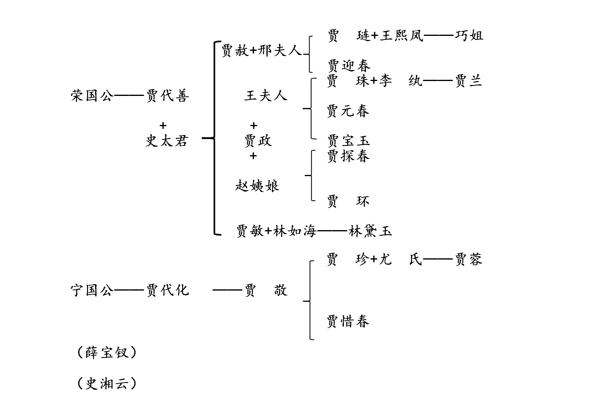

# 《红楼梦》导读

## 一、《红楼梦》阅读现状

在阅读《红楼梦》过程中，有一致的细节是被人所忽视的，而这些细节有时候非常重要。当然也没有思考：在什么样的情境，人在这样的情境下会做出什么选择。

### 《红楼梦》关系表

 

贾府分为两支：宁国府宁国公贾演（东府）、荣国府荣国公贾源（西府）。

我们在阅读中经常会出现一些盲点，常常被自己、被这个时代的某些成见所预先决定的阅读方向、跟这个阅读方向所决定的成果究竟是什么？还有这些盲点究竟在哪里？

### 对《红楼梦》的误解：

读《红楼梦》某个意义上来讲并不是客观地认识《红楼梦》，而只是投射我们这个时代所想要的价值观。对于符合我们这个时代的价值观的，我们就颂扬，而不顾这到底是不是人物反应的真正内涵。因此警惕在读《红楼梦》的时候是否在用自己现在的价值观去看待小说。

日本的山本玄绛禅师在龙泽寺讲经，提到

> “一切诸经，皆不过是敲门砖，是要敲开门，唤出其中的人来，此人即是你自己”。——读者的角色与经典同样重要。

你是什么样的人，你就会读出什么样的《红楼梦》。你是什么样的人，你就会怎样去解释林黛玉、去解释薛宝钗。这些解释都是在自己的人格特质所形成的有色眼镜之下所看到的样子。经典的意义，某个意义上来讲是拿我们自己和经典做一个激荡，召唤出来真实内在的自我。你为什么会这样去解释这个世界，你是悲观主义者还是乐观主义者？你为什么觉得林黛玉寄人篱下、楚楚可怜、仰人鼻息？你是不是忽略掉很多东西，以及你自己对于人的理解就停留在这个层次？而这可能就是你自己，是你自己可能都没有意识到的自己。

既然在这样的关系中，可以发现读者的角色跟经典一样重要。经典是封闭的、静止的，具体存在那里的是固定的样态。如何让它（经典）活过来，这个是读者的责任。当读者是一个单面向的，是一个很简化在思考的人，是一个投射型的人，那时候你召唤出来的贾宝玉跟林黛玉就是非常扁平化、非常单一的那个形象。所以读者越是能够丰富的深刻地阐述这些经典和人物，那么读者本身也已经提升到跟经典一样高的地位。

所以什么样的读者就会读出什么样的《红楼梦》，这一点就要让我们深深地自我期许，也深深地自我警惕。我们作为一个读者一定要客观、中肯，而且一定要努力，没有努力研究过就不要妄下断言。然而轻率的下判断对于我们所批评的对象太过不公平，我们连他都不了解凭什么我们就可以对他下判断呢？

## 二、阅读要求

究竟是一个什么样的读者才配得起这样一部非常丰富的经典呢？作为读者应该要怎么样自我锻炼？

### 1. 任何细节都一样重要。

我们要来观摩一个小说创作者以及他有丰富创作经验，同时又有很深刻的批判思维的小说，批评家亨利·詹姆斯（Henry James）(1843-1916)(《小说的艺术》)：

> “要说某些情节在本质上要比别的情节重要得多，这话听上去几乎显得幼稚。”
>
> “一部小说是一个有生命的东西，像任何一个别的有机体一样，它是一个整体，并且连续不断，而且我认为，它越富于生命的话，你就越会发现，在它的每一个部分里都包含着每一个别的部分里的东西。”

西方的文学评论家走在很前面，他们认为读者个人的成见应该尽量地摒除，尽量地抽离，为的就是要清楚完整深刻地理解对象。而我们读书不就是这个目的吗？我们读书不就是为了看到我们原来不知道的东西吗？这才能够构成我们个人的成长。很多人，包括以前的我，如果我们读书竟然只是为了印证我们在读这本书时就已经知道的东西，这样的读书意义到底在哪里？

所以读书事实上是要<u>打破旧的自我</u>，然后去<u>开启出我们新的自我的可能性。</u>

### 2. 人文研究避免各种极端。

当然也要注意人文在任何可能性里面都可能是对的，但是问题是你对不代表你就是**最全面**的。

别林斯基（俄国）：

> “在论断中必须避免各种极端。每一个极端是真实的，但仅仅是从事物中抽出的一个方面而已。只有包括事物各个方面的思想才是完整的真理。这种思想能够掌握住自己，不让自己专门沉溺于某一个方面，但是能从它们具体的统一中看到全体。”

### 3. 对于作者的所表露意图的态度。

我们总是要去知道曹雪芹的观点，总觉得如果这是曹雪芹的观点就是应该要去张扬的。这是对的嘛？

- 问题1：一个作者真的是用他自己的价值观来主导写作的吗？
- 问题2：假设他是用他的自觉的一个个人的价值观来主导创作的时候，难道没有其他非自觉的潜意识会渗透到他的笔端而影响到他的写作吗？有没有可能？当然有，我们每个人都有潜意识，如果作者有非意识的潜意识的这个层次的一个某种力量的干扰而在他的写作中发生了影响，那么凭什么要有一个所谓作者自觉的价值观在引导。也就是说甚至有作者自己都不知道的某些东西，都已经加进到他的具体写作里面来，所以怎么可能有一个所谓的清楚的作者的价值观在作为指引呢？
- 问题3：假设作者这么做了，你会认为这是一个好的做法吗？一个作者用他自己的价值观，善恶二分、是非分明，就他所认为对的东西作为全书的主轴去引导，你认为这样会是一部好的小说吗？然而一部好的小说不是更应该是很广袤多元的、开展人性的各种可能的吗？这样一来，假如有一个很明显的一个优势的意见在作为最高亢的唯一的独白，你真的会觉得这是一部好的作品，会深深地吸引你吗？
- 问题4，作者在创作的时候，除了潜意识之外，还有没有别的一些我们真的没有办法、一直到今天为止都没有办法去破解的**创作的奥妙**呢？一个活生生的小说人物根本不受小说家的控制，他有自己的生命，当你刚开始好像是你创造他出来的同时呢，他事实上就已经开始独立出来了，你必须顺着他的个性去写，他已经脱离了你的掌控，他有他的生命。于是小说家反而退居到只不过是把这个生命呈现出了的一个媒介而已。创作是连作家本身恐怕都不能参透的奥妙，所以如果我们要问这个小说家的价值观究竟是什么，他到底想要表达的是什么意思，这个问题是不是全部问错了？
- 问题5：就算作者有一个很明确的意见，他也如实地表达了，可是不要忘记，一个作品的生命是由读者所赋予的，读者不去读、不去诠释，作品就是死的。只有读者的阅读，才是你赋予作品生命的力量。

你读者怎么读既然那么重要，为什么我们要去管作者在想什么呢？罗兰˙巴特的有一句名言：

> “作者已死。”

米兰˙昆德拉（Milan Kundera）（《小说的艺术》）：

>“我小说中的人物是我自己没有意识到的诸种可能性。正因为如此，我对他们都一样地喜爱，他们也都同样的让我感到惊讶。”

不轻易让自己模糊，让自己粗糙，让自己想当然耳。要尽量客观。米兰˙昆德拉认为：“小说不是人类的自白，也不是个人的自白，是对人类生活里的一个总体考察生活在已经成为网罗的世界。”他引述法国福楼拜一段话：“小说家的任务就是力求从作品背后退位。”他认为：“小说家不是任何观念的代言人，严格来说，他甚至不应该为自己的信念说话。”小说家不能凌驾于任何人头上。一个人要用缩小自己而使自己伟大。

小说人物怎么产生的呢？他提到：“小说人物不是对活生生的生命体进行模拟，小说人物是一个想象的生命，一个实验性的自我。”

那么好的小说是什么样的？好的小说在巴赫金看来应该是一个复调性的小说。米兰昆德拉提到：“音乐的复调，是同时发展两个声部（两个旋律的线），尽管它们完美地连接着，但却又保有它们相对的独立……所有主张复调曲式的伟大音乐家，都有一个基本原则，那就是声部之间的平等。”

### 4. 不要随意对人物做褒贬。

浦安迪的《中国叙事学》：

> 透过真假的辩证关系，让读者看到，真跟假其实人生经验中是互为补充而不是对抗的两个方面。一线之间会产生莫大的翻转。（“假作真时真亦假，无为有处有还无。”）不要以为真就是好，假就是不好。假跟真可以一样好，真也会跟假一样不好。一样重要，彼此之间没有根本差异。

在《好了歌注》（甄士隐）“闹哄哄，你方唱罢我登场”，没有人是这个世界的永远的主角，没有一个绝对性的价值，一个人不可能永远是这个世界的焦点，暗示着二元取代的关系（二元补衬）。

夏志清《中国古典小说史论》：

>  这种稀奇古怪的主观反映，就如同前面所指出的那样，部分是由于一种本能的，对于**感觉**而**非对于理智**的偏爱。感觉太容易了，我们就被它牵着走，而理智要刻苦地压抑自己，要训练自己思想逻辑的严密，所以一般人都不做。于是诉诸感觉的结果就是任由那些表面的错误来主宰我们。除了少数有眼力的人，不够格的读者放纵自己的地方。

### 5. 要诉诸理性。

一个道理：当我们作者被感觉所主宰而不用理智去思考的时候，我们事实上所讲出来的那些话语它事实上只有意见的资格，而根本谈不上是知识。只有那诉诸理智、艰苦的、客观严谨的、我们所得到的那个看法才会是知识。

人类应该怎么样来提升自己的智性而使得我们的努力是真正能够让我们的头脑更加的经济。这个其实是来自于源远流长的希腊文。西方人对此分别的非常清楚。事实上人类讲出来的话，在你在做判断，在做描述的时候，可以有两个层次的分别，一个叫做意见（doxa），一个叫做知识（episteme），doxa意味着是一个 common belief，或者是一个popular opinion，doxa就是一般性的，大家都这么说，我们普遍就这么以为，这就是一个人云亦云的成见，但是episteme不一样，它要求我们做到所谓的knowledge，或者是science，而这是需要经过反复多次的检验、实验、印证、推敲，严谨到没有例外。

我们一般人在读书、想事情、作判断的时候，只是在doxa的层次，我们不愿意要求自己不知为不知，我们不愿意承认我们很多东西不知道就很急着去表达自己的想法，那只是一个自我情绪要去宣泄，有快感；可是快感还是感觉。要诉诸理性。

当我们被感觉所主宰而不用理智去思考的时候，我们所讲出来的那些话语它事实上只有意见的资格，而根本谈不上是知识。只有那诉诸理智、艰苦的、客观严谨的、我们所得到的那个看法才会是知识。

## 三、《红楼梦》有关知识

1. 版本之别：

有甲戌本，庚辰本，程甲本，程乙本等。 庚辰本的最为依照原著，是更好的参考本。类似于书商为了让小说完结，于是让高鹗续写，也成为程高本（程甲本，程乙本都是完结的《红楼梦》）可能对前八十回有些改动。红学研究则更加看重前八十回，和脂砚斋的批本。 

2. 贾府有上千人，要有秩序（长幼有序）。以东为尊，宁国公贾演（法），荣国公贾源（[祧名]）。笔墨聚焦荣国府。人物关系介绍。

3. 课程内容： 神话、谶语式（谶语）、大观园设计

4. 何为红学？曹学？

红学是研究《红楼梦》本身的，而曹学是红学的衍生，研究曹雪芹本人的家世背景的多一点。 

曹雪芹：（1715/1724-1763/1764）

5. 何为脂砚斋？

脂砚斋是一个笼统的广义统称，也是指一个特定的人。《 红楼梦》在成书过程中经常交给亲友传阅，形成了一个特定的阅读群体，而脂砚斋这个人是《红楼梦》在亲友流传阅读圈内的一个评点家，当然还有一个人叫做畸笏叟。

脂砚斋是特定的一个人，也是留下最多批语的一个人，据考证，脂砚斋和曹雪芹的出身背景可能一样，因此，他在评点过程中所表达出来的价值观和曹雪芹本人的价值观是一致的。 

脂砚斋作为一个评点者和其他人不一样，与曹雪芹关系密切，推解出来可能是曹雪芹的亲戚，辈分比曹雪芹大，可能是曹雪芹的堂叔之类的。 脂砚斋的权力很大，不但是作为一个读者，而且是作为一个小说创作的参与者。 

6. 《红楼梦》书未成给文人留下诸多遗憾：

人生三恨：一恨河鱼多刺；二恨海棠无香；三恨《红楼梦》未完。 

《红楼梦》未完成部分该怎么对待？据脂批的零零碎碎的语言可以看出来《红楼梦》是完成的。

7. 《红楼梦》为何而写？

从脂批语言中可以体察曹雪芹《红楼梦》血泪之作。

能解者方有辛酸之泪，哭成此书。壬午除夕，书未成，芹为泪尽而逝。余常哭芹，泪亦待尽。

《红楼梦》完全是悲忏之言，心酸之泪，曹雪芹绝非是为了财富名利而去写作，他是“哭成此书”的。尼采说：“一切文学作品我只爱用血和泪写成的。” 

8.  《红楼梦》主旨探究：

鲁迅：“经学家看见《易》，道学家看见淫，才子看见缠绵，革命家看见排满，流言家看见宫闱秘事。”每个读者都拥有独立的诠释权，有他自己读书喜好的偏好，这是值得尊重的，但是，我们也应该抛弃一下个人偏好，完全从文学、艺术的方面来看。 

马尔库塞说：“真正的乌托邦是根植于过去的记取中。” 梅新林先生的《红楼梦哲学精神》 提到的《红楼梦》的三个层次： 

- 第一层次：是青春生命的挽歌，

- 第二层次：是贵族家庭的挽歌， 

- 第三层次：是尘世生活的挽歌。 

**第一层次**是青春生命的挽歌。一切是幻灭和悲凉，用记忆来重建乌托邦式的世界。而重建过去只有通过写作才能达到。

**第二层次**是贵族家庭的挽歌。脂批在元春省亲批道：“画出内家风范，石头记最难之处，别书中摸不着。”贵族这个阶层，并没有人（普通人）能接触到，别书都是幻想出来的，同时脂砚斋对其极尽讽刺。脂砚斋的批语常常会有一些这样的字眼：“大家规范”“大家风俗”“世家规模”“笔笔是写尽大家”，可看出来他对自己的出身贵族家庭相当的引以为傲。

上学的时候，我们常常被教导：《红楼梦》的宗旨意义在于反对封建礼教，在于追求个人情怀之类的，实际上是一个错误理解。 

《红楼梦》所描绘的是一个盛世可以直通达皇室的上流阶层，它的贵族不是普通的贵族，所以它的相关人等都是有世代累积的背景的，所有相关人等都是大户人家，都是诗书仕宦之族。因为没有这样的家族背景，就可能养成暴发户。贫民望其项背的区别去暴发户的气质，这需要历代的熏陶、累积、所形成的人格风范。

贾宝玉、曹雪芹作为豪门贵族的子弟，他所拥有的一切、无论是精神和财富也全部都来自于他的家族本身，况且贾宝玉是作为家族的继承人被选定，所以他怎么可能反对给自己提供一切的家族呢？我们读者所有的阅读经验都不足以支持自己来阅读《红楼梦》，读者要让自己消失，从而放大阅读对象；因此曹雪芹不但不反对封建礼教，反而是依靠这个存在的，他不是要去反对自己的阶级。 

《红楼梦》的每一个字都是发自灵魂深处，都是非写不可的。曹雪芹出生于一个豪门家族，所处之境是任何一个平凡读者所无法想象的，因此他描述的东西除非跟他有相同的背景，否则，很难真正体会到。《红楼梦》实际上是曹雪芹对是描绘自己回忆的一本书，是追忆之书。 

《红楼梦》与其他一些言情小说（《西厢记》、《牡丹亭》）有许多不同：

《西厢记》、《牡丹亭》只描写男女主角之间的情爱，通过刻意营造出来的俗世阻隔而渲染两个人，而男女主角似乎生活在社会的真空状态，这往往会扭曲人性的真相。而人性的展开和实现，一定是要在一个复杂的人际社会关系网络下的，《红楼梦》的人际关系铺开之广，描写之深刻无法想象。（《红楼梦》有名有姓的人差不多有400多人。）而这种人事复杂就建立在大家规范、秩序之下。对于一个家族继承人是相当重要的，贾府的继承人就被选定为贾宝玉，第五回贾宝玉可以神游太虚幻境，就是宁荣二公赋予警幻仙子的。

“你等不知原委：今日原欲往荣府去接绛珠，适从宁府所过，偶遇**宁荣二公之灵**，嘱吾云：‘吾家自国朝定鼎以来，功名奕世，富贵传流，虽历百年，奈运数终尽，不可挽回者。故遗之子孙虽多，竟无可以继业。**其中惟嫡孙宝玉一人**，禀性乖张，生性怪谲，虽聪明灵慧，**略可望成**，无奈吾家运数合终，恐无人**规引入正**。幸仙姑偶来，万望先以情欲声色等事警其痴顽，或能使彼跳出迷人圈子，然后入于正路，亦吾兄弟之幸矣。’如此嘱吾，故发慈心，引彼至此。先以彼家上中下三等女子之终身册籍，令彼熟玩，尚未觉悟，故引彼再至此处，令其再历饮馔声色之幻，或冀将来一悟，亦未可知也。”

《红楼梦》中贾宝玉是贾家的继承人，然而无法担任继承使命的痛悔，第一回“无才可去补苍天”脂批认为“八字便是作者一生惭恨”。“枉入红尘若许年”脂批提到“惭愧之言，呜咽如闻”“哭成此书”，因此《红楼梦》“及自愧而成”是本书的宗旨。《红楼梦》是忏悔之书，不是为了反对封建礼教，而是因为自己没有办法完成继承家业、发扬光大的使命，所以非常悲忏。

**第三层次**是尘世生活的挽歌。人生存在的本质就是无常。书中提到“乐极悲生，人非物换，到头一梦，万境归空”脂批认为是整部书的总纲。《红楼梦》的意义在于它触及了存在的本质。 
