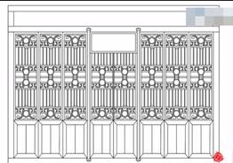
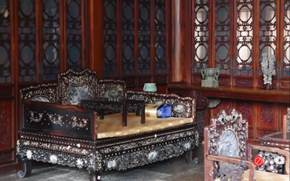
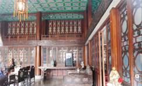
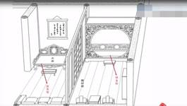

# 人物论——薛宝琴论

 

薛宝琴展现明清时女性生命形态非常独特的一种，也是作者在清代文化社会脉络合乎逻辑的塑造。

薛宝钗在太虚幻境薄命司簿册从缺（正册从缺），出场较晚（从文本叙事）。

舒无：“薛宝琴不是什么主要人物，但是她的出场值得一说。她的出场很迟，是在第四十九回，在全书中已大大超过三分之一。但是，她一出场，作者就用重笔浓彩，接二连三的大写特写。这同史湘云悄然出场，然后一笔一笔一层一层的勾勒晕染，正好成为对照。”薛宝琴从结构与人物塑造上的不同。红楼金钗都是很独特的，每一个人都有自己缺漏之处，构成她的特色所在。

史湘云和薛宝琴的人物塑造对比。

薛宝琴是《红楼梦》里所有金钗里唯一没有缺点的人物；而史湘云是一个很有特点的人物。

第二十回，脂批：

可笑近之野史中，满纸羞花闭月，莺啼燕语。殊不知真正美人方有一陋处，如太真之肥、飞燕之瘦、西子之病，若施于别个，不美矣。今见“咬舌”二字加之加以湘云，是何大法手眼，敢用此*二字*哉？不独不见其陋，且更觉轻巧娇媚。俨然一娇憨湘云立于纸上。掩卷合目思之，其爱厄娇音如入耳内。

脂砚斋认为外传、才子佳人故事中在塑造美女非常浅薄的呈现出小说家没有塑造人物的败笔，是很廉价的渲染。

俞平伯：“《红楼梦》所表现的人格，其弱点较为显露。作者对于十二钗，一半是他底恋人，但他却爱而知其恶的。所以如秦氏底淫乱，凤姐底权诈，探春底凉薄，迎春底柔懦，妙玉底矫情，皆不讳言之。即钗黛是他底真意中人了，但钗则写其城府深严，黛则写其口尖量小，其实都不能算全才。**全才原是理想中有的**，作者这面镜子如何会照得出全才呢？这正是作者极老实处，却也是极聪明处，妙解人情看去似乎极难，说老实话又似极容易，其实真是一件事底两面。”

《红楼梦》中“全才”唯一一个例外就是薛宝琴，红学界人物论讨论最少的。这一个完美的美人却引不起大家的注意、鲜明的印象以及探索她的兴趣，这就很发人深省了。宝琴作为一个理想的全才，评点家也有一些关注：

谢鸿申：“宝琴清超拔俗，不染纤尘，品格似出诸美之上。”薛宝琴没有人间烟火气，超越个人。“贾母内有孙女孙媳，外有钗玉诸人，无美不臻，心满意足，**琴儿貌不能出众，不过泛泛相值耳**，必其态度丰神迥非凡艳，致人心折如此。作者嫌正写无味，故从贾母一边写出，令人意会也，乃所原意在斯乎！意在斯乎！”

第四十九回，

又有邢夫人的兄嫂，带了女儿岫烟进京来投邢夫人的，可巧凤姐之兄王仁也正进京，两亲家一处搭帮来了。走至半路泊船时，遇见李纨寡婶，带着两个女儿，长名李纹，次名李绮，也上京，大家叙起来，又是亲戚，因此三家一路同行。后有薛蟠之从弟薛蝌，因当年父亲在京时，已将胞妹薛宝琴许配都中梅翰林之子为妻，正欲进京聘嫁，闻得王仁进京，他也随后带了妹子赶来。所以今日会齐了，来访投各人亲戚。于是大家见礼叙过，贾母王夫人都欢喜非常。……然后宝玉忙忙来至怡红院中，向袭人、麝月、晴雯笑道：“你们还不快着看去！谁知宝姐姐的亲哥哥是**那个样子**，他这叔伯兄弟，形容举止另是个样子，倒象是宝姐姐的同胞兄弟似的。更奇在你们成日家只说**宝姐姐是绝色的人物**，你们如今瞧见他这妹子，还有大嫂子的两个妹子，我竟形容不出来了。老天，老天，你有多少精华灵秀，生出这些人上之人来！可知我井底之蛙，成日家只说现在的这几个人是有一无二的，谁知不必远寻，就是本地风光，一个赛似一个。如今我又长了一层学问了。除了这几个，难道还有几个不成？”……晴雯等早去瞧了一遍回来，带笑向袭人说道：“你快瞧瞧去！大太太一个侄女儿，宝姑娘一个妹妹，大奶奶两个妹妹，倒象一把子四根水葱儿。”一语未了，只见探春也笑着进来找宝玉，因说：“咱们诗社可兴旺了。”宝玉笑道：“正是呢。这是一高兴起诗社，鬼使神差来了这些人。但只一件，不知他们可学过做诗不曾？”探春道：“我才都问了问，虽是他们自谦，看其光景，没有不会的。便是不会也没难处，你看香菱就知道了。”袭人笑道：“他们里头薛大姑娘的妹妹更好。三姑娘看着怎么样？”探春道：“果然的。据我看来，**连他姐姐并这些人总不及他**。”

曹雪芹为这几家历代人名水字辈、人字辈、文字辈、玉字辈、草字辈，历代人名从祖先到子孙能看出来似乎是越来越狭隘，越来越不能成为擎天栋梁的感觉。薛家的子孙到这一辈是虫字辈。

## 一、 非凡的外貌

宝钗、黛玉向来独占鳌头的**美貌**，在宝琴的出现后也相形见绌，让人感慨原来人外有人，让自己的开阔，容纳更多的事物。

第四十九回，

正说着，只见宝琴来了，披着一领斗篷，金翠辉煌，不知何物。宝钗忙问：“这是那里的？”宝琴笑道：“因下雪珠儿，老太太找了这一件给我的。”香菱上来瞧道：“怪道这么好看，原来是孔雀毛织的。”湘云笑道：“那里是孔雀毛？就是野鸭子头上的毛做的。可见老太太疼你了：**这么着疼宝玉，也没给他穿**。”宝钗笑道：“真是俗语说的，‘各人有各人的缘法’。我也想不到他这会子来，既来了，又有老太太这么疼他。”湘云道：“你除了在老太太跟前，就在园里，来这两处，只管玩笑吃喝。到了太太屋里，若太太在屋里，只管和太太说笑，多坐一回无妨；若太太不在屋里，你别进去。那屋里人多心坏，都是耍咱们的。”说的宝钗、宝琴、香菱、莺儿等都笑了。宝钗笑道：“说你没心却有心，虽然有心，到底嘴太直了。我们这琴儿，今儿你竟认他做亲妹妹罢。”湘云又瞅了宝琴笑道：“**这一件衣裳也只配他穿，别人穿了实在不配。**”正说着，只见琥珀走来，笑道：“老太太说了：叫宝姑娘别管紧了琴姑娘，他还小呢，让他爱怎么着就由他怎么着，他要什么东西只管要，别多心。”宝钗忙起身答应了，又推宝琴笑道：“你也不知是那里来的这点福气！你倒去罢，恐怕我们委屈了你！我就不信，我那些儿不如你？”说话之间，宝玉黛玉进来了，宝钗犹自嘲笑。

凫靥裘是野鸭子头上的毛制成的，是文化、经济、审美的集中创造出奢华的品物。这样的价值昂贵的品物有两种方法创造出来（需要消耗数量较多的普通物品制成，原来价值昂贵的材料制成的），在阶级社会等级制度与平民消费、平民审美进行区隔、差异。但是一方面会造成物质的浪费，但另一方面会开发出你所想象不到的美感与一种文化的进步。

随着科技发达、物欲提升，不必非要吃什么燕窝、鱼翅，这非常残忍的，现代人的寿命已经比古人有了很大的提升。古人可以这样做的原因是因为社会制度、意识形态造成等级制所造成的分化虽然不公平，从后世之明来做对照。尽管在等级制社会会造成权力的滥用等等问题，但这并不妨碍有权力的贵族会有所谓的道德责任感，创造非常优良的家风，而形成文化的承担者、推进者，甚至有人认为古代的历史，只有贵族社会才能创造出大传统，反而是平等的社会不会创造出大传统。就算有少数人享受特权，实际上消费还是有限的，远比平等社会所有人共同消费少得多。现代人的纵欲造成的整体损害更加强烈。节制我们的物欲，消费是多想两步，活的不要太自私。

人的问题也不是只有从公平的角度来看。如果从公平角度来看，那么所有的人就对不起自己的父母，因为他们给予我们的远远超过我们所能给予的，即便心意都是如此，更不要说实际上的付出。亲子之间，都有这样的不公平，那么就都不要了繁衍。人的社会太复杂了，人的价值和道理也太多面，一味地从公平的角度来看就会错失很多东西。

宝琴的美不会被凫靥裘掩盖，人与衣相印成辉。宝琴一到贾府能够压倒所有人，从外貌、受宠处境透过宝钗、宝玉都一一，他们变成众星拱月的星星。

第五十回，

一看四面，粉妆银砌，忽见宝琴披着凫靥裘，站在山坡背后遥等，身后一个丫鬟，抱着一瓶红梅。众人都笑道：“怪道少了两个，他却在这里等着，——也弄梅花去了！”贾母喜的忙笑道：“你们瞧，这雪坡儿上，配上他这个人物儿，又是这件衣裳，后头又是这梅花，象个什么？”众人都笑道：“就象老太太屋里挂的仇十洲画的《双艳图》。”贾母摇头笑道：“**那画的那里有这件衣裳？人也不能这样好。**” 

《双艳图》其实是不存在的。作者用“双艳”其实来呈现宝玉与宝琴某一种特殊关系。

对比手法，宝琴之美凌驾了绘画名家的手笔，也说明贾家是一个文化涵养非常深厚，具有高度品味的贵族世家，所以贾母是以这样一个眼光来否定《双艳图》来类比薛宝琴的这样一种比较低层次的见识。仇英画的《双艳图》不可能画出凫靥裘，而这也是合乎情理的，仇英并不是贵族出身，不可能有凫靥裘的见识，所以画里不可能有这样的衣服。以仇英的见识也没有办法见到养在贵族世家的深闺里通身贵族气派不食人间烟火的气度的仕女，因此也画不出来。宝琴的美只有这种贵族世家才能孕育出来，也绝对不是没有这种出身的人能想象与呈现出来的。

## 二、 聪明绝顶

宝琴的**聪明**也是凌驾了众金钗之上。宝琴“本性聪敏，自幼读书识字”（第四十九回）。

第五十回，

李纨又道：“绮儿是个‘萤’字，打一个字。”**众人猜了半日**，宝琴道：“这个意思却深，不知可是花草的‘花’字？”李绮笑道：“恰是了。”众人道：“萤与花何干？”**黛玉笑道：“妙的很，萤可不是草化的？”**众人会意，都笑了，说：“好。”宝钗道：“这些虽好，不合老太太的意。不如做些浅近的物儿，大家雅俗共赏才好。”众人都道：“也要做些浅近的俗物才是。”

《礼记˙月令》：“腐草为萤。”“草化”即“花”。贵族子弟对于经书都要熟读，传统教育极其深厚完备。

宝琴首先猜出来，将线索联结。林黛玉在聪明退了“一射之地”，其他人是“乃觉三十里”（“我才不及卿，乃觉三十里”）。

## 三、 才华出众

宝琴**才华**出众。

芦雪庵联句，整首诗七十句，非常完整的一首联句。湘云（诗疯子）写了十八句，宝琴十三句，黛玉十一句，宝钗五句。

宝琴和黛玉共战湘云。宝琴比起大观园的诗社顶尖任务是不逊色的。

第五十回，

宝玉见宝琴年纪最小，才又敏捷，深为奇异。

姜琪《红楼梦诗》：“才调无双人第一，白雪红梅艳花魁。”以诗作为评论的手段是从杜甫开启，论诗、论艺可用诗这样的韵文来承载。

宝琴不仅美丽、有才华、聪明，而且**性格完美**。综合了诸家所长，有宝钗的圆熟沉稳，可是不深沉世故；有湘云的诚挚与坦荡，没有湘云的率直与风快；有黛玉的才华洋溢，但是没有她的孤高自许。宝琴明明有那么多遭嫉的、打压的条件，但是又偏偏性格完美到与周围融合为一体，而且她的极端受宠也没有引起别人的嫉妒。宝琴是一个非常独特的人物范本，完全和别人不一样的。

第四十九回，

那宝琴年轻心热。

脂批：“四字道尽，不犯宝钗。”

湘云道：“你除了在老太太跟前，就在园里，来这两处，只管玩笑吃喝。到了太太屋里，若太太在屋里，只管和太太说笑，多坐一回无妨；若太太不在屋里，你别进去。那屋里人多心坏，都是耍咱们的。”说的宝钗、宝琴、香菱、莺儿等都笑了。宝钗笑道：“说你没心却有心，虽然有心，到底嘴太直了。**我们这琴儿，我们这琴儿就有些像你。**”

## 四、 受宠处境

宝琴极其**受宠**。

第四十九回，

探春道：“老太太一见了，喜欢的无可不可的，已经逼着太太认了干女孩儿了。”

王夫人已认了薛宝琴做干女儿，贾母喜欢非常，不命往园中住，晚上跟着贾母一处安寝。

宝琴凌驾众人的享受被宠的特权，外来之客中第一个享受这个特权是林黛玉，而宝琴的受宠凌驾于黛玉、宝玉之上。

第五十二回，

贾母犹未起来，知道宝玉出门，便开了屋门，命宝玉进去。宝玉见贾母身后宝琴面向里也睡着未醒。

第四十九回，

正说着，只见琥珀走来，笑道：“老太太说了：叫宝姑娘别管紧了琴姑娘，他还小呢，让他爱怎么着就由他怎么着，他要什么东西只管要，别多心。”**宝钗忙起身答应了**，又**推**宝琴笑道：“你也不知是那里来的这点福气！你倒去罢，恐怕我们委屈了你！我就不信，我那些儿不如你？”

对于教养很深厚的贵族子弟，很少有“推”这个动作。宝钗是一个很稳重的人，而唯一推的是妹妹，即使是自己的妹妹，这也说明她稍微有一点失控了。这是整部小说薛宝钗唯一一次的表现出嫉妒多心酸酸醋味的样态，这是薛宝琴引起的。

黛玉一进贾府夺占了嫡系孙女的地位，宝琴一进贾府就是一个复制的现象，也是非凡的受宠。但内部的细节有很大的不同：

第三回，

黛玉同随贾母一处坐卧。

黛玉与贾母不是共用一个睡床，甚至不是同一个空间。

当下奶娘来问黛玉房舍，贾母便说：“今将宝玉挪出来，同我在**套间暖阁**里，把你林姑娘暂且安置在碧纱厨里。等过了残冬，春天再给他们收拾房屋，另作一番安置罢。”宝玉道：“好祖宗，我就在碧纱厨外的床上很妥当。又何必出来，闹的老祖宗不得安宁呢？”贾母想一想说：“也罢了。”……当下王嬷嬷与鹦哥陪侍黛玉在**碧纱厨内**，宝玉乳母李嬷嬷并大丫头名唤袭人的陪侍在**外面大床上**。

贾母住在套间暖阁，宝玉住在碧纱橱外的大床，黛玉在碧纱橱内。这是传统大型建筑会有的一些基本隔间、隔间方式。

套间：是和正房相连的两侧的房间。在套间里隔出一个暖阁（睡卧空间）。

第四十回，

刘姥姥笑道：“人人都说：‘大家子住大房。’昨儿见了老太太正房，配上大箱、大柜、大桌子、大床，果然威武。那柜子比我们一间房子还大还高。怪道后院子里有个梯子，我想又不上房晒东西，预备这梯子做什么？后来我想起来，一定是为开顶柜取东西，离了那梯子怎么上得去呢？如今又见了这小屋子，更比大的越发齐整了。满屋里东西都只好看，可不知叫什么。我越看越舍不得离了这里了！”

贾母的正房非常宏伟宽大。

碧纱橱：可以相通的但有一些间隔不同空间，实际是隔扇，一层门，一般四扇到十二扇的门，可以镂空的做雕花木门，各式各样造型，例如流云百福等等，创造出一种艺术美感。为了区隔空间的连续门扇，除了中间的门扇可以开合，其余都是固定的。当为了区隔空间，就叫做格扇门或格门（镂空的雕花），中间一般会糊纸，富贵人家会安上玻璃或者绢纱、罗纱。

 

|      |                                                   |      |                                                   |
| ---- | ------------------------------------------------- | ---- | ------------------------------------------------- |
|      |  |      |  |
|      | 隔扇草图                                          |      | 恭王府                                            |

这样的空间相通性很高，两边声息相通，除了视觉、活动上稍做区隔。因此这种大户人家一定要面临的就是“隔墙有耳”、没有隐私的。（杨贵妃与唐玄宗的“密相誓心”。）

 

|      |                                                   |      |                                                   |
| ---- | ------------------------------------------------- | ---- | ------------------------------------------------- |
|      |  |      |  |
|      | 正堂                                              |      | 宝黛卧房示意图                                    |

隔扇是柱子与柱子之间的落地门。

宝玉对黛玉说的“一床睡”（第二十回）“一床上睡觉”（第二十八回）就是这个概念。二人睡具是连接的，中间有隔断的。

宝黛二人虽跟随贾母，但还没有亲密到宝琴和贾母的关系。

第四十九回，

宝琴正在里间房内梳洗更衣。

第五十二回，

贾母犹未起来，知道宝玉出门，便开了房门，命宝玉进去。宝玉见贾母身后宝琴面向里也睡着未醒。

贾母与宝琴同睡一床，且睡外侧，带有一种护卫与屏障宝琴的意味。比起黛玉莅临情况另有一种亲密。

第五十八回，

两府无人，因此大家计议，家中无主，便报了“尤氏产育”，将他腾挪出来，协理宁荣两处事件。因托了薛姨妈在园内照管他姊妹丫鬟，只得也挪进园来。此时宝钗处有湘云香菱；李纨处目今李婶母虽去，然有时来往，三五日不定，**贾母又将宝琴送与他去照管**；迎春处有岫烟；探春因家务冗杂，且不时有赵姨娘与贾环嘈聒，甚不方便；惜春处房屋狭小：因此薛姨妈都难住。况贾母又千叮咛万嘱咐托他照管黛玉，自己素性也最怜爱他，今既巧遇这事，便挪至潇湘馆和黛玉同房，一应药饵饮食，十分经心。

第七十回，

碧月道：“我们奶奶不玩，把两个姨娘和琴姑娘也都宾住了。**如今琴姑娘跟了老太太前头去**，更冷冷清清的了。两个姨娘到明年冬天，也都家去了，更那才寂寞了。”

分享：妙玉，奉给贾母茶所用的水，烹煮老君眉的水是旧年蠲的雨水，妙玉是姑苏人，当地的文献五月的梅雨季节非常的精纯，大户人家会准备大翁，用来储存雨水，这种水被好茶的人视为珍品，因为这种水比山泉还来的甘甜滑润，有一个名字叫“梅水”，把家乡的水带到北京，她是一个很念旧的人。透过她的生活上的物质怜惜，似乎是往日的延续。

宝琴在很多方面很完美，命运也很好，《红楼梦》最幸福的人。她的风筝造型是大红蝙蝠，红：喜庆，蝙蝠：谐音“福”，祥瑞的象征，在前期是最幸福的，许嫁梅翰林之子之后的命运就不知道了。

薛宝琴非比寻常，最重要、最完美的一位金钗。曹雪芹作为一个最伟大的小说家，他其实在告诉我们，这个人物之所以会这样，以及怎样的样貌结合的非常严谨。意思就说这个人是如何的人，以及何以至此都提供了合情合理的解释，他调动了自己所有这个世间的道理以及对各种人性的复杂幽微专门为这个人量身打造一个专属于她一个人格因素的解释，这样的一个解释一定有个别性，但是也有共通性，透过薛宝琴的个别人物的独树一格、同时来了解她的共通意义上对于一般人来讲有什么启发意义。

薛宝琴之所以这么完美，除了先天因素，其实和她的后天教养息息相关。一个人单单天赋是不会成为这个样子的，影响他之所以成为如此这般，是因为他的家庭环境、所受到的各种后天的影响，以至于他会呈现出他现在这个样貌，而薛宝琴有她自己专属的，别的金钗没有的一个独特的际遇。

## **构成宝琴这个人不可或缺的基本条件：**

宝琴的教养完备，来自于一个贵族世家的一位千金，由于他们的经济资本导致他们也拥有高度的文化资本，贵族女性也受到很良好的教育，这是从六朝以来一个通则，上层家族基本上有足够的经、文化条件来使家族中男女从小都受到很好的教育，当然男女的教育也会有性别分工，女性偏向妇德，持家，做贤内助，男性朝着经世济民、建功立业这方面要求，但是在传统的诗书教育方面都可以有很好的条件。

### 一、 诗书教养

第四十九回，

宝琴本性聪敏，自幼读书识字。

脂砚斋：“*我批此书竟得一秘诀*以告诸公几：野史中所云“才貌双全佳人”者，细细通审之，只得一个粗知笔墨之女子耳。此书凡云“知书识字”者便是**上等才女**，不信时只看他通部行为及诗词、诙谐皆可知。*妙在此书从不肯自下评注*，云此人系何等人，只借书中人闲评一二语，故不得有未密之缝被看书者指出，真狡猾之笔耳。”

“上等才女”：大家闺秀，“大家”是指“礼出大家”的“大家”，守礼尚义。“礼”：礼教，他们最基本的最文明的教育，使他们文明、优雅、内敛而因此带有一种尊严的基本的人格外在力量的来源。

第四十二回，

也算是个读书人家，祖父手里极爱藏书。

薛家也是诗书名门。

一个家族绵延几代，如果不注重教育，用书中道理来提升子孙后代的性情，后变成非常可怕的“富二代”、“富三代”。对于世家大族，比起金钱，更看重的就是文化的品味，诗书教育带给一个人的高度的自我要求。当然诗书教育虽然是普遍现象，这也与家长态度也有很大的关系。（除了普遍现象不同之外，还有就是亲长的态度。）

第四回，

这李氏亦系金陵名宦之女，父名李守中，曾为国子祭酒；族中男女无不读诗书者。至李守中继续以来，便谓“女子无才便是德”，故生了此女不曾叫他十分认真读书，只不过将些《女四书》、《列女传》读读，认得几个字，记得前朝这几个贤女便了。却以纺绩女红为要，因取名为李纨，字宫裁。

参照林黛玉的情况。

第二回，

（林如海）夫妻无子，**故**爱如珍宝，且又见他生得聪明清秀，**便也**欲使他读书识几个字。

“爱如珍宝”和“读书识字”似乎是有因果关系。一个人从小读书识字是和父母的爱如珍宝有关系的。

参照薛宝钗情况。

第四回，

（父亲）酷爱此女，**令**其读书识字，较之乃兄竟高十倍。

薛宝琴从小“读书识字”，应该与父亲“酷爱”有关系的。

薛宝琴的优越素质与教育背景有关，因为内在潜能很多是在年幼时开发的。

### 二、 商家出身。

薛家的商家是非常罕见的皇商。（动摇国本）

贾家与薛家不同：贾家承袭的荣国公随着随代降等制度逐渐的降级，最终只能通过科举取第来挽救家族；而薛家是皇商。

第四回，

且家中有百万之富，现领着**内帑**钱粮，采办杂料

内：内务府。帑：古代指收藏钱财的府库或钱财。

自薛蟠父亲死后，**各省中所有的卖买承局、总管、伙计**人等，见薛蟠年轻不谙世事，便趁时拐骗起来，**京都几处生意**渐亦销耗。

京都的生意：木材行（秦可卿棺木）、参行、恒舒典的当铺，可见薛家生意涵盖面非常广泛。

薛家这种皇商意味着和皇家做生意提供给皇室种种用品的商人。皇商是个专有名词，所谓的广州十三行商，其中最有权力的一个就是皇商，在广州专做国际贸易，政府特许的行业，这十三家要有强硬的后台、权贵的挑选，不是一般人得其门而入的。十三行商垄断欧洲西方贸易，其中又有一两个是由内务府从中出理其事（最有权的）。内务府是一个独立的机构，专门负责与皇室有关的种种事物。

对于薛家误解：普通商人、儒商，因此用商人文化、商人性格来解析薛宝钗性格是错误的，薛家非常的显贵的，这个“贵”字又带有一种高度的文化与精神、社会地位意涵在里面，与一般商人文化范畴完全不相同。

薛宝琴和薛宝钗在皇商的背景之下，还是有相通之处。

第四十九回，

那宝琴年轻心热，且本性聪敏，自幼读书识字，今在贾府住了两日，大概人物已知；又见众姊妹都不是那轻薄脂粉，且又和姐姐皆和契，故也**不肯怠慢**。其中又见林黛玉是个出类拔萃的，便更与黛玉亲敬异常。

宝琴在贾府住了两天“大概人物已知”，就是已经了解这些人的个性和特质，眼力非比寻常，薛宝琴与薛宝钗的这一面相似。

第二十七回，

宝钗外面听见这话，心中吃惊，想道：“怪道从古至今那些奸淫狗盗的人，心机都不错，这一开了，见我在这里，他们岂不臊了？况且说话的语音，大似宝玉房里的小红。**他素昔眼空心大，是个头等刁钻古怪的丫头**，今儿我听了他的短儿，‘人急造反，狗急跳墙’，不但生事，而且我还没趣。如今便赶着躲了料也躲不及，少不得要使个‘金蝉脱壳’的法子。”

“**不肯**怠慢”：绝非泛泛之辈，和姐姐关系好。宝琴是心中算计过的，出于意志（认知、判断）才做出的选择。她懂得人情世故，而且经过取舍、衡量之后做的应对进退之道。

宝琴之所以有湘云的诚挚与坦荡，没有湘云的率直与风快；有黛玉的才华洋溢，但是没有孤高自许。

薛家既然是皇商，就不可避免的有商人的运作方式：

“易观市、来商旅、纳货贿。”（《礼记˙月令》）

宝琴在这样的家世涵养里多少耳濡目染获得了在群体实践中周旋应对的一种智慧，所以初来乍到两天就观察入微，大概“人物已知”，为了人情考虑懂得“不肯怠慢”，特别和其中出类拔萃的人更加的亲近，这里就多多少少有实际的人情考量了，宝琴绝对不是一朵不食人间烟火的“阆苑仙葩”，所以说她是藐姑射山的仙子，就忽略掉她根植现实人间的土壤里，且与她商家的背景脱离不了关系，她和黛玉的亲近也是在比较高下的选择，宝琴有与世间的社会层面直接相关的地方。

第二十六回，

那贾芸自从宝玉病了，他在里头混了两天，都把有名人口记了一半，他看见这丫鬟，知道是袭人。他在宝玉房中比别个不同

宝琴懂得观察、比较作出选择判断，而因此多少有差别待遇的人际之道，与贾府中家世背景相似的没有商业情况的家族的少女们很不一样。史湘云对人比较的没心的舒朗阔大。

贾探春：“有心”（四十六回）“最是心里有算计”（六十二回，宝玉）“好多心”（第七十一回，宝玉），高瞻远瞩、深谋远虑的人，因此被不负责任的宝玉认为是“算计”的人。

第四十六回，探春“有心”是小说家的客观评论，懂得察言观色，平量得失，对事情做最好的解决。探春在处世上有一个轻重缓急的精准判断，把事物去除人情的纠葛，从根本上在合情合理的层面上解决，探春在人与人的相处上是“姐妹兄弟中，谁和我好，我和谁好”（七十二回）。探春的人际关系准则是顺其自然的，纯粹的以两人相处的感觉建立交情。探春明明是精明玲珑的人，具有掌握本质，有坚强勇气抵抗人情的种种勒索的人，但是在人与人的具体相处上却又是顺其自然的“唯情主义”。

薛宝琴的世界比一般的闺阁元大得多。

### 三、 名士父教。

宝琴的父亲非比寻常，不只是像林如海、宝钗之父因为爱女儿让她从小读书，她的父亲除了是皇商之外，有一种名士的气派，带给薛宝琴一种名士的辽阔，以至于薛宝琴才会和湘云有那么像的地方，兼具湘云的优点。（湘云是一个名士派的人，“是真名士自风流”，不要“假清高”。）“商人重利轻别离”，对商人的不实指控，商人这个行业就注定要在外面跑，去洽谈、押货、去产地选货、验货等等，不可能在家里整天待着，就连在朝为官，无论是从政、从军都不可能夫妻日夜相守（“忽见陌头杨柳色，悔教夫婿觅封侯”“无端嫁得金龟婿，辜负香衾事早朝”）。商人外出很难带家眷的。

薛宝琴的父亲愿意将家眷带着，出门行商。破除陈规，颠覆了女性大门不出，二门不迈的思想，带着一个未出阁，在室女儿周游大江南北，跟着她全天下都跑遍了，使得薛宝琴在养出一个非常开阔的胸襟，虽然有心，却不会多心与算计。

第五十回，

贾母因又说及宝琴雪下折梅，比画儿上还好；又细问他的年庚八字并家内景况。薛姨妈度其意思，大约是要给他求配。薛姨妈心中因也遂意，只是已许过梅家了，因贾母尚未说明，自己也不好拟定，遂半吐半露告诉贾母道：“可惜了这孩子没福，前年他父亲就没了。他从小儿见的世面倒多，跟他父母四山五岳都走遍了。他父亲好乐的，各处因有买卖，带了家眷这一省逛一年，明年又到那一省逛半年，所以**天下十停走了有五六停了**那年在这里，把他许了梅翰林的儿子，偏第二年他父亲就辞世了。如今他母亲又是痰症。”

薛宝琴天下如此广大，已经走了差不多一半，突破了空间囿限，走遍大江南北，这连一般男人都很罕见的（没有足够的经济条件，忙着经济仕途）。这就使得她从小见的世面就很多，世界何其广大，天南地北，单单天气、风土人情就有那么大的差别，宝琴都一一能够观览，这对于一个人影响是非同小可，这也构成宝琴最独特的人格印记。

第五十回，

李纨道：“昨日姨妈说，**琴妹妹见得世面多，走的道路也多**，你正该编谜儿。况且你的诗又好，为什么不编几个儿我们猜一猜？”

第五十二回，

我八岁的时节，跟我父亲到**西海沿上**买洋货。谁知有个**真真国**的女孩子，才十五岁，那脸面就和那西洋画上的美人一样，也披着黄头发，打着联垂，满头带着都是玛瑙、珊瑚、猫儿眼、祖母绿，身上穿着金丝织的锁子甲，洋锦袄袖，带着倭刀也是镶金嵌宝的。实在画儿上也没他那么好看。

西海：南海，买洋货：广州十三行，能够见到西洋的少女。宝琴甚至到海上去旅游。宝琴身上的特点很像欧洲十七世纪、十八世纪的在贵族阶级非常流行的“大旅行”（最常去的是意大利、法国，当时很流行的时代风潮，对他们来讲，旅行，尤其是长途、长期国际旅行对于她们教养的概念是一个新增加的对于人格、胸襟、见识的培养，认为这是一个非常重要的方式，也变成教育的一环）。“观上国之光”看到各国最丰富的文化遗产，对于一个人的眼界和心灵的陶养，绝对不是单指读书思考所能达到的。可以证明两件事：第一，宝琴父亲疼爱她，愿意把女儿带到身边，观览四海，造就宝琴的不凡，第二，宝琴也是《红楼梦》唯一一个有资格用她担来负创作《怀古十绝句》

的最佳人选，到古迹发出忧思，和咏史诗不同。曹雪芹的非常严密的安排，其中有一个就是《交趾怀古》（交趾：越南）。宝琴从小走过的古迹不少，见得世面也多，做灯谜诗，借古迹来缅怀古人，包含一个俗物。

道路奔波对于一个人是一个很累的，经济条件足够就可以深度旅游，真正感受到地方风土人情到来的视野扩展，轻松愉悦的进行旅行。

可惜了这孩子没福，前年他父亲就没了。他从小儿见的世面倒多，跟他父母四山五岳都走遍了。他父亲**好乐的**，各处因有买卖，带了家眷这一省**逛**一年，明年又到那一省**逛**半年，所以**天下十停走了有五六停了**那年在这里，把他许了梅翰林的儿子，偏第二年他父亲就辞世了。如今他母亲又是痰症。”

薛父不是匆匆忙忙的奔波，而是轻松自在的享受旅途，充实人生，而不只是以赚钱为主。

宝琴的父亲是一个很有意思的人，基本上是塑造宝琴性格的大功臣。所以请准备好，让自己变得更好，知道什么是更好的人或生命的时候，再去孕育下一代。只有自己成为更好的人再去孕育下一代，否则只是在复制庸俗的生命和平庸的生活，所以准备好，稍微懂得人生了，再来担负一个教养生命的责任。

“游”在训诂上的含义：康达威（David R.Knechtges，1942-）：“‘遊’字无论是写作‘水’还是‘辵’字部，它的本义是‘漂流’、‘旅行’、‘漫步’、‘闲逛’、甚至‘享乐’的意思。”

宝琴的际遇难得来自于她的父亲，难的原因在于当时的性别区划，无论中外，男性都有一个性别共通性。西蒙波娃（Simone de Beauvoir，1908-1986）《第二性》：“‘男性’是‘超越’的化身，女性则不幸被编排了传宗接代和操持家务的任务，那就是她的功用是‘内囿’的，可以说，女子的一生是消磨在等待中，这是由于她被禁闭在‘内囿’与‘无常’的囚牢里，她的生命意义永远掌握在他人手中。”（去性化）

二知道人《红楼梦说梦》：“宝琴幼随其父历览名胜，眼界阔矣。文士而得以壮游者，吾见亦罕，况处女乎！”

学者研究明清文化，形成的女性形象之一，走出闺阁的行游佳人。高彦颐：“‘足不出户’无疑是一种思想，但即使在闺秀中，旅行也是很多的，这些旅行的范围从长途的旅程，如陪伴丈夫上任远行，到和其他女性一起的短途游玩。”（从宦游）

### 四、 女子壮游。

宝琴的胸襟开阔、性格沉稳，与她的成长背景息息相关。曹雪芹安插了一组诗，主题是怀古（题材的限定，亲旅其地）。典型怀古诗的特点：抒发主要是人类命运的集体感怀，也就是沧海桑田，古今的大变迁。严格说宝琴的怀古诗并不典型，不是集体人物命运的感慨，而是个别人物或其人其事的抒发，这个写法比较偏向咏史诗，这组怀古诗是一种复杂类型的结合，因此它的得失好坏不能够非常简单来判断。单单只就诗歌类型的典型规范和特征来说，咏史诗是在家里读书有感而发，但是怀古诗要亲旅其地，就这个基本特征来说，《红楼梦》有三个组诗出于一个人手中。

第一组，二十三回，贾宝玉的《四时即事诗》是即景诗；第二组，六十三回，林黛玉的《五美吟》（王昭君、绿珠、西施、红拂女、虞姬），纯粹出自于一个之手。第三组，第五十回，薛宝琴《怀古十绝句》，宝琴怀古诗多达十首。一一的历数，只有薛宝琴适合创作怀古诗。

脂砚斋评薛姨妈的话：“伏下回的怀古十首灯谜。”

第五十回，

探春也有了一个，方欲念时，宝琴走来，笑道：“从小儿所走的地方的古迹不少，我也来挑了十个地方古迹，做了十首‘怀古诗’。诗虽粗鄙，却怀往事，又暗隐俗物十件，姐姐们请猜一猜。”

这十首诗有三个功能：缅怀往事（咏怀），指射世间事物（咏物），真正的写作又在咏史；涵盖四个类型：咏怀、咏物、咏怀、怀古（诗歌题目又是怀古）。与《五美吟》纯粹的咏史诗不同。

第五十一回，

众人看了，都称奇道妙。……大家猜了一回，皆不是。

咏史诗在历史上不断发展，到了唐代陈子昂就有咏史诗，还不算典型，一直到了晚唐时就奠定使用绝句的形式。宝琴用了七言绝句（晚唐咏史最喜欢的体裁，李商隐是其中代表）时融合了咏史诗的常见写法，不是怀古诗常见的套式。怀古诗一般用律诗（四联），起承转合比较能含纳古今的对照，绝句铺陈空间不够。宝琴的诗内容偏向咏史诗。

《赤壁怀古》在湖北，《交趾怀古》在越南，《钟山怀古》《淮阴怀古》、《广陵怀古》、《桃叶渡怀古》在江苏，《青冢怀古》在内蒙古呼和浩特（塞外），《马嵬怀古》在陕西。《蒲东寺怀古》在山西，《梅花观怀古》在浙江省湖州。

补充：

《马嵬怀古》

寂寞脂痕积汗光，温柔一旦付东洋。

只因遗得风流迹，此日衣衾尚有香。

公认的答案，香皂。

蒲东寺怀古

小红骨贱一身轻，私掖偷携强撮成。

虽被夫人时吊起，已经勾引彼同行。

梅花观怀古

不在梅边在柳边，个中谁拾画婵娟？

团圆莫忆春香到，一别西风又一年。

来自于《西厢记》《牡丹亭》，引起二人的针锋相对，并不是价值观的争锋。

黛玉忙拦着：“这宝姐姐也忒胶柱鼓瑟、矫揉造作了。两首虽于史鉴上无考，咱们虽不曾看这些外传，不知底里，难道咱们连两本戏也没见过不成？那三岁的孩子也知道，何况咱们？”探春便道：“这话正是了。”李纨又道：“况且他原走到这个地方的。这两件事虽无考，古往今来，以讹传讹，好事者竟故意的弄出这古迹来以愚人。比如那年上京的时节，便是关夫子的坟，倒见了三四处。关夫人一身事业皆是有据的，如何又有许多的坟？自然是后来人敬爱他生前为人，只怕从这敬爱上穿凿出来也是有的。及至看《广舆记》上，不止关夫子的坟多有，古来有名望的人，那坟就不少。无考的古迹更多。如今这两首诗虽无考，凡说书唱戏，甚至于求的签上都有。老少男女俗语口头，人人皆知皆说的。况且又并不是看了《西厢记》、《牡丹亭》的词曲，怕看了邪书了。这也无妨，只管留着。”宝钗听说，方罢了。

价值观完全一样，在传播途径里大家都知道，没有必要删除。四个人价值观相同，大家闺秀的禁忌是文本，如果是舞台上的表演，或说书人的表演就可以欣赏。

薛宝琴的怀古地点：

 

|      |                                                   |
| ---- | ------------------------------------------------- |
|      |  |

清代的大半疆域大概走遍（除了新疆、西藏、东北区）。

薛宝琴的旅历：有山有水、有中原有边疆、有可考的实地、有无稽的虚构（梅花观、蒲东寺），清代趋向虚构的地点，会变得实地化。（日本力争杨贵妃死在这里。“入宝山而不自知”。）

脂批：“作者从不作安逸苟且的文字，文章中无一个闲字，是作者具菩萨之心，秉刀斧之笔，撰成此书，一字不可更，一语不可少。”张新之：“书中诗词……其优劣都是各随本人，按头制帽，故不揣摩大家高唱，不比他小说，先有几首事诗，然后以人硬嵌上的。”

怀古诗有它的美学上的范式。

朱庭珍《筱园诗话》：“凡怀古诗，须上下千古，包罗浑**含**，出新奇以正大之域，融议论于神韵之中，则**气韵雄壮**，情文相生，有我有人，意不竭而识自见，始非史论一派。”

闺秀的手笔很难表达怀古诗的审美要求。

《西江月》：

汉苑零星有限，隋堤点缀无穷。**三春事业付东风。**明月梨花一梦。几处落红庭院，谁家香雪帘栊？江南江北一般同。偏是离人恨重。

众人都笑说：“到底是他的**声调壮**。‘几处’、‘谁家’两句最妙。”

……

因看这一阕《临江仙》道：白玉堂前春解舞，东风卷得均匀。湘云先笑道：“好一个‘东风卷得均匀’，这一句就出人之上了。”——蜂围蝶阵乱纷纷：几曾随逝水？岂必委芳尘？**万缕千丝终不改，任他随聚随分**。韶华休笑本无根：好风凭借力，送我上青云。

……

众人拍案叫绝，都说：“果然翻的好。自然这首为尊。缠绵悲戚，让潇湘子；情致妩媚，却是枕霞；**小薛与蕉客今日落第**，要受罚的。”宝琴笑道：“**我们自然受罚**。但不知交白卷子的，又怎么罚？”李纨道：“不用忙，这定要重重的罚他，下次为例。”

这首词与宝琴怀古的生命有关。歌咏柳絮。“声调壮”，与怀古的包罗浑含、气韵雄壮一致的。“汉苑”（北方）与“隋堤”（江南）“江南江北”，空间跨越的幅员，作者对于这样的一个细节都照顾到了。在大观园审美里不喜欢这种带有阳刚的、男性气质的诗词作品。两个原因：包罗浑含、气韵雄壮是不符合闺秀的气质；词的美学要求是“媚”（“诗庄词媚”），一直与美人、爱情，宴席相关，与诗歌言志不同。

## 五、 “金玉良姻”重探

贾母真正流露出求配意向的是薛宝琴。

到底宝二奶奶的人选是怎样的？真正在舆论上宝二奶奶人选是林黛玉，金玉良姻是对一个未来事实的预告。

第二十五回，

凤姐笑道：“你既吃了我们家的茶，怎么还不给我们家作媳妇儿？”众人都大笑起来。黛玉涨红了脸，回过头去，一声儿不言语。宝钗笑道：“二嫂子的诙谐真是好的。”黛玉道：“什么诙谐！不过是下作贫嘴贱舌的讨人厌罢了！”说着又啐了一口。凤姐笑道：“你给我们家做了媳妇，还亏负你么？”指着宝玉道：“你瞧瞧人物儿配不上？门第儿配不上？根基儿家私儿配不上？那一点儿玷辱你？”

巧妙运用了婚俗里的奉茶来开玩笑。

第五十七回，

薛姨妈忙笑劝，用手分开方罢。又向宝钗道：“连邢姑娘我还怕你哥哥遭塌了他，所以给你兄弟，别说这孩子，我也断不肯给他。前日老太太要把你妹妹说给宝玉，偏生又有了人家；不然，倒是门子好亲事。前日我说定了邢姑娘，老太太还取笑说：‘我原要说他的人，谁知他的人没到手，倒被他说了我们一个去了！’虽是玩话，细想来倒也有些意思。我想宝琴虽有了人家，我虽无人可给，难道一句话也没说？我想你宝兄弟，老太太那样疼他，你又生得那样，若要外头说去，老太太断不中意。不如把你林妹妹定给他，岂不四角俱全？”黛玉先还怔怔的听，后来见说到自己身上，便啐了宝钗一口，红了脸，拉着宝钗笑道：“我只打你！为什么招出姨妈这些老没正经的话来？”宝钗笑道：“这可奇了。妈妈说你，为什么打我？”紫鹃忙跑来笑道：“姨太太既有这主意，为什么不和老太太说去？”薛姨妈笑道：“这孩子急什么！想必催着姑娘出了阁，你也要早些寻一个小女婿子去了。”紫鹃飞红了脸，笑道：“姨太太真个倚老卖老的。”说着便转身去了。黛玉先骂：“又与你这蹄子什么相干！”后来见了这样，也笑道：“阿弥陀佛，该该该！也臊了一鼻子灰去了。”薛姨妈母女及婆子丫鬟都笑起来。

第六十六回，

兴儿笑道：“若论模样儿行为，倒是一对儿好人。只是他已经有了人了，只是没有露形儿，将来准是林姑娘定了的。因林姑娘多病，二则都还小，所以还没办呢。再过三二年，老太太便一开言，那是再无不准的了。”

薛家的人提到金玉良姻，是因为和尚的吩咐，是一个天命、神谕，在小说后期的很少出现。（《红楼梦中的“金玉良姻”重探》）而林黛玉的木石之缘是不断地被人提起的。

二宝的金玉良姻宝玉并非被迫的。

第二十回，

因他自幼姐妹丛中长大，亲姊妹有元春探春，叔伯的有迎春惜春，亲戚中又有湘云黛玉**宝钗**等人，他便料定天地间灵淑之气只钟于女子，男儿们不过是些渣滓浊沫而已。因此把一切男子都看成浊物，可有可无。

少女崇拜的心灵，含山川精秀，其中就有宝钗。

二宝一致的价值观：

宝玉讨厌读书，称做官的人“禄蠹”（十九回）“国贼禄鬼”（三十六回）。林黛玉不劝宝玉读书，但也不认为这些人是“禄蠹”“国贼禄鬼”。第四十二回，宝钗的话：

男人们读书不明理，尚且不如不读书的好，何况你我？连做诗写字等事，这也不是你我分内之事，究竟也不是男人分内之事。男人们读书明理，辅国治民，这便好了。只是如今并听不见有这样的人，读了书倒更坏了。这并不是书误了他，可惜他把书遭塌了，所以竟不如耕种买卖，倒没有什么大害处。

横扫天下的读书人。二人才是真正的同道。第三十八回，

眼前道路无经纬，皮里春秋空黑黄。看到这里，众人不禁叫绝。宝玉道：“**骂得痛快！我的诗也该烧了**。”看底下道：酒未涤腥还用菊，性防积冷定须姜。于今落釜成何益？月浦空馀禾黍香。众人看毕，都说：“这方是食蟹的绝唱！这些小题目，原要寓大意思，才算是大才。只是**讽刺世人太毒了些**。”

其他人认为是对于世人、读书人有太多的讽刺，二宝二人判断是完全一样。

第二十四回，

焚花散麝，而闺阁始人含其劝矣；**戕宝钗之仙姿，灰黛玉之灵窍**，丧灭情意，而闺阁之美恶始相类矣。彼含其劝，则无参商之虞矣；**戕其仙姿，无恋爱之心矣；灰其灵窍，无才思之情矣**。彼钗、玉、花、麝者，皆张其罗而邃其穴，所以迷惑缠陷天下者也。

花：袭人，麝：麝月。宝钗：仙姿，恋爱；黛玉：灵窍，才思。宝玉真心爱恋宝钗，在外在上，比较喜欢宝钗。但内在上宝钗也与宝玉是一致的。脂批：

“奇文！写得钗、玉二人形景较诸人皆近，何也？宝玉之心，凡女子前不论贵贱，皆亲密之至，岂于宝钗前反生远心哉？盖宝钗之行止，端肃恭严，不可轻犯，宝玉欲近之，而恐一时有渎，故不敢狎犯也。宝钗待下愚尚且和平亲密，何反于兄弟前有远心哉？盖宝玉之形景已泥于闺阁，近之则恐不逊，反成远离之端也。故二人之远，实相近之至也。至颦儿于宝玉似近之至矣，却远之至也。”“钗与玉远中近，颦与玉近中远，是紧要两大股，不可粗心看过。”

保持距离不但有美感，而且能使情感更长久。“君子之交淡如水”。

贾母表达求配宝琴的意愿之前对于宝二奶奶人选的争议。（木石姻缘与金玉良姻）

木石姻缘。

第二十五回，

凤姐笑道：“你给我们家做了媳妇，还亏负你么？”指着宝玉道：“你瞧瞧人物儿配不上？门第儿配不上？根基儿家私儿配不上？那一点儿玷辱你？”

脂砚斋：“二玉事在贾府上下诸人，即看书人、批书人皆信定一对好夫妻，书中常常每每道及，岂其不然！叹叹！”

第六十六回，

兴儿笑道：“若论模样儿行为，倒是一对儿好人。只是他已经有了人了，只是没有露形儿，将来准是林姑娘定了的。因林姑娘多病，二则都还小，所以还没办呢。再过三二年，老太太便一开言，那是再无不准的了。”

金玉良姻，高鹗续书：

第八十二回，

怨不得我们太太说，这林姑娘和你们宝二爷是一对儿，原来真是天仙似的。

续书对于这一点一以贯之的。

二玉姻缘是众人的公认。在全书中提到二玉姻缘是自始至终；而提到金玉良姻三十几回之前（28-36回），点到五次。二玉姻缘来自于上上下下的主仆之口。金玉良姻，一是贾宝玉梦话，还有表达转述和尚的交代（薛家成员）。（和尚提供海上方，对久治不愈的病有效的，因此他的话必然会听；在传统社会，薛姨妈夫死从子，父亲不在长兄如父的伦理秩序，给薛蟠交代是必然的。）还有出于林黛玉之口，金玉良姻构成他的心魔。心理上的主观的心魔，客观上的事实二玉良姻。金玉良姻的作用，情节内容的调剂，二玉的感情的试炼，逐渐卸下黛玉心防，使二人情缘加深，并没有推动情节。《红楼梦》是以二玉姻缘为主轴，在主要的意义上金玉良缘是黛玉心里以及二玉良缘的试炼。金玉良姻不构成故事情节发展的动力。木石姻缘才是实质，金玉良姻是虚构。木石姻缘是主要情节的核心，金玉良姻是一个陪衬的宾，主宾之间情节是不对等的；木石姻缘是故事发展的现在式，金玉良姻是未来式的一个预告；木石姻缘始终如一，金玉良姻半途而废。

贾母并没有真正地说定二玉姻缘。贾母也是非常喜欢宝钗的。第三十五回，

贾母道：“提起姐妹，不是我当着姨太太的面奉承：千真万真，从我们家里四个女孩儿算起，都不如宝丫头。”薛姨妈听了，忙笑道：“这话是老太太说偏了。”王夫人忙又笑道：“老太太时常背地里和我说宝丫头好，这倒不是假话。”

贾母是个很理性的人。

心态的客观公正与姻缘的开放未决，当最好的人选一出现，那么呼之欲出的人选林黛玉或者更好的人选薛宝钗全部一并退位，这个人就是选宝琴。贾母唯一表露想要求配的就是宝琴。

贾母因又说及宝琴雪下折梅，比画儿上还好；又细问他的年庚八字并家内景况。薛姨妈度其意思，大约是要给他求配。薛姨妈心中因也遂意，只是已许过梅家了，因贾母尚未说明，自己也不好拟定，遂半吐半露告诉贾母道：“可惜了这孩子没福，前年他父亲就没了。他从小儿见的世面倒多，跟他父亲四山五岳都走遍了。他父亲好乐的，各处因有买卖，带了家眷这一省逛一年，明年又到那一省逛半年，所以天下十停走了有五六停了那年在这里，把他许了梅翰林的儿子，偏第二年他父亲就辞世了。如今他母亲又是痰症。”**凤姐儿也不等说完，便嗐声跺脚的说：“偏不巧！我正要做个媒呢，又已经许了人家！”**贾母笑道：“你要给谁说媒？”凤姐儿笑道：“老祖宗别管。心里看准了，他们两个是一对。如今有了人家，说也无益，不如不说罢了。”贾母也知凤姐儿的意思，听见已有人家，也就不提了。

凤姐：迎合贾母心意，揣摩上意；挑明这个意思，转移尴尬境遇，让贾母下台阶。虽然贾母没有挑明，无论怎样的婉转，是碰了软钉子，为了化解贾母的阴微的难堪，将钉子揽过来，来消化这个钉子，体贴入微、灵巧机敏的心思，灵动的化解尴尬，不愧为“水晶玻璃心肝”。尽管这场婚姻关联在三言两语间的消除，但宝玉与宝琴的联姻在其他文字却不断地强化。贾母将凫靥裘给了宝琴，将雀金呢给了宝玉，一样的金翠辉煌，绿中带金，再再一致。全书中一共出现八次的物谶其中就有凫靥裘和雀金呢，事实上二人的婚恋关系是金玉良姻的叠影。

二人是同一天的生日。第六十二回，

当下又值宝玉生日已到，原来宝琴也是这日，二人相同。

元春与太祖太爷，对家族贡献。黛玉与袭人：妻妾关系。

第七十七回，

因问：“谁是和宝玉一日的生日？”本人不敢答言。**老嬷嬷**指道：“这一个蕙香，又叫做四儿的，是同宝玉一日生日的。”王夫人细看了一看，**虽比不上晴雯一半，却有几分水秀**，**视其行止，聪明皆露在外面**，且也**打扮的不同**。王夫人冷笑道：“这也是个没廉耻的货！他背地里说的‘同日生日就是夫妻’，这可是你说的？打量我隔的远，都不知道呢。可知我身子虽不大来，我的心耳神意时时都在这里。难道我统共一个宝玉，就白放心凭你们勾引坏了不成？”

“同日生日是夫妻”，宝玉和宝琴的姻缘，宝琴是宝玉的良配佳偶，但被人捷足先登了。这个世界是充满开放和变数，人的心也会有变化的，不要像小孩子一样以为这个世界就一种可能。

宝琴品格似出诸美之上（两性均衡发展）。

双性均衡对于一个人的成熟发展有什么助益。

荣格从心理学的角度考察，早已发现每个人的内在本就是两性兼具，“每个人都天生具有异性的某些特质”，构成其内部形象（inward face），“要想是人格和谐平衡，就必须男人性格中的女性方面（anima）和女性人格中男性方面（animus）在个人的意识和行为中得到展现。”

宝琴“见得世面多，走的道路也多”。宝琴得到了一个可以打开这个世界、扩充世面，让自己的眼界的平衡的机会。这样的机会是探春可望而不可即的，她曾悲愤地说：“我但凡是个男人，可以出得去，我早走了，立出一番事业来，那时自有一番道理。偏我是女孩儿家，一句多话也没我说的。”

宝琴能够出得去，在名士派的父亲的随身携带、随地教导之下，她能有一个宏阔的视野、以至于塑造出宽广开阔的心胸和成熟稳健的气度，这就是她为什么完美，让贾母一见如此动心的原因。宝琴之所以打动贾母，不只是选美第一名的美貌，还包括她自身散发出来的优雅、沉稳的气度，真的是与众不同。从心理学上可以知道宝琴有机会均衡发展双性，以至于兼具两性之长，焕发出来的气质连宝钗、黛玉这样一等一的都相形失色。宝琴在旅行当中可以展开主体与这个世界的交锋对话，可以超越闺阁的囿限。女性主义曾经告诉我们：在外界女性是内囿的，向心型的。琳达˙麦道为尔（Linda McDowell）：“女性与空间相处的时间极短，因此对于外在世界存有这恐惧感及焦虑。”宝琴在安全无虞的情况下（父母随身在侧），在十几岁就能长期、长途的出外旅行，对她的心灵的潜移默化形成以下影响：

透过旅行个人世界即自我的主体与他者对话交锋，刺激了自我的进一步建构，扩大深化自我的内在领域（以女性来讲就是animus）。对她来讲，经历的真实的旅行，所以展开的是清晰具体的，而不是幻想揣摩的人生图景。她会比较懂的真实的行动，也知道收敛的力量，面对短暂无常会有唏嘘，却并不沉溺于在这样的唏嘘里，她也期待崭新无限的未来，在了解历史的需要，可是也接受世界的变动，同时也洞识永恒的存在，掌握不变的秩序（从怀古诗感受到的）。薛宝琴具有观察和处理现实的技能，也具备瞭望延展梦想的灵思。宝琴明白社会生活的粗糙、平庸、浅俗，因此她不是厌烦、唾弃、排斥，而是可以培养出一种宽容、等待的耐心，也不放弃展望优雅、崇高的云间。这是真正成熟的人面对世界应有的宽阔。

宝琴可以打动识人无数的贾母。

## 六、 结语

薛宝琴综合众家所长，却留下的印象不深。

可笑近之野史中，满纸羞花闭月，莺啼燕语。**殊不知真正美人方有一陋处**，如太真之肥、飞燕之瘦、西子之病，若施于别个，不美矣。今见“咬舌”二字加之加以湘云，是何大法手眼，敢用此*二字*哉？不独不见其陋，且更觉轻巧娇媚。俨然一娇憨湘云立于纸上。掩卷合目思之，其爱厄娇音如入耳内。

​                     ——脂砚斋

这是传统小说叙事的形成一个观念。这种写法可以追溯到太史公《史记》中的写法，史记中的列传，就要写出每个人的独特性，包含个人成败，以及导致成败的原因把握。司马迁绝对洞察人性，见多识广，明白形形色色的人各有其生命史、地狱，使得他的列传能够活灵活色众多历史人物出来。但是有趣的是这样的一个写法到了后来慢慢的结合了“画鬼容易画人难”这样一个绘画心得，在小说的描写里，吸收了太史公写人的技巧，小说要画人、写人一样的难，于是就与太史公伟大高超的史家手笔结合在一起。

太史公列传每人于纰漏处刻画不肯休，盖此纰漏，即本人之真精神，所以别于诸人也。

——董复亨（明）

薛宝琴没有纰漏出，也完全没有涉及到宝琴的情绪起伏。

无论如何，曹雪芹或者落入到武侠小说的平庸的窠臼，或者其他，然而文本只是实实在在告诉读者还有比宝钗、黛玉更出色的女子，当然不必像贾母一样因此而动心，改变既有喜爱的对象，但是借由宝琴的出场，在人性的理解和审美的多元上，假设顽强的偏执在一个特定的人物，那就是在画地自限，如果因为这样的偏执，以至于去否定、批评不同的人格境界、生命的姿态，那你就更是在自我耽误，像一个理解力不足的幼稚的孩童，或者是一个没有见过世面的“乡巴佬”。

恩斯特˙卡西尔（Frnst Cassirer，1874-1945）《人论》：“人总是倾向于把他生活的小圈子看成是世界的中心，并且把他的特殊的个人生活作为宇宙的标准。但是，人必须放弃这种虚幻的托词，放弃这种小心眼儿的乡下佬的思考方式和判断方式。”“人不能狂妄自负的听从自己。他必须使自己沉默，以便去倾听一个更高和更真的声音。”

文本的客观事实：宝琴高于宝钗、黛玉。作为一个成熟的人就要高于坦然接受，接受后去了解：自己缺失的是什么，所盲目的是什么，如此一来才能让自己去倾听“更高和更真的声音”，而不被自我偏执落入到“小心眼儿的乡下佬的思考方式和判断方式”，这样一来也并不会影响到你原来所偏爱的，你依然可以殷勤的灌溉，情有独钟的那一朵玫瑰，喜欢她小小的故作姿态、小小的咳嗽，但是也可以同样的开放心胸，让你的心填充更丰富的宏大的世界。

姑且不论薛宝琴的写作技巧，但她身上有非常合理的写实逻辑，也有一种抽象式的像武侠小说一样的呈现方法，但是无论怎样，透过薛宝琴，最愿意分享的是一种阅读的、待人处事的心态，千千万万要自觉到自己作为一个人在一个人性本能的影响之下，一不小心就会落入到“小心眼儿的乡下佬的思考方式和判断方式”，何况没有自觉呢？所以不要“把你生活的小圈子看成是世界的中心”，这个世界无比宏大，毫无界限，远超乎我们的想象，自己的特殊生活、个人生活，那也只是你个人的小世界而已，不能作为宇宙的标准，理性的人就发展出来这样的认识，成熟、均衡、理性地看待自我与世界。