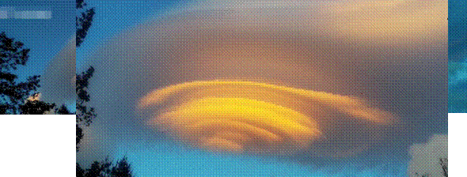

# 人物论——贾宝玉论

 

## 一、 传统说法

顽石怎么理解？只是客观表述，还是带有人文价值的贬义？事实上理想的自我应该是不断超越的自我。

**“石——玉——石”的石头循环三部曲对应于存在的空间：**

**“神界—俗界—神界”**

| 神界： | 自然、真我、精神、超越 |
| ------ | ---------------------- |
| 俗界： | 文明、假我、物质、世俗 |

第一回，

一僧一道远远而来，……便说道红尘中荣华富贵。此石听了，不觉打动凡心，也想要到人间去享一享这荣华富贵，但**自恨粗蠢**，不得已，便口吐人言，向那僧道说道：“大师，弟子蠢物，不能见礼了。适闻二位谈那人世间荣耀繁华，心切慕之。弟子质虽**粗蠢**，性却稍通，况见二师仙形道体，定非凡品，必有补天济世之材，利物济人之德。如蒙发一点慈心，携带弟子得入红尘，在那**富贵场中，温柔乡**里受享几年，自当永佩洪恩，万劫不忘也。”二仙师听毕，齐憨笑道：善哉，善哉！那红尘中有却有些乐事，但不能永远依恃，况又有‘美中不足，好事多魔’八个字紧相连属，瞬息间则又乐极生悲，人非物换，究竟是到头一梦，万境归空，倒不如不去的好。”这石**凡心已炽**，那里听得进这话去，乃复**苦求再四**。二仙知不可强制，乃叹道： 此亦静极怂级？无中生有之数也。既如此，我们便携你去受享受享，只是到不得意时二仙知不可强制，乃叹道： “此亦静极思动？无中生有之数也。既如此，我们便携你去受享受享，只是到不得意时，切莫后悔！” 石道：“自然，自然。”那僧又道：“若说你性灵，却又如此质蠢，并更无奇贵之处。如此也只好踮脚而已。也罢，我如今**大施佛法助你助**，待劫終之日，**复还本质**，以了此案。你道好否？”石头听了，感谢不尽。那僧**便念咒书符，大展幻术，**将一块大石**登时变成一块鲜明莹洁的美玉**，且又缩成扇坠大小的可佩可拿。那僧托于掌上，笑道：“形体倒也是个宝物了！还只没有实在的好处，须得再镌上数字，使人一见便知是奇物方妙。然后携你到那昌明隆盛之邦，诗礼簪缨之族，花柳繁华地，温柔富贵乡去安身乐业。”石头听了，喜不能禁，乃问：“不知赐了弟子那几件奇处，又不知携了弟子到何地方？望乞明示，使弟子不惑。”那僧笑道：“你且莫问，日后自然明白的。”说着，便袖了这石，同那道人飘然而去，竟不知投奔何方何舍。

这段话有“粗蠢”“质蠢”，“不能见礼”等词语。

王国维第一位用哲学来分析《红楼梦》，真正将其作为文学来诠释。红学一直无法摆脱非文学性的研究，甚至有人声称将《红楼梦》作为一部文学作品来研究是最大的谬误。王国维的这篇《红楼梦评论》非常的重要，算作一座里程碑，用西方的哲学来研究《红楼梦》也是具有开创性的做法，彰显出《红楼梦》思想的深度，是可以超越国族、超越文化藩篱的，这些常识非常的好。王国维用了叔本华《意志与表象的世界》（生命哲学）的文学作品解析，产生了一个负面的影响，实则“借他人之酒杯，浇自己之块垒”。他认为《红楼梦》在解决生活或生命本身最严重、很难破解的一个问题——就是人会受限于欲望。

“生活之本质为何？欲而已矣。”

“所谓玉者，不过生活之欲只代表而已。”

“饮食男女，人之大欲存焉。”

“人不婚宦，情欲失半。”

生活的本质是欲吗？王国维用运用谐音法“玉”等于“欲”。婚：情欲；宦：饮食。

告子曰：“食、色，性也”（《孟子》）

生活就是“欲**而已**矣”吗？将生活限缩在“欲”作为根本的、唯一的核心，实际上是把人简化、矮化、本能化，似乎人根本就是本能的存在而已，这是很大的问题，人永远有超越人之上无边无际，而且永远有无穷的高处可以去攀爬、向往、追升的空间。当你觉得“饮食男女，人之大欲存焉”，觉得“食、色，性也”的时候，就是犯了一个所谓的本能主义者（用本能来解释人格问题、人在社会的种种问题）。

但是有许多人与人的问题并不是因为本能所发生的，人与人有太多的是非纷扰、纠葛乃至于引起人内心的心理病变，导致精神疾病，这都与本能没有关系。

以本能来认识问题，最严重的错误是固然“饮食男女，人之大欲存焉”，但是没有一个人的程度和样态不是完全一样的。有人可以是弘一大师，有人可以是暴发户，同样是吃天差地别。即便是本能都会有差异，且这种差异就是人的价值。

对于贾宝玉的玉思考，王国维认为“玉”就是“欲”，是一个俗性的、俗界的表现。

 质疑：以《红楼梦》这样的庞大的、伟大的作品会这样建大的看待“玉”的存在吗？尤其“玉”在中华文化有几千年的历史，而且是非常的重要构成文化内涵一个重要东西，所以它怎么会就这么简单呢？更何况名字里有“玉”的人真的都只是展现欲望、俗界的表现吗？“宝玉”这个名字有个“宝”字，“宝”确确实实是一个俗性范畴的用语，好像是与“玉”是同义副词。

林黛玉的“玉”，就算有欲望，也是对爱情的渴望，不涉及食与色。（《红楼梦》中贵族少女是饮食非常有节制。）妙玉：对爱情的向往。

我们太常用二元对立的思考模式去认识世界，包含认识经典，而这个是非战之罪，不抨击这个现象，因为这是来自于人性。人类学家提出来：我们人从小就认识世界就一定是透过二元，如果不透过二元就没有办法展开认识，认识世界建立知识就一定用二元的方式展开。我们始终会限制在二元这个概念里，因此佛教经典希望解脱、解离重重的这个世界或者其他的污染，就是要破除二元的方式。二元对立作为人类学习知识、认识世界、掌握道理所不可或缺的基本的思想运作模式，会这样理解“玉”与“石”真的是自然而然。自然而然的结果不会让我们超越常识般的层次。（真正的智慧是超越二元对立之上的。）

曹雪芹触及到了这个辨证的智慧。“假作真时真亦假，无为有处有还无”。颠覆了贬低假，弘扬真的二元对立观，真与假是一体的两面，互相转换。当人把假当做是真，那么假就变成了真；当你追求真，把真当做一个价值，就变成了假。藕官与菂官的假戏真做，假可以成真（杏子阴假凤泣虚凰）。明代的文化里流行一种文化是世人皆“崇真”，后来变成一个价值，带动一个流弊，率真都在被模仿，就变成了假，也愿意承担以自我为中心会付出代价，被大家推崇。人不是刚出生的幼儿，“崇真”有很大的问题，涉及到人性论、哲学的一些辩证。曹雪芹不是反封建礼教的，相反在告诉我们礼教与自然可以合而为一的（史湘云的“名教中自有乐地”）。

事情是辩证的，没有这么简单的。石头三部曲不可能成立的，每个阶段都有双重性的。

## 二、 玉石一体：玉的双重性

宝玉在神界就是玉石。

《淮南子˙览冥训》：*于是女娲炼五色石以补苍天*，断鳌足以立四极，杀黑龙以济冀州，积芦灰以止淫水。

五色石不可能是顽石。赤瑕宫：在宋代是个专有名词“赤赮”，是五色石，等同于天边的彩霞。所以神瑛侍者是宝玉。

第一回，

**灵性已通**，因见众石俱得补天，独自己无才不得入选，遂自怨自叹，日夜悲号惭愧。

已经通灵，就是玉。什么叫灵性？《文心雕龙˙原道》：“为人参之，**性灵所钟**，是谓三才。为五行之秀，实天地之心，**心生而言立，言立而文明**，自然之道也。”

早早就在神界，宝玉就是一块玉，外形之美，“**心生而言立，言立而文明**”，能够参透道的“五行之秀”。（与孙悟空那块石头一样，女娲补天之石是顶天立地，维系人类文明的。）曹雪芹所讲述的是中华文化所塑造的人类文明的极致，石头不能派上用场真的是“悲号惭愧”，感觉自己是瑕疵品，不足以参与这个宏大事业的败笔。

当宝玉以一颗通灵的五色石被抛弃在青埂峰时又发展出另外一个存在的形态，以神瑛侍者为中介去与绛珠仙草建立一个还泪的木石前盟。神瑛侍者（归属赤瑕宫）是宝玉前身，可能以不同的形态在神界活动。“瑛”：《说文解字》：“玉光也。”《玉篇》“瑛，美石，似玉；水精谓之玉瑛也。”（《说文解字》：“玉，美石也。”）

到了俗界，与开始有了分化——“宝”与“玉”。二者有所区隔。玉具有特别的双重性。

玉的美赋予以价值，但本质是玉石。在《红楼梦》中贾家降等承袭即将归零，玉字辈：贾珍、贾琏、贾珠、贾瑞、贾璜、贾环、贾琮、贾㻞、*贾琼*、贾琛、贾珩、贾璎、贾璘、贾珖，都是单名，祧名：共用一个偏旁或一个字，唯独宝玉是复名，形成鲜明的对比。

到了明清时期，复名比单名多了，与中华文化最早命名情况不同。《公羊传》：“定公六年：二名，非礼也。”西汉末年王莽“二名之禁”，东汉人大多都是单名（贾谊、屈原、孔丘等）。王泉根《华夏取名艺术》：“其于汉晋间流行，乃为了便于避讳，五胡乱华以后就比较松弛。”王泉根《中国人名文化》：“唐宋明清间的取名方式与前期相比，复名（二字名）的使用率越来越高，大致说来，唐、宋、元时代的复名的使用率约占人命的一半左右，到了明、清时段，则逐步遽增至60%与70%。”

“宝”与“玉”两字是不同的范畴，因为到了人间，增加了世俗性，在这个复名上呈现出来。

宝玉的“玉”以一个全形的姿态出现（都是偏旁，最多是名字的一半），把玉的种种特色包含进来，容纳所有的玉的特性，从神界到俗界，所有的自然与人为、超现实与现实、神性与俗性在“玉”里全部涵括。“玉字辈”其他人因为“玉”被挤到一边，它的特性就比较是被消减了玉很正面的这一面，就是一般所以为的神性、心灵价值等精神性的这一面。这些人一般就比较庸俗、世俗，像贾琏好色，贾珍爬灰，贾环“下流种子”，贾瑞想与凤姐乱伦，斜玉旁的玉字辈都非常的不堪。贾宝玉来到人间就用了“玉”字的全形，就有了玉字辈没有的精神性的那一面。

宝玉命名的来历：

第五十六回，

四人笑说：“今年十三岁。因长的齐整，老太太很疼，自幼淘气异常，天天逃学，老爷太太也不便十分管教。”贾母笑道：“也不成了我们家的了？你这哥儿叫什么名字？”四人道：“**因老太太当作宝贝一样，他又生的白，老太太便叫作‘宝玉’**。”

“宝贝”，贾宝玉的宝就来自于世俗，有了人为的价值；“白”，对应了“玉”字但是玉有其他很深厚的内涵。

康雍乾时期是被历史学家称为盛清。从嘉庆年间整个国家每况愈下，再加上外来的侵略。在一个剧烈的折辱、伤害下整个民族的自信心荡然无存，就在不断地自我否定、自我毁灭，从民国以后是非常惨烈的，整个传统的根被刨掉了历史我们其实都是见证过得，而现在只是亡羊补牢，其实有点晚了。

宝玉是诞生在乾隆这样一个盛清，被视为空前繁荣和平的时代，这样的宝玉怎么可能是反封建反礼教呢？他根本就是诞生在太平盛世，整个社会是最富庶的时代、最巅峰的状态之下的一个宠儿、一个佼佼者，他不会是反对这个时代的。石头下凡限定在就是“富贵场温柔乡”，他是来受享荣华富贵，不是来受折磨、修炼自己的，整个的《红楼梦》描写的就是贵族世家非常富庶，而且具有精英阶层的最高雅的文化的集中地美好的时代。因此他叫做宝玉，“宝”是说明他在贾府里备受宠爱的宠儿的地位之外，也呼应了“玉”字容纳了精神性与世俗性双重面向，他有重叠和分化的不同的层次。宝玉的故事非常麻烦，在文中一定有很多的矛盾冲突。

玉石固然来自神界，但是这颗补天遗留的石头作为宝玉的前身就是玉石，从头到尾就是玉石，而不是石—玉石—石的循环，从神界到俗界，这颗石头所在场域是变幻的，来到俗界这颗玉石被附加了世俗的这个面向，形成了**神性和俗性、精神性与世俗性的一个双重面向**。

“宝”与“玉”不是同义复词。第十五回，

水溶笑道：“名不虚传，果然如‘宝’似‘玉’。”

第三十回，

可巧小生宝官、正旦玉官两个女孩子，正在怡红院和袭人玩笑。

第二十二回，

黛玉先笑道：“宝玉，我问你：**至贵者宝，至坚者玉**。尔有何贵？尔有何坚？”宝玉竟不能答。

石头的本质：至坚。

《吕氏春秋》：“石可破也，不可夺其坚。”

《淮南子》：“石生而坚。”

在宝玉的名字命名下在社会场域得到了本不属于它的一些世俗性。贾宝玉很矛盾的。这能用这两个字涵盖他的矛盾辩证关系。贾宝玉命名原因：保有玉的全形；有“宝”的世俗性的凸显。

贾宝玉与甄宝玉的联结？贾宝玉是来反抗世俗性；甄宝玉顺应世俗性，归引入正，符合世家的佳子弟。后四十回阅读对前八十回阅读的影响。

“宝”与“玉”有重叠与分化的关系，而二者在世俗的这一面重叠，因为“玉”来到人世间，被附加了“宝贝”，但事实上它内在又是所谓的“至坚者”，来自神界的那一颗美好的玉石。当玉在玉石的故事时候，玉石在如宝之贵，小说中出现的情节就是金玉良姻，符合传统和世俗的要求，金玉良姻也建立在如宝之贵的外貌上。

“戕宝钗之仙姿……戕其仙姿，无恋爱之心矣。”

二人在对世界上的读书人也有同样的价值观。两人是同道人。

宝钗与宝玉是显性重像。容貌：

第三回，

面若中秋之月，色如春晓之花，鬓若刀裁，眉如墨画，鼻如悬胆，睛若秋波，…

第五回，

容貌丰美

第八回，

唇不点而红，眉不画而翠，脸若银盆，眼如水杏，

第二十八回，

脸若银盆，眼似水杏，唇不点而红，眉不画而翠

体型：

第二十九回，宝玉“越发发福了”

第三十回，宝钗“体丰怯热”“他们拿姐姐比杨妃”

二宝是从先天就注定要联姻的，从长相世俗的审美范畴，再加上和尚的居中以神谕的方式指点他们当中的一种关联，二人当然就构成了金玉良姻。当金玉良姻浮现出来就会想成黛玉、宝玉二人之间的纷扰，干扰到了木石情盟，宝玉为了证明对黛玉的情感就有摔玉与砸玉的情节出现，这时候就是黛玉要求“至坚者玉”来试探、来产生个人的纠结，宝玉来摔玉，就是金玉良姻的玉，即“至贵者宝”的玉。当小说情节表现出玉在“宝”的这一面，即世俗的这一面时候，就会有金玉良姻，这也构成了黛玉的梦魇。木石情盟就是在玉石的本质上得以开展出来的。

贾宝玉也有很世俗性的一面。（“思无邪”不可解释一切行为。）真与假是同一件事。（史湘云与翠缕谈阴阳。）

王希濂《红楼梦总评》：“《红楼梦》一书，全部最要关键的是‘真假’二字。读者须知，真即是假，假即是真；真中有假，假中有真；真不是真，假不是假。明此数意，则甄宝玉、贾宝玉是一是二，便心目了然，不为作者冷齿，亦知作者匠心。”（佛教传入是从最精英阶层，思想细密复杂，能成为专门的学问。）

贾宝玉的十九年人生中呈现的一种“假宝真玉”的面向，无论怎样的辩证，还是在否定这个世俗，否则最后就不会出家（出家就是否定这个尘世的范畴），脱离世俗。代表着一种价值的取舍：否定“宝”（社会所外加的世俗的这一面），最后走向对于玉石的肯定（精神性）；甄宝玉，就是真宝假玉。宝玉所反对的那个“宝”，一开始为了享受荣华富贵来到人间，十九年后否定世俗。在这十九年拥有“宝”的面向：金玉其外（外貌）。

第二十五回，

宝玉儿还是小孩子家，长的**得人意儿**，**大人偏疼他**些儿也还罢了。

第五十六回，

就是**大人溺爱**的，也因为他一则**生的得人意**

第二十三回，

贾政一举目见宝玉站在跟前，**神彩飘逸，秀色夺人**，又看看贾环人物委琐，举止粗糙，忽又想起贾珠来。再看看王夫人只有这一个亲生的儿子，素爱如珍；自己的胡须将已苍白：**因此上把平日嫌恶宝玉之心不觉减了八九分。**

貌寝之论。人生得到成就感谢上天的，人要慈悲、谦虚。

甄宝玉长得与贾宝玉相似。（第五十六回）

第一百一十五回，（续书）

我想来有了他，我竟要连我这个相貌都不要了。

宝玉拨开金玉其外的世俗性，最后的大彻大悟，悬崖撒手，拥有真正的超越性，彻底的回到了真玉石的状态。（铁拐李故事：寻找到智慧的真谛。）（庄子齐物最终庄周梦蝶，真正的逍遥，解脱，要透过齐物；智慧的人：支离疏、啮缺。）甄宝玉完全的走向了世俗性，真宝假玉。

第五十六回，

如今看来，模样是一样！据老太太说，淘气也一样，

第二回，

其**暴虐浮躁，顽劣憨痴，种种异常**；只一放了学，进去见了那些女儿们，其温厚和平、聪敏文雅，竟变了一个样子。

正邪两赋的人：不能担负家族使命，不能走向正统君子的样态。“置于*万万人*之中，其聪俊*灵秀*之气，则*在万万人之上*；其乖僻邪谬不近人情之态，又在万万人之下。”

甄宝玉以显性替身，与贾宝玉的关系，一开始是重叠，在后四十回是分割手法。贾宝玉的“宝”从内在到外在都毁弃了，从精神到形体都完全的玉石化了；甄宝玉是由外而内，逐步地彻底改变除了金玉的外貌，他的心灵也宝玉化了，是一个完整的世俗价值体现，二人走向完全不同的方向。

这样的说法，难免就把玉与宝当成截然不同的东西看待，是不是可以做这样一个认知，是有所保留的。

玉石完全是精神性的吗？

假如《红楼梦》是一个玉石的故事，玉石神话时，玉石也不是完全没有世俗性。玉石的神话里面，女娲补天就是经世济民的一个比喻，忠孝是玉石的性格，神性、俗性的二分是非常危险的。

贾宝玉的玉石诠释。玉石神话给他一个贵族出身，贵族在世俗里的等级制形成的。

在传统文化里，与有多方面的功能的，可以用来执盟、用来祝祷、用来礼天地四方和日月星辰、用来聘女供飨。只要又严肃意义的场合玉都可以发挥作用。

宝玉转世含玉转世而来，玉可以让生命再生，与宇宙最深层的力量发生关联。玉的重要价值：华夏文明所特有的玉石崇拜，绵延千年玉石信仰。高雅文明的结晶，玉器是权势财富的象征，与上层社会交往活动有关的，后来对于礼制也是相关的。所以贾宝玉不可能反礼教的。春秋时期，贵族墓葬里随葬玉器；后来又转化为王权象征。玉有非常庞大的文化内涵。

玉根本上就是与贵族世家息息相关的。

## 三、 玉石的神话

玉石担负了更多的文明的责任。

玉石早在春秋时代就是权势、财富、等级身份的象征物，上层社会活动不可缺少的凭借，甚至是礼制的定型化动力的一个重要来源源，因为玉的关系而有了各式各样的礼仪、各式各样场合的运作。古代贵族佩玉、重视玉，这样一个广泛流行的习俗就更加证明，后来与王权的象征有了联结。因此不能说宝玉的前身是一颗顽石，而是一颗玉石。从前身到今世所展演的都是玉石的故事，这是中国有史以来唯一一部讲贵族的小说。（那些才子佳人小说，不符合他们贵族的意识形态。平民阶层比较自由的，六朝以来的民歌都是在讲恋爱、爱情。）某个意义玉石就是来说明宝玉是具有贵族的血统。

第一回，

那僧便念咒书符，大展幻术，将一块大石登时变成一块鲜明莹洁的**美玉**，且又缩成扇坠大小的可佩可拿。

玉石只有大小的变化，本质没有变化。

第二回，

五彩晶莹

第八回，

大如雀卵，灿若明霞，莹润如**酥**，**五色花纹**缠护。

酥：牛奶。五色花纹：就是五色石。

脂批：

| 体       | 色       | 质       | 文           |
| -------- | -------- | -------- | ------------ |
| 大如雀卵 | 灿若明霞 | 莹润如酥 | 五色花纹缠护 |

 

文的含义相当复杂，代表文明与秩序（地文、天文、人文）。里外聚美，文质彬彬，本身具有高度文明条件。

第一回，

到那昌明隆盛之邦、诗礼簪缨之族、花柳繁华地、温柔富贵乡那里去安身乐业。

展现了大中华当时的骄傲。《红楼梦》不是反封建礼教，而是表现了在文化集中的精英阶层，可以参与高度的文明，参透宇宙的奥妙。补天的玉石以最高标准锻炼，就算“不用”，它也是一个非常的存在。

奇异的出生（Monstrous birth），非常独特的出生类型。小说家援引了民间的传说尤其是英雄的传世，衔玉而生本来就合乎转世再生的意义，对应转世投胎的意义。（《周礼》、《左传》均有记载。）出生时胎里带来的灵物，在澳洲土人被称为秋苓格（Churinga），被视为神圣的物品。（宝玉受宠合乎人性。）灵物平时藏在洞穴，只有举行仪式才使用。神话里也有“孩子出生时身上常常带有其他物品”。汤普森（Smith Thonmpson）《民间文学情节单元索引》（《Motif-index of folk-literature》）：“编号T婚姻、生育”中“编号T500-T599怀孕和生育”类中的T552项就是奇异诞生。

第一回，

那西方灵河岸上三生石畔，有绛珠仙草一株，时有赤瑕宫神瑛侍者，日以甘露灌溉，这绛珠草始得久延岁月。后来既受天地精华，复得雨露滋养，遂得脱却草木之胎，得换人形，**仅**修成女体，终日游于离恨天外，饥则食蜜青果为膳，渴则饮灌愁海水为汤。

林黛玉的性格给了一个合理的说明。

佛教的女性观，女人是来来人间受苦、赎罪。（唐传奇《红线传》）女有五漏，心灵素质低劣，女人是少修五百年，陷溺在欲望与情绪中不得解脱。（《红楼梦》真正的出家的甄士隐、柳湘莲、贾宝玉）（风月宝鉴只给“王孙公子”看的：平民不可以，女子不可以）。

那绛珠仙子道：“他是甘露之惠，我并无此水可还。他既下世为人，我也去下世为人，但把我一生所有的眼泪还他，也偿还得过他了。”

神瑛侍者可能是玉石幻化出来的。神瑛侍者就是玉石，贾宝玉也是玉石。神话可以笼统，可以囫囵吞枣。（神话思维）

第一回，

不觉打动凡心，也想要到人间去享一享这荣华富贵，但自恨粗蠢，不得已，便**口吐人言**，向那僧道说道：“大师，弟子蠢物，不能见礼了。

脂批：竟有人问口生于何处，其无心肝，可笑可恨之极。

对于创作者是深深的羞辱，质疑创作的想象，不能用物理的逻辑来思考。必须承认这个神话就是在神话范畴里，对于深层的象征意义没有帮助。补天玉石就贾宝玉。神瑛侍者就是石头。

第五回，

都道是金玉良姻，俺只念木石前盟。

第三十六回，

“和尚道士的话如何信得？什么‘金玉姻缘’？我偏说‘木石姻缘’！”

第二十五回，

那僧道：“长官有所不知。那宝玉原是灵的，只因为声色货利所迷，故此不灵了。今将此宝取出来，待我持诵持诵，自然依旧灵了。”贾政便向宝玉项上取下那块玉来，递与他二人。那和尚擎在掌上，长叹一声，道：“青埂峰一别，展眼已过十三载矣。人世光阴迅速，尘缘满日，若似弹指！可羡你当日那段好处：天不拘兮地不羁，心头无喜亦无悲。只因锻炼通灵后，便向人间惹是非。可惜今日这番经历：粉渍脂痕污宝光，房栊日夜困鸳鸯。沉酣一梦终须醒，冤债偿清好散场。”念毕，又摩弄了一回，说了些疯话，递与贾政道：“此物已灵，不可亵渎，悬于卧室槛上，**除亲身妻母外**，不可令**阴人**冲犯。三十三日之后，包管好了。”

赫尔曼˙黑塞《流浪者之歌》：悉达多沉沦在世俗，陷溺在名妓的温柔乡，最终走出世俗。被蒙蔽的是宝玉，走出梦幻的是宝玉。玉石是宝玉的灵性、灵魂甚至生命的本源。

在宝玉起死回生的除了一僧一道，帮助他复生就是王夫人。对于一个贵公子，不可以以儿女私情妨碍大节（君父的存在，伦理秩序）。

脂砚斋对于神瑛侍者的批语：“单点玉字二（也）。”

脂砚斋：“‘瑕’字本注：**玉小赤也**，又玉有病也。以此命名恰极。”

观看之道是一个文化行为，知识和文化系统决定人能看到的东西。

赤瑕源于原始神话的“赤赮”，赤赮根本就是女娲补天的补天石。在宋代《路史》：“炼石成赮，地势北高南下。”

“赤赮”，因为无才补天，就成了“赤瑕”，作者巧妙地把传统文化转化，是一个巧思。

玉石来到人间，不是来磨练、受苦，而是受享。除此之外，也是来验证接受高度文明的性灵的追求。

贾宝玉一定会投身到国勋门第，充满了富贵荣华，他也是个不肖子孙。

第二回，

如今生齿日繁，事务日盛，安富尊荣者尽多，**运筹谋画者无一**，那；其日用排场费用，又不能将就省俭。如今外面的架子虽没很倒，内囊却也尽上来了。——这也是小事。更有一件大事：谁知这样钟鸣鼎食之家，翰墨诗书之族，如今养的儿孙，竟一代不如一代了！”

对《红楼梦》中的大家族来讲财富、经济上的问题是小事，他们真正关心的问题是教育不张。贾敬父教不张，家族将会沦落。心性败坏是他们最难的，是他们精神堕落的原因。第五十五回，探春打理贾府。第七十一回，

宝玉道：“谁都象三妹妹心多事？我常劝你总别听那些俗语、想那些俗事，管**安富尊荣**才是，比不得我们，没这清福，应该混闹的。”

贾宝玉对探春的苦心经营家族的行为有了微词。（自私而单纯的话。婴儿女神会给她怎样的庇荫。）明明在写一个不孝的子孙，却被歌颂成为一个时代的英雄。

如果说冷子兴批评贾府安富尊荣者尽多是正确的，那么一个安富尊荣的贾宝玉为什么会被捧得如此崇高？（双重标准）

石头的来到人间是非常心满意足。批评家可以讲出好多道理，小说家负责讲故事，不可点破，让读者领会。

第三回，脂批：“*试问石兄*此一摔，比青埂峰下萧然坦卧如何？”

第八回，脂批：*试问石兄*此一摔，比青埂峰下猿啼虎啸何如？余代答曰，遂心如意。”

第八回，脂批：“*试问石兄*此一握，比青埂峰下松风明月如何？”

玉石苦求僧道是为了这样一个心满意足的追求。石头在元妃省亲太平景象，富贵风流的场面，忍不住发出自己的感叹了。

第十八回，

此时自己回想在大荒山、青埂峰下，那等凄凉寂寞；若不亏癞僧跛道二人携来到此，又安能得见这般**世面**。

玉石神话第一个就是安富尊荣的受享意识。另一关键就是“世面”。世面：贵族在眼界、胸襟、文化涵养、精神道德各方面的高度，要有很好的教育、丰富的知识与学问，这是他们非常看重的。贵族看不起暴发户的原因就是因为他们只有财富，而没有百年形成的涵养，简单来说这个就叫做世面。

高鹗的续书在“世面”上的败笔：

第八十五回，

*黛玉略换了几件*新鲜衣服，打扮得宛如嫦娥下界，含羞带笑的出来见了众人。

前八十回的几次生日宴，在重大的宴会都有一定的穿戴礼服。林黛玉进贾府，三春穿的一模一样。这就是贵族的样态。第七十回，探春换了礼服，各处行礼（祠堂——贾母——父母，这是不可乱掉的伦理架构）。

“嫦娥下界”，正是脂砚斋批评的写作手法。在《红楼梦》中“仙女下凡”的话只在刘姥姥的口里有一次。第四十回，

“我的姑娘！你这么大年纪儿，又这么个好模样儿，还有这个能干，别是个神仙托生的罢？”

等级给了他教养，续书者受到了等级限制，贵族的一些常识是他一生都无法企及的。

“含羞带笑”，忸怩作态的小家碧玉，不是贵族大小姐的风范，大家小姐平日就有仆人二三十人伺候，早就习惯了做主人，怎会有这番姿态。林黛玉六七岁就表现出一种雍容华贵。第三回，

“天下真有这样标致人儿！我今日才算看见了！况且这**通身的气派**竟不象老祖宗的外孙女儿，竟是嫡亲的孙女儿似的，怨不得老祖宗天天嘴里心里放不下。”

“通身气派”就是言谈举止有一种舒坦沉稳、动静之间有一种优雅自在，自然地散发出大方合度的大家闺秀的风范。

“含羞带笑”的描写很像第十三回的描写，族中的一些媳妇“或有羞口的，或有羞脚的，或有不惯见人的”，都是小家作态。续书者的视野与眼光无法企及贵族文化的样态。贾府的国勋门第连丫鬟也比一般小姐的都强。

第五十四回，

殊不知别说庶出，便是我们的丫头，比人家的小姐还强呢。

而续书者将一个钦差大臣的正房嫡出女儿写得连一般的丫头都不如了。

世面：

第十六回，

凤姐笑道：“若果然如此，我可也见个大世面了。可恨我小几岁年纪，若早生二三十年，如今这些老人家也不薄我没见世面了。说起当年**太祖皇帝仿舜巡**的故事，比一部书还热闹，我偏没造化赶上。”

对贵族阶层也是千载难逢的盛事，对于王熙凤这样的年轻人老人家也是认为她没见世面。“太祖皇帝仿舜巡”：康熙南巡。单单二十几年王熙凤在大家族见到的、听到的，对于庶民就是罕见的了。

刘姥姥看着李纨与凤姐儿对坐着吃饭，叹道：“别的罢了，我只爱你们家这行事！怪道说，‘礼出大家’。”

人可以不断提升，可以不断地学习。

第六回，

你又是个男人，又这么个嘴脸，自然去不得。我们姑娘年轻的媳妇儿，也难卖头卖脚的。倒还是舍着我这副老脸去碰一碰。果然有些好处，大家都有益；便是没银子来，我也到那公府侯门见一见世面，也不枉我一生。

人选抉择：男人不行，一家之主，且是男性见不到人；媳妇，年轻，户外空间具有危险性；老人，去性化。王夫人是一个相当温厚的人。

刘姥姥不计较现实的得失，只想见见世面，比起得到银子更重要。有些人是汲汲营营，只为了利益，就成了现实的富翁，人生却非常贫瘠，所谓“穷的只剩钱”。刘姥姥作为一个乡下老妪知道人生可以有其他更重要的事情，比如见见世面，提升一下自己。只是世面有大有小，所以人无论在哪里都要提升自己。“也不枉我一生”：可见这样一种文化集中的精英阶层所体现出来的文化品位、精致优雅对贫民来说是如此之珍贵，当我们在这样一种平民化社会是不能体会到刘姥姥的心态。刘姥姥是有大智慧的人，就算刘姥姥在扮小丑，那也是她在故意扮小丑，她知道“扮小丑”会有怎样的效果，这样的效果也是为了答谢帮助她的人，愿意变成献给对方欢笑的礼物。

曹雪芹不是在讲封建礼教，而是在这样的社会有许多无法重现的情境。

第二十七回，

愿意不愿意，我们也不敢说。只是跟着奶奶，我们学些眉眼高低，出入上下，大小的事儿，也得见识见识。”

林红玉想要跟着王熙凤学习一些大小事处理。无论在什么处境、无论哪一种身份，永远都可以更积极向上。没有一个人都有的主体能动性。脂砚斋：“凤姐用小红，可知晴雯等埋没其人久矣，无怪有私心私情，且红玉后有宝玉大得力处，此于千里外伏线也。”怡红院有那么多丫鬟，埋没红玉，就是晴雯总领头的。

一个是世家大族的出身的主子、一个是乡村老妪、一个是卑贱的奴仆，他们都希望能变得更好，见得的更多，那么我们这样的人又该如何呢？

石头幻形入世就是有这样一个目的：见世面。

被神瑛侍者灌溉的仙草是绛珠仙草。

绛珠仙草：绛珠红色的圆点状的东西，是叶片上的斑点？还是果实？结的果实是一颗还是一簇？

绛珠：文献追踪。

在传统文献中，在中医里有绛珠膏，《御馔》介绍其功用治溃疡诸毒、去腐定痛生肌等；绛珠作为以形象比喻红色的圆的小东西，比喻红色的水珠、枸杞、道教用语、红色的樱桃、红色西瓜子、红色的枇杷果子、红色的珍珠、红色的罂粟、红色的奇异果、彩光、红色石榴果实。

绛珠仙草的绛珠到底是什么？

绛珠仙草推论是《山海经》瑶草，形成一个主流看法。主要推论有两个：

《山海经˙中山经˙中次七经》：“又东二百里，曰姑**媱**之山。帝女死焉，其名曰女尸，化为䔄草，其叶胥成，其华黄，其实如菟丘，**服之媚于人**。”

郭璞注：“为人所爱也；一名荒夫草”

《文选˙别赋》：“引宋玉〈高唐赋〉所云：我帝之季女，名曰**瑶姬**，未行而亡，封于**巫山之台**，精神为草，实曰灵芝。”

行：出嫁（女子有行《诗经》）。林黛玉注定未嫁而逝。巫山之台：神女（巫山云雨），爱欲女神。

推演过程：绛珠仙草=瑶草=瑶姬=瑶女=佚女=佻女=遊女=滛女

最大的问题：两则文献中的女子都没有与林黛玉有明显的关系；“**服之媚于人**”与黛玉性格不合，“荒夫草”（郭璞的注）。其次瑶姬到底是怎样的一个女神？

陈梦家《高禖郊社祖庙通考》：“瑶姬=瑶女=佚女=佻女=遊女=滛女”，瑶姬，私奔的神女；佻女，轻佻；遊女，在外游荡；滛女，淫荡。巫山云雨的神话有上古时期圣婚仪式的色彩。

从药效到神格都没有关系，只有“未行而亡”接近。“未行而亡”，亡：逃走，变成遊女。

瑶草叫做荒夫草，荒：欠缺，没有丈夫，与前面相关的解释相通。所有的指向爱欲女神的形象。

除了瑶草的解释之外；也没有绛珠的形象相关的解释。灵芝，与绛珠无关。这个主流看法不能成立的。

赵之谦：“云西示余珍珠莲，类天竹而细，**红艳娇娜**。叶一茎七片，边有刺，干绿色，而有碧丝如划，插瓶亦耐久。常州人呼珊瑚草，偏考不知其名，疑《红楼梦》中绛珠仙草是此。此野田所有，得亦可奇。却与通灵宝玉的对，家中是宝，外间即废物也。”

绛珠仙草就是人参草，林黛玉是服用人参养荣丸。荣：中医常用语汇。清朝人参买卖形成了很大的规模。

《红楼梦》里提到的资料与娥皇女英洒泪的故事一体的分化，湘妃竹来到天上是绛珠仙草，绛珠仙草来到人间就是湘妃竹。脂砚斋：“点红字，细思‘绛珠’二字岂非血泪乎。”

第八回，脂批：“一泪化一血珠。”

第三十七回，

探春笑道：“有了，我却爱这芭蕉，就称‘蕉下客’罢。”众人都道别致有趣。黛玉笑道：“你们快牵了他来，炖了肉脯子来吃酒。”众人不解，黛玉笑道：“庄子说的‘蕉叶覆鹿’，他自称‘蕉下客’，可不是一只鹿么？快做了鹿脯来。”众人听了都笑起来。探春因笑道：“你又使巧话来骂人！你别忙，我已替你想了个极当的美号了。”又向众人道：“当日娥皇女英洒泪竹上成斑，故今斑竹又名湘妃竹。如今他住的是潇湘馆，他又爱哭，将来他想林姐夫，那竹子想来也是要变成斑竹的，以后都叫他做‘潇湘妃子’就完了。”大家听说都拍手叫妙，**黛玉低了头，也不言语**。

南朝任昉《述异记》：“昔舜南巡而葬于苍梧之野，尧之二女娥皇、女英追之不及，相与恸哭，泪下沾竹，竹文上为之斑斑也。”林黛玉的神话前生就是娥皇女英。湘水女神，凌波微步湘江上，永恒追忆丈夫。

《潇湘神词二首》

刘禹锡

其一

湘水流，湘水流，九疑云雾至今愁。君问二妃何处所？零陵香草露中秋。

其二

斑竹枝，斑竹枝，泪痕点点寄相思。楚客欲听瑶瑟怨，潇湘深夜月明时。

远别离

李白（唐）

**远别离，古有皇英之二女，乃在洞庭之南，潇湘之浦。** 

**海水直下万里深，谁人不言此离苦？** 

……

**帝子泣兮绿云间，随风波兮去无还。**（ 绿云：竹林 ）

**恸哭兮远望，见苍梧之深山。** 

**苍梧山崩湘水绝，竹上之泪乃可灭。** 

死亡与眼泪联结。只有等到山崩水绝才可以泪止，爱到地老天荒。这也是林黛玉的还泪预言。

| 林黛玉   | 身躯消亡           | 泪水枯竭             |
| -------- | ------------------ | -------------------- |
| 潇湘妃子 | 苍梧山崩湘水绝     | 竹上之泪乃可灭       |
| 李商隐诗 | 春蚕到死，蜡炬成灰 | 丝（思）方尽，泪始干 |

斑竹上的泪痕是红色的。

《潇湘遊》

刘言史

欸乃知从何处生，当时泣舜肠断声。翠华寂寞婵娟没，野筱空馀**红**泪情。

 

《赠梁浦秀才斑竹拄杖》

贾岛

拣得林中最细枝，结根石上长身迟。

莫嫌滴沥**红斑**少，恰似湘妃泪尽时。

《斑竹祠》

汪遵

九处烟霞九处昏，一回延首一销魂。

因凭直节流**红泪**，图得千秋见**血痕**。

娥皇女英的眼泪就是血泪。沾上血泪的仙草就是绛珠仙草，就是湘妃竹在天上的投影，而湘妃竹是绛珠仙草移植在人间的化身。泪点斑斑是二者共同的造型。

林黛玉与贾宝玉的爱情本质，容易爱欲混淆。真正的爱是让人生更丰富。

曹雪芹是反对一见钟情，一见钟情太过浅薄，且容易混淆与情欲。宝黛爱情是《红楼梦》的主轴之一，呈现了作者真肯定的爱情样态。

对于神瑛侍者与绛珠仙草之间的感情是否投射现代的爱情观。宝黛之恋不是全书创作宗旨，呈现了《红楼梦》主张的爱情观，透过神话来解释爱情定义来，与现在的爱情大相径庭。现代的爱情观具有强有力的排他性，包括所有的人际关系和人生价值，爱情是至高无上的，其他的都要全部退位甚至应该被牺牲，仿佛若非如此，就不能彰显爱情的伟大，甚至爱情可以凌驾在生命之上。现代人的爱情崇拜下，不自觉地独断的爱情霸权的思维。五四以来的爱情，在现代思潮引领之下，认为爱情有个非常强大的动力，一方面来自与生俱来的本能（对情爱的渴望），带有一种不被人为所根除的一种强大动力，因此这样一种爱情被视为具有改造社会的推动革命之轮的一种力量，所以人们歌颂爱情，在五四以来的创作里面又常混淆于肉欲，有一种误解，他们认为情欲也是来自与生俱来的生物本能，不可能被后天的一些力量（如礼教、伦理、道德的力量）所根除，也因此二者就被结合在一起形成一个强大的力量，被歌颂为一种伟大的具有革命性的力量。但是无论这个爱情是个纯情还是与欲的混淆性的，它的力量是被过度的高估。把爱情等同于一种非理性的力量，好像是可以不用透过学习，不是透过人格的修养、深化、丰富的一种意识形态，而这反过来是对爱情很重大的伤害，这样会误失掉爱情的真正本质，因此来看曹雪芹怎样来看宝黛爱情，这可以作为一面鉴镜。人要成长，不要永远停留在20岁，不可以一味歌颂青春。

神瑛侍者对绛珠仙草甘露灌溉是来自慈悲，人本性中的“恻隐之心”；仙草也想回报神瑛侍者，用一生的眼泪汇报，二者一直在儒家的恩德、恩惠的伦理范畴展开的。第一回，

他却常在西方灵河岸上行走，看见那灵河岸上三生石畔有棵绛珠仙草，十分娇娜可爱，遂日以甘露灌溉，这绛珠草始得久延岁月。

西方灵河，也是爱河；人的偏执或执着像陷入在爱河里，无可自拔，直到爱河枯竭才可以解脱；林黛玉一直到爱河（死）才可以解脱，她的一生被限定在无法解脱的处境。三生石：佛教的典故。袁郊《甘泽谣》牧童唱的：*三生石上旧精魂*，赏月吟风不用论。惭愧情人远相访，此身虽异性常存。情人：有情之人，包括友情。任何的情谊都可以这样真挚深刻，不独爱情。真正的知己同心不只爱情，也可是友情。

第五回，

就是宝玉黛玉二人的**亲密友爱**，也较别人不同，日则同行同坐，夜则同止同息，真是言和意顺，似漆如胶。

男女之间有妨嫌之道，在贾母孝道干预下超越这一点，是合理的让二者拥有一起生活的条件。随着年龄的增长，二人进入不同的阶段，到第二十九回，宝玉十二三岁。第二十五回，“十三载”。爱情是对对方的怜惜、关心、呵护，爱是后天学习的能力。

第二十九回，

*如今稍明时事*，又看了那些邪书僻传，凡远亲近友之家所见的那些闺英闱秀，皆未有稍及黛玉者，所以早存了一段心事，只不好说出来。

*“稍明时事”，宝玉开始成熟了，有了认知能力；“*又看了那些邪书僻传*”*，透过学习才学会爱情，人的所谓特质与性格有多少是来自学习的，一味强调本能，会误入歧途。单单只就爱情，就不是本能，才知道有这样的关系。“凡远亲近友之家所见的那些闺英闱秀，皆未有稍及黛玉者”宝玉对黛玉在二十九回之前是友爱，在经过学习和比较之后才选择了黛玉。宝玉对黛玉的情感性质是与时俱变的，他有渐进的学习的历程，甚至充分的了解和认识，还有比较与取舍，绝对不是建立在感性知觉“不知所起”的一见钟情。“不知所起”是由于现代人对爱情的夸大的赞颂以至于汤显祖塑造的杜丽娘变成一个至情的典范，曹雪芹并不赞成杜丽娘式的爱情。

曹雪芹认为爱情与人的见识、成长、人格状态息息相关，而且他认为爱情的前提是深厚的友谊（知己之情）。一见钟情太过短暂，有可能就是美妙的颂歌，也可能是可怕的灾难。一见钟情太强烈，会蒙蔽理性，基础太薄弱，虽然有情感的强度，可是了解的深度、广度都太少，这不是一个能够长期发展的可靠前提。

第五十七回，紫鹃：

我们这里就算好人家，别的都容易，最难得的是从小儿一处长大，脾气情性都彼此知道的了。

岂不闻俗语说的：‘万两黄金容易得，知心一个也难求！’

神瑛侍者阶段不是对特定对象的情有独钟，而是博爱普施，善心对待弱势之人，前世今生一直在延续。

第五回，

自天性所禀一片愚拙偏僻，视姊妹兄弟皆如一体，并无亲疏远近之别。如今与黛玉同处贾母房中，故略比别的姊妹熟惯些。既熟惯便更觉亲密，既亲密便不免有些不虞之隙、求全之毁。

黛玉入世还泪是为了报恩。（佛教因缘观：业报、轮回）

清代评点家话石主人：“化灰不是痴语，是道家玄机；还泪不是奇文，是**佛门因果**。”

谪凡神话，从仙界来到人间（道教文学）。

宝黛的俗界情爱是神界的恩义的延续与完成。恩义建立在报恩与德惠的儒家伦理基础上，其本质更接近儒家思想。以道教文学的谪凡，是二人没有犯罪，符合谪凡的模式，但是在很多细节上不够吻合；用佛门因果来讲又太过宽泛，更精确的儒家的德义是曹雪芹的推崇的。

神瑛侍者的甘露之惠，绛珠仙草还泪以报。杨联陞《报——中国社会关系的一个基础》：“报恩的基本精神就是《礼记˙曲礼》里面的所说的‘太上贵德其次务施报礼尚往来，往而不来，非礼也。来而不往，亦非礼也。’中国人相信行动的交互性，这一种给别人好处的行为通常被视为一种社会投资（social investments），事实上每一个社会中这种交互报偿的原则都是被接受的，只是在中国此一原则有由来久远的历史，在这个文化里人们也高度地意识到它的存在，因此，这个‘报’，报恩、礼尚往来的交互性就广泛地应用在社会制度上而产生深刻的影响。”恩到底是哪一类的恩？回报有怎么样的方式？

文崇一《报恩与复仇：交换行为的分析》：“恩，是一种泛称，事实上史书中所说的德、惠、赠与、招待、救济都算是恩惠，那施恩的行为就集中在生活救济、挽救生命和照顾事业这三项，报恩方式是集中于生命、升官、赠与，报偿的行为大多要由本人来执行，报恩、报偿的内容往往是以转换的形态比较多，以同样方式的比较少，如果追踪历史纪录至少从战国以来，知恩报恩就是一个很正常的交换行为，不回报才叫反常。”

第一回，

常说：‘他是甘露之惠，我并无此水可**还**。他若下世为人，我也同去走一遭，但把我一生所有的眼泪还他，也还得过了。’

绛珠仙子转换的报偿，用自己本身拥有的泪水来偿还。神瑛侍者施恩是生命，黛玉还以眼泪（生命）。二者的关系吻合儒家的报恩与德惠的定义。

前生——恩义、德惠的报偿基础

今世——日常生活的伦理情感

与其说黛玉的生命结构是为情而生、为情而死，不如说是受惠而生、报恩而死。二人的关系在恩惠中还裹挟了自幼至长逐渐累积的一种青梅竹马的真情，因此比单纯的男女之爱更深厚，又比单纯的偿债关系更感人。宝黛之恋：

| 先天 | 善良美好的品质  友情（慈悲、感恩的礼尚往来）       |
| ---- | -------------------------------------------------- |
| 今生 | 长期的互动关系知己之情  “亲密友爱”的感情转化为爱情 |

曹雪芹的创作动机：

不赞成一见钟情，具有非理性以及危险性；更反对情欲混淆，不可以欲代情。

第一回，

历来野史中，或讪谤君相，或贬人妻女，奸淫凶恶，不可胜数；更有一种风月笔墨，其淫秽污臭、屠毒笔墨，坏人子弟不可胜数。至于佳人才子等书，则又**千部共出一套**，且终不能不归于淫滥，以致满纸潘安、子建、西子、文君。不过作者要写出自己的两首情诗艳赋来，故假拟出男女二人名姓；又必旁添一小人其间拨乱，如戏中的小丑然。

第五十四回，史太君破陈腐旧套。

《红楼梦》反对才子佳人小说中形式上的美学缺陷，但是在贵族社会价值上更不能容忍才子佳人小说中的淫滥。

才子佳人小说有非常纯情的阶段，到了乾嘉时期，变得肉欲化，很露骨的。曹雪芹认为这些才子佳人小说全部都是淫滥。即使纯情，没有身体的接触，也是淫滥的。对曹雪芹（贵族世家）的淫滥是无比的严格，非常注重礼教、伦理道德，婚恋是要父母之命、媒妁之言，在婚前就发生私情迷恋，就是心灵的不贞，不贞就是淫滥。《红楼梦》在怎样的意识形态下看问题的？

第三十四回，

也因正在气头儿上，未曾想话之**轻重**，便道：“好妹妹，你不用和我闹，我早知道你的心了。从先妈妈和我说：你这金锁要拣有玉的才可配，你留了心，见宝玉有那劳什子，你自然如今行动护着他。”话未说了，把个宝钗气怔了，拉着薛姨妈哭道：“妈妈，你听哥哥说的是什么话！”薛蟠见妹子哭了，便知自己冒撞，便赌气走到自己屋里安歇不提。宝钗满心委屈气忿，待要怎样，又怕他母亲不安，少不得含泪别了母亲，各自回来。到屋里整哭了一夜。

女子未婚之前有对一个男子私心，就是淫滥，就会引起生死之心的疑虑。才子佳人小说抵触到贵族的贞洁观。

以人本能来进行消费就是性消费，很容易造成社会的偏颇的流行。刘熙载（清）：“流俗误以欲为情，欲长情消，患在世道。”

对于贾宝玉代表了作者的想法？创作宗旨？神话对贾宝玉的先天禀赋是什么？

神话设定的先天定格（贾宝玉的人格特质）：无才补天

\1.  补天弃石：于国于家无望

\2.  “原非大观”的畸零人格

\3.  “正邪两赋”的特殊禀赋

\4.  “情痴情种”的专属意义

柯恩（前苏联）：“一知半解者读古代希腊悲剧，天真地以为古代希腊人的思想感受和我们完全一样，放心大胆地议论着俄狄浦斯的良心折磨和‘悲剧过失’等等问题。可是专家们知道这样不行的，古人所回答的问题不是我们的问题，而是他们自己的问题，专家经过精密分析原文，透过语言学和汉语义学来寻找解答这些问题的钥匙。”不要想当然耳、不要望文生义。艾柯（意大利）：“诠释文本和使用文本并不相同，所以读者固然可以自由地“使用”文本，但是如果想“诠释”文本的话，就必须尊重他那个时代的语言背景，一个敏锐而有责任的读者要有责任先考察那个时代的**语言系统**的基本状况。”
   女娲补天神话流传已久，什么时候有了剩下石头的想象。到了晚唐诗人有“补天遗石”的想象（与“补天弃石”不同）。

李秘《禁中送任山人》：“补天留彩石，缩地入青山。”

姚合《天竺寺殿前立石》：“补天残片女娲抛，扑落禅门压地坳。”

中晚唐女娲补天神话增加了一个新的想象。到了宋代补天石被弃表现了自己的怀才不遇，不再是赞美石头的象征了。

苏轼《儋耳山》：“君看道旁石，尽是补天余。”

辛弃疾《归朝欢》：“补天又笑女娲忙，却将此石投闲处。”

一直到了清代还是同样的用法，甚至发展出补天弃石悲号痛疚的形象。曹寅的《巫峡石歌》：“巫峡石，黝且烂，周老囊中携一片，状如猛士剖余肝。……蜗皇采炼古所遗，廉角磨碧用不得。嗟哉石，顽而矿，砺刃不发硎，系舂不举踵。砑光何堪日一番，**抱山泣亦徒湩湩**。”《红楼梦》的补天弃石就是沿用了

第一回，

原来女娲氏炼石补天之时，于大荒山无稽崖炼成高十二丈、见方二十四丈大的顽石三万六千五百零一块。那娲皇只用了三万六千五百块，**单单剩下一块未用**，弃在青埂峰下。**灵性已通**，因见众石俱得补天，独自己无才不得入选，遂自怨自叹，日夜悲号惭愧。

脂批：“数足，偏遗我，‘不堪入选’句中透出心眼。”天地间只有自己一人无用，那种被遗弃的痛苦是无法想象的。“弃在青埂峰下”就像脂批：“落堕情根，故无补天之用。”这和“无用”互为因果，当补天石被丢到以情为根的青埂峰下，就会更加的无补天之用，陷溺在情里面，只满足个人的私情、私爱，结果就更荒失于家国的责任以至于作为一个男性，真正的价值也受到了斵丧，也就注定人生更加的沉沦于无用，越是在青埂峰下就越无用，越无用的人也只好寻求自己的出路，只好进入到温柔乡里安顿，这是一个恶性循环。宝玉的沉浸温柔乡里，是因为补天无用而被遗弃，只好寻求的一个出路，可是这个出路会让他更背离补天的事业，他的人生进入到价值归零的荒芜里面。

“落堕情根”的无用之徒会养成哪些性格与特质？他具有一种双性特质，沉浸在温柔乡里，让他染上女孩子的脂粉气。宝玉从女娲炼造厂出来，因为有了瑕疵而被抛弃，隐含的象征意义从女娲炼造厂出来，没有走向天空，而是落堕青梗（情根）是补天石没有完成既定的完整程序，而造成的一种阴柔的气性使得宝玉有一种特殊的双性气质。

约翰˙拉雅（John Layard，1891-1974）：“每个附着在山脚或石床上的石块，都还是女性，它离开采石场，独立的存在时才算是一块男性石头。”

女娲的炼石厂叫赤赮宫，当其他石头补天后，就变成了赤瑕宫。女娲的炼石补天某个意义来讲隐喻把原始的女性转化成为独立的男性这样的一个意义，当补天石一一离开采石场进入到广大无垠的天空独立存在时，也就完成了从女性到男性的蜕变，但是宝玉前生的畸零玉石中断了性别转换的过程，而在中间阶段的中介。他无法回到原始混沌的状态，只能间乎其中，在中间阶段的中介过程里面形成一种半男半女的双性同体。这也能说明宝玉为什么很远离男性世界。

宝玉的女性化。第一个是抓周上呈现。（人在周岁上测试人在未来的志向进行的一个成长礼仪。）

第二回，

那年周岁时，政老爹便要试他将来的志向，便将世上所有之物摆了无数，与他抓取。谁知他一概不取，伸手只把些脂粉钗环抓来。那政老爹便大怒了，说‘将来不过酒色之徒耳！’因此便不大喜悦。独那史老太君还是命根子一般。

抓周，叫试晬（zuì），也叫试儿，婴儿周岁时陈列玩具、文具、用具各色有象征意义的物品，用来预卜将来志向、兴趣和前途。北朝的颜之推《颜氏家训》：“江南风俗，儿生一期，为制新衣，盥浴装饰，男则用弓矢纸笔，女则刀尺针缕，并加饮食之物，及珍宝服玩，置之儿前，观其发意所取，以验贪廉愚智，名之为试儿。”宋代《东京梦华录》：“*至来岁生日谓之*周晬，*罗列盘盏于地，盛果木饮食、*官诰笔砚、算秤等，经卷针钱，应用之物，观其所先拈者以为征兆，*谓之*试晬，此小儿之盛礼也。”

第九回，

都生的花朵儿一般的模样，又见秦钟腼腆温柔，未语面先红，怯怯羞羞，有女儿之风；宝玉又是天生成惯能作小服低，赔身下气，情性体贴，言语缠绵。

第十五回，

“好兄弟，你是个尊贵人，女孩儿一样的人品，别学他们猴在马上。下来，咱们姐儿两个同坐车，岂不好？”

第三十回，

因此禁不住便说道：“不用写了，你看身上都湿了。”那女孩子听说，倒唬了一跳，抬头一看，只见花外一个人叫他“不用写了”。一则宝玉脸面俊秀，二则花叶繁茂，上下俱被枝叶隐住，刚露着半边脸儿：那女孩子只当也是个丫头，再不想是宝玉，因笑道：“多谢姐姐提醒了我。——难道姐姐在外头有什么遮雨的？”

第五十回，

贾母道：“那又是那个女孩儿？”众人笑道：“我们都在这里，那是宝玉。”贾母笑道：“我的眼越发花了。”

尤三姐观察入微。第六十六回，

咱们也不是见过一面两面的，行事、言谈、吃喝，原有些女儿气的，自然是天天只在里头惯了的。

宝玉的女性化气质与在里头互为因果。

第七十八回，

想必原是个丫头错投了胎不成？

曹雪芹把石头神话象征意涵与今世的宝玉的女性化结合在一起就可以解释了。

文化无所不在，普遍涉及性别、自然与文明等等的一切。

炼石成赮，赮是彩云、彩霞的象征。

 

|      |                                                   |
| ---- | ------------------------------------------------- |
|      |  |

曹雪芹为宝玉做神话前生后设安排是有很深刻寓意，在当时的人们一望可知，但是由于文化断层、历史断层、学问上的距离以至于没有很快的正确把握，除了双性特质的这一面之外有采石场（赤赮宫），隐喻了从女性变成男性这样一个转化过程。宝玉的转变过程中断，他的成长过程出现的中断，因此他停留在一个介乎女性与男性的中介地带，具有一种由内到外独特的双性气质。这是这个神话提供的一个炼石没有完成的特定用意。对于宝玉，没有完成补天的终极任务，也象征着脱母入父的失败，这其实是没有办法定位的身份认同。

“脱母入父”，神话的普适意义。补天石的锻造和目的除了性别转换之外，本来就意味着脱母入父，由自然到文明的过程。“脱母”就是离开母亲的怀抱，离开母亲的混沌子宫，在那里你很自由（绝对的自由），可以任性，没有任何法律和约束来压制你，可以收到所有的包容。但是人不可能永远地停留在母性的怀抱（Chora，母性空间），以一个独立的姿态进入到父亲的世界，法律和秩序建构的文明世界。

诺伊曼（Erich Neumann）：“其实所谓的由自然到文明基本上的意义就是逐渐放弃母性原型世界，去和父亲原型相妥协、相认同，当进入到父亲文明象征秩序里面就会变成父权社会的一员，可以说成了现成秩序的维护者，也就是由母亲怀中没有责任、无忧无虑，这样的无忧无虑甚至还保存着动物时代朦胧的记忆，在当时母亲的怀抱里，没有你不能、不应该等等的清规戒律，一切都是让人随缘心所欲自然而然的发生，这就是所谓的母性空间。可是你不能永远的停留在这个状态里，所以最后要经过一整套仪式，包含启蒙仪式、成年礼等等，让人顺利过渡转变进入到文明的和责任的象征秩序里面，然后就开始承担种种的只有在超越动物本性之后才开始建立的文明世界。”

拉康（Jacques Lacan）：“所谓的象征秩序就是指父权制的性别社会文化的秩序当然是父亲的中心（‘菲勒斯’phallua），要受父亲的法律支配。”

宝玉的畸零玉石受到人成长像喻式的说法来说明宝玉这个人在成长过程中没有顺利转型的一个病态人格，因为他没有顺利的从母性的空间进入到父亲的象征秩序中，当其他的36500块玉石都已经很顺利地进入到补天的事业（文明的秩序的维护），只有宝玉因为炼制未就中途被抛弃在非父非母的状态，因为被锻造过，不能回到母亲的世界里；也是父亲象征秩序的排斥者，前后失据的状态，在身份认同上遇到很严重的认同障碍的一个人物，没办法去定位。贾宝玉在这一生为什么是这么独特，这个独特当然不是对他特异人格的歌咏，找不到出路，不知道自己真正的人生定位在哪里的一个彷徨失据的畸零人。畸零玉石隐喻了在人间没有办法确认的暧昧状态。所以宝玉一方面抗拒家族的责任，一心一意地想要待在一个温柔乡里面，可是这个温柔乡也是人为创造出来的，因为温柔乡里面的美丽少女中会在时间延续中也完成属于女性的成年礼，都将要进入到婚姻，走入人生另外一个成熟的阶段，就此而言这个温柔乡也注定在没有多久就会消灭，宝玉又该何去何从。宝玉是知道这一点的，所以他用一种非常奇怪的方式来寄求乐园的永恒化，女儿们永远也不要出嫁或者在女儿出嫁前先死了（化灰、化烟）。原来宝玉是苦涩的，在他表面非常任性、率真、追求个人主义式的自由浪漫的同时她的内心潜藏着一种根深蒂固、坚不可摧的彷徨与恐惧。

身份认同。身份，一个人在体系中所占据的结构的位置，这样的身份让我们和各个社会体系产生关联，提供给我们经历、参与这些体系是一条阻力最小的路。融入社会才可能有所发展，不适应、与社会敌对会遭遇更大的问题。宝玉总是以人子的身份来抗拒脱离人子进入到成年，要有伸出羽翼来补天的辛苦付出。宝玉固执地只想限定在母性空间里面作为人子、人孙享受许多特权，然后利用特权转化成照顾弱势女子的权利（落堕情根），这就是他比较有意义的出路，可是在温柔乡里面不数年就会消灭、崩溃的情况下，这个身份也很快就会被瓦解。护花使者不可能是他一生的身份。宝玉的这个身份摇摇欲坠且融入社会障碍重重。

身份认同，除了身份之外，还有认同的问题，个人怎样去认同、接受这个身份的问题。泰勒（Charles Taylor）：“所谓的身份认同，已经不是你的社会身份的问题，不是一个阶级、职业、伦理角色等等的外在归属的问题，不是自己是谁的描述性问题，而是自己是什么样子的人的一个叙事。”要做一个怎样的人，怎样的人对自己有意义，就开始动员自己的能量，去塑造自己想要追求的理想的我的那个状态。对于探春而言，她的问题不是自己到底是庶出还是嫡出，到底认哪一家作为自己血脉的来源，对她来讲，探春与赵姨娘的冲突根本不是阶级与伦理角色的冲突与矛盾，探春之所以舍赵姨娘趋进王夫人：第一，合法（宗法）；第二，合情（从小就是王夫人带大，日积月累的培养出来的真正的母女情）；第三，合理，在身份认同上，当我认同王夫人，就是我要做一个正派的君子的选择，当决定认同赵姨娘的话，就要接受赵姨娘作为有一个小人集团会逼迫你、收编你，让你成为与他们成为沆瀣一气的利益追求的小团体，充满了私心，充满了赵氏本位不择手段的利益团体。如果探春在被迫血缘认同生母的话，那么她就要沦落成为与他们一样为了谋夺贾家的财产不择手段、伤天害理，甚至可以作法去害人性命的恶劣心性的团体。这是探春不能忍受的。对探春而言，要选择那一边就是她自己是什么样的人这个层次上的取舍。赵姨娘与探春的斗争根本不在于血缘、亲情，而是人格的君子与小人的斗争，所以要用宗法这个合法的制度很合理的摆脱掉赵姨娘的血缘勒索。当我们可以对自己的人生去思考这个层面，就可以某个程度决定自己成为怎样的人。

宝玉在炼石补天的过程中，在离开赤赮宫前往最终的目的无边的天际去担任补天这个男性的职业、职能，在中途竟然因为不够格一个瑕疵品，以被弃的方式停留在非母非父的中介地带，也失去了自然母亲的庇护，无法回归锻炼之前“心中无喜亦无悲”完全自然混沌状态的一个母性空间，可是他已经锻炼通灵了，懂得是非、懂得价值的高下、懂得什么叫成与毁、懂得什么叫成人什么叫不成熟，又徘徊在父亲文明的世界之外，丧失了象征秩序的父亲为中心的世界的一个编码，没有一个阶级、职业、伦理角色的归属，陷入进退失据茫惑的状态。宝玉其实非常茫然而又恐慌的，除了人子、人孙的身份，随着年龄的增长，那么他的定位在哪里？这是宝玉抗拒成长不得不面对的一个问题。宝玉常常是活在一个自欺欺人的状态中的，这个状态常被人以“傻话”戳破，他无话可说就被逼到“等我死了”来应对。宝玉是活的非常辛苦的，他在身份认同上出了重大问题，他在成长中衔接的很不顺利的，他没有一个很明确的很成熟的成年礼让他过渡到成人的父亲的那个世界里面，以至于曹雪芹就动用了女娲补天用这样一个很特殊的设计来微妙而又深刻的暗示宝玉的人生是在这里出了严重的问题，那就是身份认同的失败。

第一回，脂批：

“瑕”字本注：“玉小赤也，又**玉有病**也。”以此命名恰极。

这是一个病态人格的故事，而不是革命的反礼教的故事。

第九回，脂批：

余今窥其用意之旨，则是作者借此正为贬玉**原非大观**者也。

大观：就是补天。传统的王道、经世济民，是精英正统文化中大我的实践。

第一回，

却说那女娲氏炼石补天之时，于大荒山无稽崖炼成高十二丈、见方二十四丈大的顽石三万六千五百零一块。那娲皇只用了三万六千五百块，单单剩下一块未用，弃在青埂峰下。谁知此石自经锻炼之后，灵性已通，自去自来，可大可小。因见众石俱得补天，独自己无才不得入选，遂自怨自叹，日夜悲号惭愧。

脂批：“数足，偏遗我，‘不堪入选’句中透出心眼。”

三万六千五百多中选，只有自己落选，对于一个个体是严重而彻底地否定，对一个人的存在的抹杀是多么的彻底，是非常严重的价值抹杀。

忽见一块大石，上面字迹分明，编述历历。空空道人乃从头一看，原来是**无才补天、幻形入世**，被那茫茫大士、渺渺真人携入红尘、引登彼岸的一块顽石；上面叙着堕落之乡、投胎之处，以及家庭琐事、闺阁闲情、诗词谜语，倒还全备。只是朝代年纪，失落无考。后面又有一偈云：**无才可去补苍天**，**枉入红尘若许年**。此系身前身后事，倩谁记去作奇传？

对这个故事总结“无才补天、幻形入世”（“无才可去补苍天，枉入红尘若许年”），对于宝玉这是多么惨烈的落空的悲剧。

脂批：“无才可去补苍天”

认为“八字便是*作者一生惭恨*。”“书之本旨。”

无限忏悔、悔恨的忏悔录。无才可去补苍天的遗憾。

脂批：“枉入红尘若许年”

“惭愧之言，呜咽如闻。”“哭成此书。”

他在哭啊，你为什么没有听到，为什么总是要把一个生为人子身份认同失败，在病态人格下任性没有担负起家族的责任、没有对国家有所贡献的以至于人生完全白费的遗憾，这样的哭声读者竟然完全听而不闻，一味的在这样的人物上贴上我们现代人想要的所谓反封建、反礼教的革命标签，这不是现代人的一个荒谬吗？

第五回，

‘吾家自国朝定鼎以来，功名奕世，富贵流传，已历百年。奈运终数尽不可挽回，**我等遗之子孙虽多**，**竟无可以继业者**。惟嫡孙宝玉一人，禀性乖张，用情怪谲，虽聪明灵慧，**略可望成**，无奈吾家运数合终，恐无人**规引入正**。幸仙姑偶来，望先以情欲声色等事警其痴顽，或能使他跳出迷人圈子，入于正路，便是吾兄弟之幸了。’

宁荣二公打下的基业，却没有继业的人，痛彻心扉。

“我等遗之子孙虽多，竟无可以继业者”脂批：

这是作者真正一把眼泪。

宝玉确实有曹雪芹的投射，不是真理的代言人，宝玉与曹雪芹的等同就在“惭恨”这一面。

第三回，

我有一个孽根祸胎。

脂批：

四字是血泪盈面，不得已，无可奈何而下，四字是作者痛哭。

四个字是曹雪芹对自己憾恨、自我谴责。

第十二回，眉批，

处处点父母痴心，子孙不肖。——此书系自愧而成。

愧为人子的憾恨。

第四十二回，脂批

*作者一片苦心，代佛说法*，代圣讲道，看书者，不可轻忽。

第三回，《西江月》

富贵不知乐业，贫穷难耐凄凉。**可怜辜负好韶光**，**于国于家无望**。天下无能第一，古今不肖无双。寄言纨袴与膏粱：莫效此儿形状！

庚辰本有一段作者自云：

此开卷第一回也。作者自云：因曾历过一番梦幻之后，故将真事隐去，而借“通灵”之说，撰此《石头记》一书也。故曰“甄士隐”云云。但书中所记何事何人？自又云：**“今风尘碌碌，一事无成，**忽念及当日所有之女子，一一细考较去，**觉其行止见识皆出于我之上**。何我堂堂须眉，诚不若彼裙钗哉？实则愧则有馀，悔又无益之大无可如何之日也！当此，则自欲将已往所赖天恩祖德，锦衣纨袴之时，饫甘餍肥之日，背父兄教育之恩，负师友规训之德，**以至今日一技无成，半生潦倒之罪**，编述一集，以告天下人：**我之罪固不免**，然闺阁中本自历历有人，万不可因我之不肖，自护己短，一并使其泯灭也。虽今日之茅椽蓬牖，瓦灶绳床，其晨夕风露，阶柳庭花，亦未有妨我之襟怀笔墨者。虽我未学，下笔无文，又何妨用假语村言，敷演出一段故事来，亦可使闺阁昭传，复可悦世之目，破人愁闷，不亦宜乎？”

曹雪芹，字梦阮，“梦阮”常见的解释向往阮籍，成为现代革命分子的千古知己。

阮，阮籍。阮籍只有反礼教的一个面向吗？礼教的行为由礼教的精神驱动，阮籍与《红楼梦》中的精神的异同。阮籍反对虚有其表的礼教规范，反对有权力的统治者用礼教来作为一种权力的工具。宝玉对礼教精神是极其向往的，在他很多言行孔孟是不可以亵渎的，宝玉反对的是当你内在精神不够支撑的时候，礼教的行为就会变成虚有其表，徒具形式，这与反对礼教完全不相同的。

  刘琨《答卢谌书》：“*昔在少壮*，未尝检括。远慕老庄之齐物，近嘉阮生之放旷。”“困于逆乱，国破家亡，亲友雕残。块*然*独坐，则哀愤两集，负杖行吟，则百忧俱至。然后知聃、周之为虚诞，嗣宗之为妄作也。”

第二回，气论是中国源远流长的理解构成万物与人的原则。

雨村罕然厉色道：“非也！可惜你们不知道这人的来历，大约政老前辈也错以淫魔色鬼看待了。若非**多读书识事**，加以**致知格物之功**、悟道参玄之力者，不能知也。”

认识贾宝玉要有以上的功夫，说明人们都在雾里看花的理解贾宝玉。贾家的纨绔子弟（唯一坏处是好色）没有一个比贾雨村（为讨好贾赦，抢夺石呆子的扇子）更坏，“不以人废言”（贾雨村出现在前五回有很重要的功能，与甄士隐第一组真假对照，有性灵的一面，第一位出家就是甄士隐，）。

贾雨村又参禅悟道的潜质。第二回，

这一日偶至郭外，意欲赏鉴那村野风光。信步至一山环水漩、茂林修竹之处，隐隐有座庙宇，门巷倾颓，墙垣朽败。有额题曰：“智通寺”。门旁又有一副旧破的对联云：

身后有馀忘缩手，眼前无路想回头。

雨村看了，因想道：“这两句文虽甚浅，其意则深。也曾游过些名山大刹，倒不曾见过这话头，其中想必有个翻过筋斗来的亦未可知，何不进去试试。”走入看时，只有一个龙钟老僧在那里煮粥。雨村见了，便不在意；及至问他两句话，那老僧既聋且昏，又齿落舌钝，所答非所问。雨村不耐烦，仍走出来。

“茂林修竹”：王羲之《兰亭集序》的影子。智通：通往智慧。身后有馀忘缩手，眼前无路想回头：对迷津中的人当头棒喝。《庄子》中的道体，中央之地，日凿一窍浑沌死。贾雨村见到了智通，泥足深陷，无法超脱的时候。贾雨村是有慧根的（渐悟与顿悟），不被世俗彻底污染。

 贾雨村，在一百二十回，“急流津觉迷渡口”大踏步走出世俗。作为第一组真假对照，甄士隐是第一个出家，贾雨村最后出家（心灵的解脱），贾雨村当然可以作为正邪两赋气论阐述者。第二回，

子兴见他说得这样重大，忙请教其故。雨村道：“天地生人，除大仁大恶，**馀者皆无大异**。若大仁者则**应运而生**，大恶者则**应劫而生**，**运生世治，劫生世危。**尧、舜、禹、汤、文、武、周、召、孔、孟、董、韩、周、程、张、朱，皆应运而生者（正统的价值观，最后四个是周敦颐、程浩程颐、张载、朱熹）；蚩尤、共工、桀、纣、始皇、王莽、曹操、桓温、安禄山、秦桧等，皆应劫而生者。大仁者**修治天下**，大恶者扰乱天下。清明灵秀，天地之正气，仁者之所秉也；残忍乖僻，天地之邪气，恶者之所秉也。今当运隆祚永之日，太平无为之世，清明灵秀之气所秉者，上自朝廷，下至草野，比比皆是。所馀之秀气漫无所归，遂为甘露、为和风，洽然溉及四海。彼残忍乖邪之气。不能荡溢于光天化日之下，遂凝结充塞于深沟大壑之中。偶因风荡，或被云摧，略有摇动感发之意，一丝半缕误而逸出者，偶值灵秀之气适过，**正不容邪，邪复妒正，两不相下**；如风水雷电地中既遇，既不能消，又不能让，必致搏击掀发始尽。既然发泄，那邪气亦必**赋之于人**。假使或男或女偶秉此气而生者，上则不能为仁人为君子，下亦不能为大凶大恶。置之千万人之中，其聪俊灵秀之气，则在千万人之上；其乖僻邪谬不近人情之态，又在千万人之下。**若生于公侯富贵之家，则为情痴情种。若生于诗书清贫之族，则为逸士高人。纵然生于薄祚寒门，甚至为奇优，为名倡，亦断不至为走卒健仆，甘遭庸夫驱制。如前之许由、陶潜、阮籍、嵇康、刘伶、王谢二族、顾虎头、陈后主、唐明皇、宋徽宗、刘庭芝、温飞卿、米南宫、石曼卿、柳耆卿、秦少游，近日倪云林、唐伯虎、祝枝山，再如李龟年、黄幡绰、敬新磨、卓文君、红拂、薛涛、崔莺、朝云之流，此皆易地则同之人也。**”

正邪两气彼此互相争斗，最后只能赋人，内在不断地斗争，就成为一个怪异的人。驳杂而矛盾的人。

正邪两赋的特质再加上一个后天环境引导与分化。

| 正邪两赋     | **后天环境** | **人物类型** | **举例**                                                     |
| ------------ | ------------ | ------------ | ------------------------------------------------------------ |
| 公侯富贵之家 | 情痴情种     | —            |                                                              |
| 诗书清贫之族 | 逸士高人     | —            |                                                              |
| 薄祚寒门     | 奇优名倡     | —            |                                                              |
| 正气         | 应运而生     | 大仁者       | 尧、舜、禹、汤、文、武、周、召、孔、孟、董、韩、周、程、张、朱 |
| 邪气         | 应劫而生     | 大恶者       | 蚩尤、共工、桀、纣、始皇、王莽、曹操、桓温、安禄山、秦桧     |
| 余者皆无大异 |              |              |                                                              |

第七十七回，

若用大题目比，孔子庙前之桧，坟前之草，诸葛祠前之柏，岳武穆坟前之松：这都是堂堂正大之气，千古不磨之物。世乱他就枯干了，世治他就茂盛了，凡千年枯了又生的几次，这不是应兆么？

宝玉因为有了正气，没有成为纨绔子弟，但是也因为有邪气，就很驳杂，不可能成为一个顶天立地的“于国于家有望”的补天石，对国家无用，对家族无用（“金紫万千谁治国，裙钗一二可齐家”），不是放荡淫邪的纨绔子弟，而是以情痴情种的样态来展现美学的风姿。祁克果认为一些特异的人格大概有三个类型：宗教性的人格（出世的范畴）、伦理性的人格（对世界有积极的贡献）、审美性的人格（在活的样态里呈现一个美感的一个追求），宝玉就用这样的概念来理解。情痴情种要在正邪两赋的先天禀赋的必要条件之下，还要再加上公侯富贵之家的原因在于，因为只有公侯富贵之家才能提供给人高度的文化品位，否则就根本没有条件学习什么叫做格调，什么叫做美感，这是展现宝玉对女性美的欣赏、玩味、珍惜是绝不可能的。公侯富贵之家是构成宝玉这类人很重要不可或缺的条件。但是也不是凡是公侯富贵之家的子弟都是情痴情种。

它不会让一个有权势富贵出生的人堕入皮肤滥淫里，这一种人家提供贵族阶层的礼教因子，如果没有礼教的话，人在享有很多特权的情况下一定会江河日下，这是人性。可是人性里有这样一个力量帮助提升，就不会沦落到富二代这样的局面，就是因为这种人家很重视教育，尤其这个教育还涵盖礼教里面。现代人反礼教，是因为追求的放任式的自由和放任式的个人主义，就以为只要是外在的某些道德的伦理要求就是对人性的压抑、甚至是戕害，这是百年来习惯探讨人性问题的时候常常不自觉采用的论述模式，然而这个论述模式非常的粗糙甚至是错误的，事实上人性的构成非常复杂，后天所成长的家庭背景同时在建构你的内在自我。社会学家研究表明：“对十七岁的人来说，80%的学习是在八岁的时候就已经完成，50%的学习在四岁的时候就已经完成。这些资料很有力地支持，游戏是最有力最密集的学习活动。”构成人的一个人的人格很大比例在后天的家庭和周围的环境就真正获得确认与完成。

人的自我与本能不可以画上等号，因为那是对人性的贬低，自我的主体性不能建立在人的生物本能上，对这个本能不加压抑，竟然认为这是主体的建立、自我的伸张，人会变的连动物都不如的。人的人格和人性内涵有一大半是在出生之后进行的。

从亚里士多德到黑格尔到现代法国的思想界（布迪厄）都深刻地认识到其实所谓的惯习（habitus）是一个整套的人格禀赋的一个系统，里面的格调、美学反应、对这个世界的认知以及言语行为的模式其实是在小孩子的教育里就已经确立，而这些东西是人一辈子也摆脱不掉的。因此所谓的habitus与人的阶层、生长环境所在的地理状况都有直接而密切的关系。

对于一个人的人格呈现包括人的品味、格调作为一个构成人的一部分的力量其实是终生难以摆脱。（乔治˙欧威尔）

“在等级中，贵族总是贵族，平民总是平民，不管他们其他的生活条件如何：这似乎一种与他们的个性不可分割的品质。”（马克思、恩格斯）

礼的活动并不是外在的行为表现，事实上“礼者，履也。履道，成文也。”（《白虎通˙性情》）

“文”就是文化。平民是没有文化，光绪三十年识字率期望值1%，所以古代平民没有文化的。贵族的文化极度集中的。因此对少数的精英分子道德要求是很高的，整体成长内化的自我期许。卜弼德（Peter A. Boodberg，1903-1972）：“‘体’和‘礼’，把这两个字联系在一起的是有机的形式，而不是几何的形式，中国古代学者在他们的评注中，一再用‘体’来定义‘礼’，即是明证。”

周何《何以不学礼无以立》：“礼义极其蕴含伦理道德的内在价值，而礼器、礼数、礼文即在表现实践精神的外在价值。”

宝玉活在这样的一个贵族世家。

第五十六回，

四人笑道：“如今看来，模样是一样！据老太太说，淘气也一样，我们看来，这位哥儿性情却比我们的好些。”贾母忙笑问怎么。四人笑道：“方才我们拉哥儿的手说话，便知道了。若是我们那一位，只说我们糊涂。不要说拉手，他的东西我们略动一动也不依。所使唤的人都是女孩子们。”四人未说完，李纨姊妹等禁不住都失声笑出来。贾母也笑道：“我们这会子也打发人去见了你们宝玉，若拉他的手，他也自然勉强忍耐着。不知你我这样人家的孩子，凭他们有什么刁钻古怪的毛病，见了外人，必是要还出正经礼数来的。若他不还正经礼数，也断不容他刁钻去了。就是大人溺爱的，也因为他一则生的得人意儿；二则见人礼数，竟比大人行出来的还周到，使人见了可爱可怜，背地里所以才纵他一点子。若一味他只管没里没外，不与大人争光，凭他生的怎样，也是该打死的。”四人听了，都笑道：“老太太这话正是。虽然我们宝玉淘气古怪，有时见了人客，规矩礼数，比大人还有礼，所以无人见了不爱，只说：‘为什么还打他？’殊不知他在家里无法无天，大人想不到的话偏会说，想不到的事偏会行，所以老爷太太恨的无法。就是任性，也是小孩子的常情；胡乱花费，也是公子哥儿的常情；怕上学，也是小孩子的常情：都还治的过来。第一，天生下来这一种刁钻古怪的脾气，如何使得？”

乔治˙欧威尔（George Orwell，1903-1950）：“影响一个人并形成阶级差异的因素里与金钱同样重要的是还有风范、品味和认知水平。”“从经济上来讲，毫无疑问当然有两种等级就是富人和穷人，可是从社会角度来看，有一整个有各种阶层组成的等级制度，而每一个等级的成员从各自童年时代习得的风范和传统不但大相径庭，而且他们终其一生都很难改变的一种东西，如果想要从自己出身的等级逃离从文化的意义来讲非常困难。”

礼教根本是构成宝玉内在的一部分。严守大家礼数并不是宝玉这类人还正经礼数装出来的、敷衍与应付，事实上在“还正经礼数”不是为了不被打死，是为了把自己伦理道德的内在价值把他外显出来的一种实践，所以宝玉对女儿们也是呵护备至，这是他内在礼仪的一个表达。因此，全书中宝玉都在表达一种正统观。（虽然有时候会惊世骇俗的言论，他的行为实际上和李白、杜甫这一类人相似。）

第三回，

“除《四书》外，杜撰的也太多，偏只是我杜撰不成？”

第十九回，

只除‘明明德’外无书，都是前人自己不能辅圣人之书，混编纂出来的。

第二十回，

父亲叔伯兄弟中，因孔子是亘古第一人说下的不可忤慢。

第三十六回，

除《四书》外，竟将别的书焚了。

第五十一回，

“松柏不敢比。连孔夫子都说：‘岁寒然后知松柏之后雕’呢，可知这两件东西高雅。不害臊的才拿他混比呢。”

第五十八回，

以后断不可烧纸钱，这纸钱原是后人异端，不是孔子遗训。

都是宝玉私下，没有外人在场，甚至是自己的内心中的一个独白。可见由内而外，宝玉始终如一真正彰显出宝玉的价值观其实是以孔子为至上的圣人，以四书为千古的圭臬，所以他所谓的“杜撰”、“编纂”、“异端”都是对后人世俗化的流弊所产生的欺世盗名的东西所做的强烈的不满，到处都是在敬奉孔子的训诲，一点都没有要违背的。小说中很多地方都在呈现宝玉恪守礼教正统的行为，而且比大人更有礼数，更遵照礼教的精神。

第十七回，

宝玉回道：“老爷方才所说已是。但如今追究了去，似乎当日欧阳公题酿泉用一‘泻’字则妥，今日此泉也用‘泻’字，似乎不妥。况此处既为省亲别墅，**亦当入于应制之例**，**用此等字亦似粗陋不雅**。求再拟蕴藉含蓄者。”贾政笑道：“诸公听此论何如？方才众人编新，你说‘不如述古’；如今我们述古，你又说粗陋不妥。你且说你的。”宝玉道：“用‘泻玉’二字，则不若‘沁芳’二字，岂不新雅？”**贾政拈须点头不语。**

贾政的无言的赞许。

贾政冷笑道：“怎么不妥？”宝玉道：“这是第一处行幸之所，必须颂圣方可。若用四字的匾，又有古人现成的，何必再做？”贾政道：“难道‘淇水’、‘睢园’不是古人的？”宝玉道：“这太板了。莫若‘有凤来仪’四字。”

潇湘馆是游园的第一站。（潇湘馆是林黛玉自己选择的，说明林黛玉的宠儿地位。）“有凤来仪”典出《诗经》，隐喻元妃。竹子与凤凰的联结是来自于《庄子》。

第五十二回，

周瑞侧身笑道：“老爷不在书房里，天天锁着，爷可以不用下来罢了。”宝玉笑道：“虽锁着，也要下来的。”

真正的道德，“不欺室暗，不窥屋漏”。宝玉的做法遥遥呼应古代的一位贤者，他已经垂辉映千秋了，就是*蘧伯玉的*不欺室暗的精神。

*（卫）灵公与夫人夜坐*，闻车声辚辚，至阙而止，过阙复有声。公问夫人曰：“知此谓谁？”夫人曰：“此必蘧伯玉也。”公曰：“何以知之？”*夫人曰：*“妾闻：礼下公门式路马，所以广敬也。夫忠臣与孝子，不为昭昭信节，不为冥冥堕行。蘧伯玉，卫之贤大夫也，敬于事上，此其人必不以暗昧废礼，是以知之。”公使视之，果伯玉也。

贾宝玉如何面对爱情呢？贾宝玉心机剖白以亲疏等差，也能让林黛玉放心。

第二十回，

“你这么个明白人，难道连‘亲不间疏，后不僭先’也不知道？我虽糊涂，却明白这两句话。头一件，咱们是姑舅姐妹，宝姐姐是两姨姐妹，论亲戚也比你疏。第二件，你先来，咱们两个一桌吃，一床睡，从小儿一处长大的，他是才来的，岂有个为他疏你的呢？”

在传统社会中，姨表疏远于姑表关系。

“疏不间亲，新不间旧”典出《管子˙五辅》：

夫然则下不倍上，臣不杀君，贱不踰贵，少不陵长，**远不闲亲，新不闲旧**，小不加大，淫不破义，凡此八者，礼之经也。夫人必知礼然后恭敬，恭敬然后尊让，尊让然后少长贵贱不相踰越，少长贵贱不相踰越，故乱不生而患不作，故曰礼不可不谨也。

血缘差序、时间先后的原理。

这小姐必是通文知礼，无所不晓，竟是‘绝代佳人’，只见了一个清俊男人，不管是亲是友，想起他的终身大事来，父母也忘了，书礼也忘了，鬼不成鬼，贼不成贼，那一点儿象个佳人？

第二十八回，

宝玉道：“**我心里的事也难对你说**，**日后自然明白**。除了老太太、老爷、太太这三个人，第四个就是妹妹了。有第五个人，我也起个誓。”

礼教精神的原因让宝玉不好开口。在贾宝玉心中的伦理排序之后，黛玉排在第四位，不可能因为爱情背叛家族的，爱情臣属于亲情。所有人际关系中比较，爱情在伦常之后。不是追求婚恋的自主，反对父母包办的婚姻。民国以来，本质不同的时代，跨越认知的鸿沟来衔接经典，首先要做的就是无我，否则就会“六经皆我注脚”，就会让经典失去原貌。

第十五回，

水溶见他言语清楚，谈吐有致，一面又向贾政笑道：“令郎真乃龙驹凤雏，非小王在世翁前唐突，将来‘雏凤清于老凤声’，未可量也。”

“雏凤清于老凤声”出自李商隐的诗句。脂砚斋：“宝玉谒北静王辞对神色，方露出本来面目，迥非在闺阁中之形景。”宝玉的正经礼数，才能表现出宝玉的性格内涵。

“言语清楚，谈吐有致”脂砚斋批语：“八字道尽玉兄，如此等方是玉兄正文写照。”

宝玉也不是纯真无暇的。

野鹤《读红楼梦杂记》：“梨云馆云：‘宝玉乃是第一至情人，谓为淫人，便是皮相。’野鹤曰：此人有极精细处，有极醇厚处，有极刁滑处，最有作用，最宜细看。”

精细处：宝玉举荐王熙凤助理宁国府。

“人情乖觉取和”：乖觉

第一回，

士隐见女儿越发生得粉装玉琢，乖觉可喜，便伸手接来抱在怀中斗他玩耍一回。

第二回，

如今长了十来岁，虽然淘气异常，但聪明乖觉，百个不及他一个。

第二十四回，

这贾芸最伶俐乖觉的，听宝玉这样说，便笑道：“俗话说的，‘摇车里的爷爷，拄拐棍的孙孙’。虽然年纪大，‘山高高不过太阳’。……如若宝叔不嫌侄儿蠢笨，认做儿子，就是我的造化了。”

第五十六回，

只见那些丫鬟笑道：“宝玉怎么跑到这里来？”宝玉只当是说他，忙来陪笑说道：“因我偶步到此，不知是那位世交的花园？好姐姐们带我逛逛。”众丫鬟都笑道：“原来不是咱们家的宝玉。他生的也还干净，嘴儿也倒乖觉。”

机警，聪明采取应对之道，消弭可能出现的是非。

第五十二回，

因说道：“别人去了也罢，麝月秋纹也这么无情，各自去了？”晴雯道：“秋纹是我**撵**了他去吃饭了，麝月是方才平儿来找他出去了，两个人鬼鬼祟祟的，不知说什么。必是说我病了不出去。”宝玉道：“平儿不是那样人。况且他并不知你病特来瞧你，想来一定是找麝月来说话，偶然见你病了，随口说特瞧你的病，这也是**人情**乖觉**取和**儿的常事。便不出去，有不是，与他何干？你们素日又好，断不肯为这无干的事伤和气。”

宝玉面面俱到，用了五个理由来说明平儿不是在嚼舌根，而是一定有其他事（坠儿偷金）：平儿的性格；两房的讯息流通；平儿与晴雯交情；洞悉随机用好听的借口；一般人的避祸心理。宝玉有人情乖觉取和能力，维护四方周全。

第五十二回，

说着，便坐在黛玉常坐的地方，上搭着灰鼠椅搭一张椅上。因见暖阁之中有一玉石条盆，里面攒三聚五栽着一盆单瓣水仙，宝玉便极口赞道：“好花！这屋子越暖，这花香的越浓。怎么昨儿没见？”黛玉笑道：“这是你家的大总管赖大奶奶送薛二姑娘的两盆腊梅、两盆水仙：他送了我一盆水仙，送了蕉丫头一盆蜡梅。我原不要的，又恐辜负了他的心。你若要，我转送你如何？”宝玉道：“我屋里却有两盆，只是不及这个。**琴妹妹送你的，如何又转送人，这个断使不得。**”黛玉道：“我一日药铞子不离火，我竟是药培着呢，哪里还搁的住花香来熏？越发弱了。况且这屋子里一股药香，反把这花香搅坏了。不如你抬了去，这花儿倒清净了，没什么杂味来搅他。”

对于送礼者的感谢，不是买个等同的礼物立刻回赠，这是很伤人的，有一点是在偿还、交换的意思，给送礼的人感觉是你不想要接受他的馈赠，退还的意味。真心表现对赠礼者的感谢，就是立刻使用，这就是真正的教养，说明还是对于他很合用的（宝钗将红麝串戴在手上）。

宝玉的刁滑。

第三十三回，

宝玉听了，唬了一跳，忙回道：“**实在不知此事**。究竟‘琪官’两个字，不知为何物，况更**加以‘引逗’二字**！”**说着便哭了**。贾政未及开口，只见那长府官冷笑道：“公子也不必隐饰。或藏在家，或知其下落，早说出来，我们也少受些辛苦，岂不念公子之德呢！”宝玉连说：“实在不知。恐是讹传，也未见得。”那长府官冷笑两声道：“现有据证，必定当着老大人说出来，公子岂不吃亏？——既说不知，此人那红汗巾子怎得到了公子腰里？”宝玉听了这话，不觉轰了魂魄，目瞪口呆。心下自思：“这话他如何知道？**他既连这样机密事都知道了**，大约别的瞒不过他。不如打发他去了，**免得再说出别的事来**。”因说道：“大人既知他的底细，如何连他置买房舍这样大事倒不晓得了。听得说他如今在东郊离城二十里有个什么紫檀堡，他在那里置了几亩田地，几间房舍。想是在那里，也未可知。”

宝玉对事实矢口否认，用哭来遮掩（逼真而训练有素），前后变化好快，中间的算计一则是事迹败漏，二则锁口防堵的策略（封口），立刻的转换，心机何其深沉，种种的随机应变的灵力，装模作样的逼真，止血策略的灵活操作，高杆哪！

读者要客观公正的完整看待贾宝玉。

第六十六回，

宝玉笑道：“大喜，大喜！难得这个标致人！果然是个古今**绝色**，堪配你之为人。”湘莲道：“既是这样，他那里少了人物？如何只想到我？况且我又素日不甚和他厚，也关切不至于此。**路上忙忙的就那样再三要求定下，难道女家反赶着男家不成？我自己疑惑起来，后悔不该留下这剑作定。**所以后来想起你来，可以细细问了底里才好。”宝玉道：“你原是个精细人，如何既许了定礼又疑惑起来？你原说只要一个**绝色**的。如今既得了个**绝色**的，便罢了，何必再疑？”湘莲道：“你既不知他娶，如何又知是绝色？”宝玉道：“他是珍大嫂子的继母带来的两位小姨。我在那里和他们**混**了一个月，怎么不知？**真真一对尤物**！——他又姓尤。”湘莲听了，跌脚道：“这事不好！断乎做不得。你们东府里，除了那两个石头狮子干净罢了，只怕连猫儿狗儿都不干净。我不作这剩忘八。”宝玉听说，红了脸。（疏不间亲）湘莲自惭失言，连忙作揖，说：“我该死，胡说。你好歹告诉我，**他品行如何？**”宝玉笑道：“**你既深知**，又来问我做甚么？连我也未必干净了。”湘莲笑道：“原是我自己一时忘情，好歹别多心。”宝玉笑道：“何必再提，这倒似有心了。”

宝玉能和未婚的闺秀“混”了一个月，男女之防在大家族很注重的，且尤氏姐妹是另一房的亲戚，不是从小在大观园自然地合法的关系。“混”、“尤物”表明宝玉潜意识对尤氏姐妹看不起，人性太复杂。

真正作为共度一生的女子是要品行上有要求的。没有家庭束缚的人柳湘莲，对于妻子的人选也要追问品行。这是男权社会的必然结果。尤三姐鸳鸯梦碎，拔剑自刎。因此不是情欲解放在平等自由来解释，人要先保护自己。

对于宝玉彻骨的本体还是“礼”，所以“非礼”的尤三姐在宝玉心里面是受到轻视的。

尤三姐因为爱得很深，度过了孤衾难熬的日子（对人性的深刻的描写），就过上了非礼勿动的日子。

礼教精神非常彻底，因为有邪气，是意淫的方式呈现，就是作为一个公侯富贵之家的公子是以“护花使者”来怜惜、欣赏、保护那些比较弱势的女性。宝玉也度过了非常快乐的温柔乡岁月，尤其有大观园。他总是在表达一种乐园永恒化的追求，因此他的死法是非常特别的（化成灰、化成烟）。

第十九回，

**只求你们看着我，守着我，**等我有一日化成了飞灰，飞灰还不好，灰还有形有迹，还有知识。等我化成一股轻烟，风一吹就散了的时候儿，你们也管不得我，我也顾不得你们了，那时凭我去，我也凭你们爱那里去就去了。

第三十六回，

*我此时*若*果有造化*，*该死于此时*的，趁你们在，我就死了，再能够你们哭我的眼泪流成大河，把我的尸首漂起来，送到那鸦雀不到的幽僻之处，随风化了，自此再不要托生为人，就是我死的得时了。

第五十七回，

“我只愿这会子立刻我死了，把心迸出来，你们瞧见了。然后连皮带骨，一概都化成一股灰，——灰还有形迹，再化成一股烟，——烟还可凝聚，须得一阵大乱风吹的四面八方都登时散了，这才好！从此后别再愁了。我只告诉你一句话：活着，咱们一处活着；不活着咱们一处化灰化烟，如何？”

第七十一回，

尤氏道：“谁都象你，是一心无挂碍，只知道和姊妹们玩笑，饿了吃，困了睡，再过几年，不过是这样，一点后事也不虑。”宝玉笑道：“我能够和姊妹们过一日，是一日，死了就完了，什么后事不后事。”……宝玉笑道：“人事难定，谁死谁活？倘或我在今日明日、今年明年死了，也算是遂心一辈子了。”

当一个人死时，还是人生中的完美状态，这也是玩，这也是完美状态的永恒化。

高鹗的续书，在第一百回，

“这日子过不得了，我姊妹们都一个一个的散了！林妹妹是成了仙去了。大姐姐呢，已经死了，——这也罢了，没天天在一块儿。二姐姐碰着了一个混账不堪的东西。三妹妹又要远嫁，总不得见的了。史妹妹又不知要到那里去。薛妹妹是有了人家儿的。这些姐姐妹妹，难道一个都不留在家里，单留我做什么？”……“我也知道。为什么散的这么早呢？等我化了灰的时候再散也不迟。”

宝玉的死法就是“乐园的永恒化”（余英时）。宝玉的拒绝长大是他的内心并不是出于愚蠢，而是一种自觉的天真。由于他的无奈与茫然，或他的没有办法解决的两难，以至于等于用化灰化烟的死法来让命运决定他的前途，是非常残酷的，所以宝玉最后终究要出家。宝玉历经十九年的悟道的过程，最后出家，因此《红楼梦》里最迷人的描述里面有两个值得注意的安排，就是迷宫与镜子。整个大观园里唯一有大面镜子的就是怡红院，这当然有非常重要的象征意义，而整个怡红院的设计又像是迷宫，这一切都和宝玉的悟道过程的隐喻息息相关，在这十九年的人生终于明白宝玉最后要走向白茫茫的大地，而这个过程宝玉不是不知道的。

第二十八回，

宝钗等终归无可寻觅之时，则自己又安在呢？且自身尚不知何在何往，将来斯处、斯园、斯花、斯柳，又不知当属谁姓矣？——因此一而二二而三反复推求了去，真不知此时此际欲为何等蠢物，杳无所知，逃大造，出尘网，使可解释这段悲伤！

“斯处、斯园、斯花、斯柳，又不知当属谁姓矣”：杜牧：旧时王谢堂前燕，飞入寻常百姓家。家族的集体幻灭。解释：解除释放。

第五十八回，

殊不知只以“诚心”二字为主，**即值仓皇流离之日**，虽连香亦无，随便有土有草，只以洁净，便可为祭，不独死者享祭，便是神鬼也来享的。

宝玉已经隐隐然感到厄运将近。宝玉将来会是怎样的呢？第十九回脂批：“补明宝玉自幼何等娇贵。以此一句，留与下部后数十回‘寒冬噎酸齑，雪夜围破毡’等处对看，可谓后生过分之诫，叹叹！”

回首前生就是一场红楼大梦，幻灭无常。

甄士隐就是在不断的重大剥夺（失女、失火）中有遇人不淑（丈人），才听懂跛足道人的《好了歌》，作了《好了歌注》。

陋室空堂，当年笏满床。衰草枯杨，曾为歌舞场。蛛丝儿结满雕梁，绿纱今又在蓬窗上。说甚么脂正浓、粉正香，如何两鬓又成霜？昨日黄土陇头埋白骨，今宵红绡帐底卧鸳鸯。金满箱，银满箱，转眼乞丐人皆谤。正叹他人命不长，那知自己归来丧？训有方，保不定日后作强梁。择膏粱，谁承望流落在烟花巷！因嫌纱帽小，致使锁枷扛。昨怜破袄寒，今嫌紫蟒长：乱烘烘你方唱罢我登场，反认他乡是故乡。甚荒唐，到头来都是“为他人作嫁衣裳”。

这样的经历最后就会在宝玉身上收结，一个令人感慨的句点。宝玉最终将以人子的身份告别，这也是作为公侯富贵之家出身、礼教精神的里必然而然的结果。所以爱情并不是他人生的光环，终究在历经盛衰、炎凉、沧桑之后，十九岁的宝玉就踏上了甄士隐遥遥在第一回引领的道路，这一段是续书者最精彩的一段。

一百二十回，

*贾政打发众人*上岸投帖辞谢朋友，总说即刻开船，都不敢劳动。船中只留一个小厮伺候，自己在船中写家书，先要打发人起早到家写到宝玉的事，便停笔。抬头忽见船头上微微的雪影里面一个人，光着头，赤着脚，身上披着一领大红猩猩毡的斗篷，向贾政倒身下拜。贾政尚未认清，急忙出船，欲待扶住问他是谁。*那人已拜了四拜，站起来打了*个问讯，贾政才要还揖，迎面一看，不是别人，却是宝玉，贾政吃一大惊，忙问道：“可是宝玉么？”那人只不言语，似喜似悲。

“似喜似悲”，弘一大师在圆寂之时留下来的四个字，“悲欣交集”。

贾政又问道：“你若是宝玉，如何这样打扮，跑到这里？”宝玉未及回言，只见舡头上来了两人，一僧一道，夹住宝玉说道：“俗缘已毕，还不快走。”……贾政叹道：“……岂知宝玉是下凡历劫的，竟哄了老太太十九年！如今叫我才明白。”说到那里，掉下泪来。

这一段是描写非常凄美的。

宝玉出家的种子是宝钗的《寄生草》无意中下来的，如今开花结果。

“君子之交，其淡如水，执象而求，咫尺千里。问余何往（适），廓尔忘言，华枝春满，天心月圆。”（弘一大师）

宝玉的出家并不是对社会的逃避、抗议，而是超离，是一种圆善的了结，他并不是反成长，相反是成长步骤最后的灵的成熟，所以《红楼梦》的悲剧就不仅仅是悲剧，其实是焕发着饱含沧桑之后豁达与慈悲，所以才会“似喜似悲”，在这样的心境之下，回首前尘往事像宝玉一样、像弘一大师一样绽放出一朵含泪的微笑，而最重要的是宝玉那难舍的拜别在苍茫冰雪中留下不灭的踪影，其中一一情缘隐约如斯，不是儿女情长，是父子缘深。宝玉在人间留下的最后一幅肖像画是拜倒在父亲面前的人子，而不是恋侣的不舍，这样一位人子留给父亲的是感恩，是忏悔，也是眷恋，父亲对宝玉在尘世间的最后一眼，就是这样一个告别的姿态，也为玉石的故事画上了个句点，这是续书者很好的一个手笔。

拜倒在父亲面前的贾宝玉呈现出传统文化中非常重要的礼教，以及礼教所要开展出来的美好的心性，其实在宝玉的身上也如实的呈现。