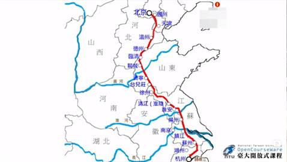

# 人物论——香菱论

 

## 一、 引言

秦可卿与香菱：长相相似，性格温柔和平，而且都展现了一种阶级流动，带着一种家族遗传基因，无论任何发生什么变故不会消磨的特质（在人生发展道路上的一个人不会被消磨的禀赋）。香菱是金陵十二钗副册之首。

固然《红楼梦》是一阙女性集体悲剧交响曲，在这一复调的诸多旋律中，每一个女性都是一条主旋律，都与众不同，这么多主旋律共构成为《红楼梦》这一部庞大的女性悲剧交响曲，但是严格来说每一条旋律所配给的不协和音（命运里的厄运与灾难），在轻重和比例上仍然是大有不同。读者最容易关注、感动林黛玉这位女性角色，作者给她塑造的楚楚可怜的特质，还给她一个还泪的神话，当我们被神话、被浪漫、被生死这些抽象概念所感染的时候，很容易就倾向这个人物。但是作为一个客观批评者（平心静气，不投射主观好恶）来说，黛玉直到死前都是住在潇湘馆里吟诗作词，而潇湘馆是大观园中元妃最喜欢的两大处所之一（黛玉可以优先选择）。其他正册的金钗们都有自己的烦扰、困难要费神费心，但都没有处在社会底层遭受现实生活上很严酷折磨与凌压，受到现实生活的重压（当然也有巧姐）。在小说叙事里，香菱是唯一遭受了命运的重压的待遇。香菱是整个《红楼梦》最不幸，最值得哀婉的一位金钗，她蒙受的苦难最多、最深，而且她受苦的意义也找不到，这一生，来到世上就是为了受苦，这样好的一位女性来到人世，竟然莫名承受苦难，而这些苦难没有任何价值与意义。所以香菱这个人物有可能提供我们一个**神学的反省**：人的存在价值到底是什么？为什么要受这些苦难？没有救赎、没有许诺，没有一个未来的公道的审判等着给你人生的补偿，那么这个人为什么活着，为什么来到人间？生命的本质到底是什么？

香菱是受苦最难、最多的人：原名甄英莲（脂砚斋：真应怜）改名香菱（脂砚斋：相【互相，单方面】怜）。作者一腔的悲悯都在香菱的身上，话石主人《红楼梦本义约编》：“开首借英莲的失散说起……归薛氏曰香菱，香菱读作相怜，后改名秋菱，谓始知并蒂相怜，终似深秋零落也。全部之节目，以英莲起，以英莲终，英莲为群芳之薄命之尤者也，此书之**始末**也。”

“以英莲起”：最出力，最尖锐、最惨烈的强高音为《红楼梦》这部磅礴、澎湃的集体悲剧吹出序奏，让人不忍卒听。

## 二、 “天赋与环境”的贵贱综合版本（上）

第一回，

当日地陷东南，这东南有处曰姑苏城，有城中阊门者，最是红尘中一二等富贵风流之地。这阊门外有个十里街（势力），街内有个仁清巷（人情），巷内有个古庙，因地方狭窄，人皆呼作“葫芦庙”。庙旁住着一家乡宦，姓甄名费（真废）字士隐，嫡妻封氏，情性贤淑，深明礼义。家中虽不甚富贵，然本地也推他为望族了。因这甄士隐禀性恬淡，不以功名为念，每日只以观花种竹、酌酒吟诗为乐，倒是神仙一流人品。只是**一件不足**：年过半百，膝下无儿，只有一女乳名英莲，年方三岁。

人情与势力相互交错。人间道理就是有成有毁，神性人物（独善其身），不能走入世俗，放在大我的群体，不能拯救世界。“封氏，情性贤淑，深明礼义。”，脂砚斋：八字正是写日后之香菱，见其**根源不凡**（与生俱来家族的遗传）。《红楼梦》里认为人是有与生俱来的特质。“甄士隐禀性恬淡，不以功名为念，每日只以观花种竹、酌酒吟诗为乐”。脂砚斋：总写香菱**根基**，**原与正十二钗无异**。家族遗传基因与贵族出身相关（接受阶级观念）。

士隐见女儿越发生得粉装玉琢，乖觉可喜，便伸手接来抱在怀中斗他玩耍一回；又带至街前，看那过会的热闹。

香菱生的可爱。

第十六回，

凤姐：“……香菱的模样儿好还是末则，其为人行事，又比别的女孩子不同，温柔安静，**差不多儿的主子姑娘还跟不上他呢**。”

作为等级制中社会里，上下关系里，有小门小户，有大家大户，而大家大户给予千金的礼仪训练与教养，只有我们这种家族（阀阅大族）的小姐才能比得上。脂砚斋批：“何曾不是主子姑娘，盖卿不知来历也。作者必用阿凤一赞，方知莲卿**尊重**（出身尊贵）不虚。”

第四十八回脂批：“*细想香菱之为人*也，根基不让迎探，容貌不让凤秦，端雅不让纨钗，风流不让湘黛，贤惠不让袭平，所惜者幼年罹祸，命运乖蹇，致为侧室。虽曾读书，不能与林湘辈并驰于海棠之杜耳。然此一人岂可不入园哉。”可见香菱又是一个兼美。尽早读书，对自己的智慧开拓是很重要的。

根基、根源：涉及到家世的阶级与天生的禀赋，显示家族血统的遗传基因的保证以及不为环境所消磨的某一种心灵素质，那是在很幼小的时候耳濡目染带给你的（六岁定终身），人在自从出生后就深深受到家庭各种因素的影响。香菱虚岁五岁被拐。《红楼梦》的高度的决定论：一个人是什么样的基本就被决定的，**人性内涵是被决定的**。香菱本应该列入正册，曹雪芹和脂砚斋认为精神素质也可以透过家族基因而遗传给子女，变成家世背景和阶级归属也会成为一种独特的人品保证。

## 三、 “天赋与环境”的贵贱综合版本（中）

香菱概要：

1. 出身背景。

2. 才性特质：兼美（太晚受到良好的教育）；诗性心灵

3. 曲折人生。

既然曹雪芹和脂砚斋认为精神素质也可以透过家族基因被遗传给子女，变成家世背景和阶级归属也会成为一种独特的人品保证。这个精神素质，除了“深明礼义，情性贤淑”之外，香菱身上有一个非常独特不被恶劣的环境所磨损的**诗性的心灵**。香菱五岁被拐，落入到一个“被打怕了”的暴力笼罩的地狱（战战兢兢地，随时准备挨打，没有教育的环境，至少八年的暴力生活）仍能保有诗性的心灵。有一种不被现实世界所摧残的诗性的向往，有独特的审美心眼才能够体现出来，用世人的眼光欣赏到被人往往忽略的风光。同样像袭人、晴雯、平儿，都来自一般的穷户家庭，后天的成长环境，香菱比他们更不如，在浅俗、悲惨、粗糙的生活里处处领略一份的诗意，而也能够与诗歌相互印证。第四十八回

香菱笑道：“据我看来，诗的好处，有口里说不出来的意思，想去却是逼真的；又似乎无理的，想去竟是有理有情的。”黛玉笑道：“这话有了些意思！但不知你从何处见得？”香菱笑道：“我看他《塞上》一首，内一联云：**‘大漠孤烟直，长河落日圆。**’想来烟如何直？日自然是圆的，这**‘直’字似无理**，**‘圆’字似太俗**。合上书一想，倒象是见了这景的。（视野开阔，用字精准。）要说再找两个字换这两个，竟再找不出两个字来。再还有：‘日落江湖白，潮来天地青。’这‘白’‘青’两个字，也似无理，想来必得这两个字才形容的尽，念在嘴里，倒象有几千斤重的一个**橄榄**似的（回甘，无尽的滋味，“橄榄”评价诗歌意蕴回味无穷始于宋代，融合唐宋诗学）。还有‘渡头馀落日，墟里上孤烟’，这‘馀’字合‘上’字，难为他怎么想来！我们**那年上京来**（金陵到北京，京杭大运河，观察生活），那日下晚便挽住船，岸上又没有人，只有几棵树。远远的几家人家作晚饭，那个烟竟是青碧连云。谁知我昨儿晚上看了这两句，倒象我又到了那个地方去了。（刚刚脱离拐子的魔掌，前途莫定，依然保有欣赏美景的心灵，对眼前的景致有如画的体验，薄暮黄昏的萧瑟之美，水墨画般的点染悠远的景观，这是非平常人的艺术发现。）”

王维的艺术造诣极高，在各方面是最为人推崇的，在长安那时代被公认的第一名诗人。红楼梦的诗学也是个大学问。

　　香菱完全用一片空白的心灵，而这片心灵曾遭受漫长的八年受到那么可怕的折磨、敲击、损害，然而它依然保有那样一种欣赏世界的眼光，这只能用天赋来解释了。非平常人的艺术发现，与生俱来的审美灵魂。罗丹：*世界上*并不缺少美，只缺少发现美的眼睛。一双发现美的眼睛要用多少条件才能获得，香菱什么条件也没有，唯一的依靠就是天赋。比起林黛玉，香菱更具有诗性的心灵，诗人的气质（黛玉自幼被父母爱如珍宝，四岁时就有专门的老师教育，很小就启蒙教育，非寻常的童蒙教育，终身与诗书为伍，潇湘馆布置得像上等的书房，古人的智慧、古人的优秀作品在濡染着她，互相激荡）。香菱五岁被拐，除了先天禀赋，她一无所有，在后天的教育资源上是与林黛玉相比天差地别的，在这样的情况下，香菱展现了在荒野上的一种艺术发现（用诗人的眼光观看世界，作家对外界观察认识所得到的一种独特的感知和领悟），动力来自天赋的力量而且这样的天赋的力量始终没有被恶劣的环境所磨灭。香菱是名副其实的一位天生的诗人。

香菱学诗时好学程度（慕雅女雅集苦吟诗）：“诸事不顾”、“茶饭无心”、“坐卧不定”、“挖心搜胆”、“耳不旁听，目不斜视”、“嘟嘟哝哝直闹到五更天才睡下（宝钗）”、“时时刻刻满心中还是想诗”、“诗魔”（宝钗）。（不疯魔不成活。）

海棠诗社唯一不是主子小姐的成员就是香菱。香菱根源和资质真的是根源不凡。为什么香菱喜欢写诗？不是模仿上流生活的样态。（凡事是模仿的不会到这种疯魔的程度）所以香菱不是附庸风雅。第四十八回，宝玉：“……老天生人再不虚赋情性的。我们成日叹说：可惜他这么个人，竟**俗**了。谁知到底有今日！可见天地至公。”宝玉在她学诗之前，众人对她的评价是“俗”，为她拥有独特的资质而可惜的是“俗”了，而“俗”与“不俗”的判断标准就是爱诗、学诗、作诗，诗就是脱俗的性灵的体现，而且脱俗的性灵的体现与生俱来，透过诗歌的表达让人不俗。诗歌就是一个非常重要的价值判断标准：诗歌大概是中国文学，甚至世界文学最精致优美的文字艺术，而且其中的一切都是锤炼过的精神结晶，折射着现实事物所没有的光辉与美丽，甚至于当它书写的是痛苦、悲哀乃至于丑陋在诗歌里都是升华过了的，所以才会形成一种美的素质，诗也就成为一生困陷在粗糙、浅薄的日常生活中却一直没有被淹没窒息的灵魂（香菱）赖以呼吸新鲜空气的窗口，所以香菱之所以热爱写字、作诗，其实就是表现得想要**超越生存的现实层次以及进入到精神层次的渴望**，那是一种没有被后天可怕的遭遇所消磨的一种飞跃的执着，可是这个飞跃的执着没有机会达到，但是因为宝钗的好意让她进驻大观园终于得到一个精神超升的满足。一个人是应该努力地超越，人性的价值就建立在本能上。

第一回，脂砚斋：*又夹写*士隐实是*翰林文苑*，非守钱虏也，直灌入“慕雅女雅集苦吟诗”一回。

周春《阅红楼梦随笔》：婢女贱流，例入又副册；香菱以**能诗**超入副册，鸳鸯贞烈，竟进于十二钗矣。

第四回，

眉心中原米粒大小的一点胭脂㾵，**从胎里带来的**。

透过香菱展现出人真有一种与生俱来的禀赋，而香菱的天生的诗性心灵，使她在泥泞中活出一种优雅。

## 四、 “天赋与环境”的贵贱综合版本（下）

香菱在不会写字之前能读书的合理性。

宝玉吃了茶便出来，一直往西院来。可巧走到凤姐儿院前，只见凤姐儿在门前站着，蹬着门槛子，拿耳挖子剔牙，看着十来个小厮们挪花盆呢。见宝玉来了，笑道：“你来的好，进来，进来，替我写几个字儿。”宝玉只得跟了进来。到了房里，凤姐命人取过笔砚纸来，向宝玉道：“大红妆缎四十匹，蟒缎四十匹，各色上用纱一百匹，金项圈四个。”宝玉道：“这算什么？又不是账，又不是礼物，怎么个写法儿？”凤姐儿道：“你只管写上，**横竖我自己明白就罢了**。”宝玉听说，只得写了。 

王熙凤是能看得懂字的。

凤姐因当家理事，每每看帖看账，**也颇识得几个字了**。那帖是大红双喜笺，便看上面写道：上月你来家后，父母已觉察了。但姑娘未出阁，尚不能完你我心愿。若园内可以相见，你可托张妈给一信。若得在园内一见，倒比来家好说话。千万千万！再所赐香珠二串，今已查收。外特寄香袋一个，略表我心。千万收好。表弟潘又安具。……凤姐笑道：“这就是了。”因说：“我念给你听听。”说着，从头念了一遍，大家都吓一跳。

书写与辨认字是两种能力。香菱是先读诗，再学写字，是合理的。

诗，不包含新诗。曹雪芹时代没有新诗；格律很重要。古代诗词在格律都有要求（汉代的大赋），形式不是压抑才华、能力、灵感的呈现，是帮助你更加去锤炼，只有灵感做不到的东西，同样的道理礼教、法律也不是压抑人的个性、人的性情，这也是全然的错误的观点，这是人类学家玛丽道格拉斯已经提出的，人与社会并不是对立的，法律、道德、伦理对个性是并不是压抑的，这是二元对立的错误观念。维克托˙日尔蒙斯基（Vktor Zhirmunskij）：“每一类有其独特规律的艺术，每一种诗歌体裁，作为特殊结构课题，严格限制着艺术成果的机会，对于诗人保持着其意义，不是束缚，**而是激励着诗人的创造性劳动**。”格律在中国古代诗歌发展史上三四百年才奠定的，单单是清晰鲜明的意象不能创造伟大的诗作。新诗就算不考虑自己的问题，也得考虑传播的问题，能背诵的新诗就很少了。

香菱是秦可卿重像。第七回

**只见香菱笑嘻嘻的走来**，周瑞家的便拉了他的手细细的看了一回，因向金钏儿笑道：“倒好个模样儿，竟有些象咱们东府里的小蓉奶奶的品格儿。”

第四回，门子

只打了个落花流水，生拖死拽把个英莲拖去，如今也**不知死活**。这冯公子空喜一场，一念未遂，反花了钱，送了命，岂不可叹！

香菱被薛蟠带走后的第一次出场（日常情况）“笑嘻嘻的”，说明她内心欢悦，当时生活样态还不错的。

香菱模样儿好：第四回薛蟠“见英莲生得不俗，立意买了。”非凡出色的容貌。第六十回，

贾琏笑道：“正是呢。我才见姨妈去，和一个年轻的小媳妇子刚走了个对脸儿，长得好**齐整模样**儿。我想咱们家没这个人哪，说话时问姨妈，才知道是打官司的那小丫头子，叫什么香菱的，竟给薛大傻子作了屋里人。开了脸，越发出挑的标致了。那薛大傻子真玷辱了他！”

第七十九回，

又见有香菱这等一个**才貌俱全**的爱妾在室，越发添了“宋太祖灭南唐”之意。

香菱学诗后、学字后增添了才气。可见作者用词之精准。

人与社会，伦理道德与知识不是蒙蔽人的本心，失去赤子之心，社会提供给我们文字表达系统以及其中蕴含过去的许许多多的智慧结晶从而提升自我。

第十六回，

香菱模样儿好还是末则，其为人行事，却又比别的女孩不同，温柔安静。

晴雯对袭人的态度与黛玉对宝钗态度不同。外貌、性格相同，命运不同，甚至人格特质的不同，这就叫分割复制。

香菱与秦可卿重像关系：分割复制（灵与肉的一种互补）。假如说秦可卿是偏于滥情的而淫流于形而下层次地这样一个人，而香菱就是灵的飞升，她爱诗，她努力追求灵魂的精神世界。

**命运的转折点：从甄英莲到无名氏**

秦可卿与香菱二人的命运发展刚好形成一种反向对立的关系，秦可卿在阶级流动是一种向上的流动，相对而言香菱就是向下流动。

香菱一辈子有命名的好几个阶段：甄英莲、香菱、秋菱，《红楼梦论稿》：“通过这个‘薄命女’的三个名字的变化，已经可以看出一个人的曲折多难得的一生。”当然也不能忽略一个中间一个阶段，全盘性失忆，无名氏（当做一个货物贩卖，牟利，无我，任人宰割），从四个名字着手研究香菱的一生，曲折多难的一生。香菱向下流动，来自命运的恶意，降临在女孩的身上。第一回，

士隐见女儿越发生得粉装玉琢，乖觉可喜，便伸手接来抱在怀中逗他玩耍一回；又带至街前，看那过会的热闹。方欲进来时，只见从那边来了一僧一道。那僧**癞头跣足**，那道**跛足蓬头**，疯疯癫癫，挥霍谈笑而至。及到了他门前，看见士隐抱着英莲，那僧便大哭起来，又向士隐道：“施主，你把这有命无运、累及爹娘之物抱在怀内作甚！”士隐听了，知是疯话，也不睬他。那僧还说：“舍我罢！舍我罢！”士隐不耐烦，便抱着女儿转身。才要进去，那僧乃指着他大笑，口内念了四句言词，道是：

**惯养娇生**笑你痴，**菱**花空对**雪**澌澌。好防佳节元宵后，便是烟消火灭时。

士隐听得明白，心下犹豫，意欲问他来历。只听道人说道：“你我不必同行，就此分手，各干营生去罢。三劫后我在北邙山等你，会齐了同往太虚幻境销号。”那僧道：“最妙，最妙！”说毕，二人一去，再不见个踪影了。

“**菱**花空对**雪**澌澌”，暗示香菱将嫁入贾家，空对：终究是落空的。

“真是闲处光阴易过，倏忽又是元宵佳节。”元宵节，明清时小说最爱用的节庆。繁华到消散，立刻消失。

士隐命**家人**霍启抱了英莲去看社火花灯，半夜中，霍启因要小解，便将**英莲放在一家门槛上坐着**。待他小解完了来抱时，那有英莲的踪影？急得霍启直寻了半夜，至天明不见，那霍启也就不敢回来见主人，便逃往他乡去了。

家人：家下人。太过粗心，即使不被拐子拐走，也有可能会发生其他事情，比如踩踏事件之类的。霍启：祸起，所托非人，自己珍爱的东西要脱给妥当的人，就会付出惨烈代价。

夫妻二人半世只生此女，一旦失去，岂不思想，因此昼夜啼哭，几乎不曾寻死。堪堪一月，士隐已先得病，夫人封氏也因思女构疾，日日请医问卦。

简短的两句话带过，背后都是血与泪，从此就是活在地狱里了，一直到解脱为止，这个解脱对于甄士隐来说就是《好了歌》，而对于妻子那就是永世不得解脱。其中的无尽辛酸，只有经过的人才可以体会。这样的打击一定会改变一个人，有可能会从地狱走出来，变得更温暖、更体贴、更愿意帮助人的人，可能一蹶不振也有。苦难是化了妆的祝福。这种经历无疑是惨烈的，内心有无尽的辛酸与惨痛，人是活在地狱里，而又挣扎不脱内心万重折磨，内心被摧毁得四分五裂，再也爬不起来。这是与内心凿开的空洞搏斗，而且注定必输无疑。这种例子应该更多。因此人真的要慈悲一点，因为每个人都活得都不容易。而且大多数外表的东西看不得，也许表面的张狂是为了掩饰内心的自卑和空虚，所以也不要太快讨厌一个人。

霍启，造成香菱命运转折关键人物，谐音灾祸从此而起。香菱被拐自拐卖的经历，葫芦庙的门子讲述来龙去脉：

雨村听说，便笑问门子道：“这样说来，却怎么了结此案？你大约也深知这凶犯躲的方向了？”门子笑道：“不瞒老爷说，不但这凶犯躲的方向，并这拐的人我也知道，死鬼买主也深知道，待我细说与老爷听。这个被打死的是一个小乡宦之子，名唤冯渊，**父母俱亡，又无兄弟**，**守着些薄产度日**，年纪十八九岁，酷爱男风，最厌女子。这也是前生冤孽，可巧遇见这丫头，**他便一眼看上了**，立意买来作妾，设誓不近男色，也不再娶第二个了。所以**三日后方进门**。谁知这拐子又偷卖与薛家，他意欲卷了两家的银子逃去。谁知又走不脱，两家拿住，打了个半死，都不肯收银，各要领人。那薛公子便喝令下人动手，将冯公子打了个稀烂，抬回去三日竟死了。这薛公子原择下日子要上京的，既打了人夺了丫头，他便没事人一般，只管带了家眷走他的路，并非为此而逃：这人命些些小事，自有他弟兄奴仆在此料理。这且别说，老爷可知这被卖的丫头是谁？”雨村道：“我如何晓得？”门子冷笑道：“这人还是老爷的大恩人呢！他就是葫芦庙旁住的甄老爷的女儿，小名英莲的。”雨村骇然道：“原来是他！听见他自五岁被人拐去，怎么如今才卖呢？”

冯渊（一个人）突然完全改变自己，可能不是一件好事。古代婚姻制度身份内婚制，要求官民不婚、士庶不婚、良贱不婚。冯渊不可以明媒正娶，香菱是黑户，在礼仪上不可做正妻，但是愿意从一而终（男性对女性是难能可贵），因此为了表示真情，愿意三天后进门的礼仪对待。以礼表情，说明礼教和情并非是完全对立的。

香菱对此的反应，只因为有人要买她，香菱自叹：“我今日的罪孽满了。”（《牡丹亭》情节设置不合人情。）香菱真的活得太辛苦了，在拐子监控下生不如死、苦不堪言。

然而三天时间给了拐子另卖他人的时间，使得冯渊惨死。冯渊三天的郑重其事却给自己带来这样的灾难。

薛家进京是通过京杭大运河走的：

 

金陵（南京）——镇江——通州，林黛玉进京路线也是通过这条水路的。

门子道：“这种拐子单拐幼女，**养至十二三岁**，度其容貌，带至他乡转卖。当日这英莲，我们天天哄他玩耍，极相熟的，**所以隔了七八年**，虽模样儿出脱的齐整，然大段未改，所以认得，且他眉心中原有米粒大的一点胭脂斑，从胎里带来的。偏这拐子又租了我的房子居住。那日拐子不在家，我也曾问他，他被拐子是打怕了的，万不敢说，只说拐子是他的亲爹，因无钱还债才卖的。哄之再四，他又哭了，只说：‘我原不记得小时的事！’这无可疑了。”（第四回）

拐卖事件是非常写实的事件，清代史料的纪录：

清雍正三年湖北巡抚法敏所奏：通又有湖南拐子，潜匿城市，诱拐人家子女，贩卖远方，使人骨肉分离，最为可恶。

在清代其他的安徽、浙江等地各地都类似的报告，而且更有一种集中性，就是人口密集的城市。

乾隆二十三年，陈宏谋自苏州之报告：“苏城五方杂处， 烟户稠密，拐窃之案，向所不免。更有一种外来拐犯，以药迷人，凡遇幼孩，用药一弹，饵以药饼，幼孩心迷，不复反顾。拐到子女，凌虐残忍，最为惨毒。”

曼素恩《晚明至盛清时的中国妇女》：“隶属于苏州‘屯户’阶级的人口贩子，四处留意贫穷人家的美貌女孩，以便出价收购。人口贩子在自己家中抚养这些女孩，等她们长大以后，再卖到某个遥远的省份充当小妾或奴婢。”

被拐子控制的这个阶段对于当事人是很残忍的，对于一个人来说是影响深远的。这七八年在一个人人生观世界观形成很重要的阶段，但这一阶段对香菱带来的影响，既没有扭曲香菱内在的平衡，也没有消磨香菱诗性的性灵，而是使她全盘性失忆（唯一负面影响）。全书一共出现四次忘记幼时的事：

第四回，

我又哄之再四，只说：“我不记得小时之事了。”

第七回，

周瑞家的又问香菱：“你几岁投身到这里？”又问：“你父母在那里呢？今年十几了？本处是那里的人？”香菱听问，摇头说：“不记得了。”

第六十二回，

（宝玉）暗想：“可惜这么一个人，没父母，连自己本姓都忘了，被人拐出来，偏又卖给这个霸王。”

第七十九回，

一日，金桂无事，因和香菱闲谈，问香菱家乡父母。香菱皆答“忘记”，金桂便不悦，说有意欺瞒了他。

香菱忘记父母家乡，有两个理由，香菱太小了。童年记忆只有很少的一部分（零零星星的一些片段）自己能记得，之所以会觉得自己记得很完整是因为有赖于成长过程中相关的亲友不断地复述那件事。然后就会记得更清楚了、更完整了。法国人类学家莫里斯：“如果我们仔细一点考察一下我们自己是如何记忆的，我们就肯定会认识到，正是当我们的父母、朋友或者其他什么人向我们提及一些事情时，我们对这些事情的记忆才会最大限度的涌入我们的脑海。”所以同样的道理童年的记忆基本上是在这样的情况下才会所谓记得很清楚。所以如果没有周围的亲友因为各种因缘际会不断的提到这些事情，你其实大概会真的忘掉。香菱作为个孤儿，五岁就完全没有任何亲人的支撑网，没有相关人员的提醒和重复更难留住相关的记忆。

第七十七回，

却说这晴雯当日系赖大买的。那时晴雯才得十岁，时常赖嬷嬷带进来，贾母见了喜欢，故此赖嬷嬷就孝敬了贾母。……这晴雯进来时，也不记得家乡父母。

而且香菱在五岁以后七八年时间又活在一种高压统治，充满了恐惧，时时刻刻都得应付眼下的莫名其妙毒打的苦难。一个小孩子的精力又有多少，都来应付眼前的苦难，即便有少数模糊的记忆也很快就会忘记。

还有另外的一份精神医学上的原因：创伤后压力症候群（post-traumatic stress discover，PTSD）。一个人突如其来受到很大的冲击之后，会出现全盘性的失忆。

为了应付没有办法应付的人的内在机制会发生许多特殊的效应。（应用心理学解释文本要谨慎，不可过度。）创伤后压力症候群的其中一种的一个状态相似，孩童时遭受心理或生理的虐待、暴力攻击，这些压力一定要极度且很突然地造成强而有力的主观反映（当事人会强烈的强烈的害怕、无助、惊恐），使人情感、自尊受伤太深，到了自我摧毁的地步，会影响一个人自我存在的意志与能力，于是心里的自我防卫机制会不知不觉发动起来，心理自我防卫机制产生一种负向的防卫。其中的一种负向的防卫就是“解离”（dissociation）的疾患（一种心理现象，把会引起人痛苦的意识活动或记忆从整个精神活动中“分解离开”出来，以保卫自我。经由这种解离之后整个人格会暂时失去他的整体性，就会出现记忆、意识、自我认同或其他人格上的变化）。其中一种解离的亚型就是解离性失忆症/（Dissociative Amnesia）又称心因性失忆症，心理因素上的引起的，其中如果忘记之间前后的状况，叫做局部性失忆症，对个人的整个生活背景，包括姓名、家人、住址都完全忘记，那就成为“全盘性失忆”。香菱在孩童时期遭受身体、心理暴力攻击与虐待的阴影之下，而其这种冲击极度的、相当突然的，五岁前是父母的掌上明珠，从没有这样的经验，对她强烈的害怕、无助、惊恐状态，引发了心理自我防卫机制产生一种负向的防卫解离，形成解离性失忆症中的全盘性失忆。第七回，脂砚斋：伤痛之极，亦必如此收住，方妙。读者应该明白有许多人在艰苦的状态下为了庄严地活下去，是多么艰难、多么的辛苦。香菱在薛家的状态仅亚于原生家庭，是能够领略到幸福的滋味的，是有意识、能领略生活滋味中幸福阶段。

香菱因为被拐而产生创伤后的精神伤害，并且经由解离造成个人对个人的整个生活背景，包括姓名、家人、住址都完全忘记的全盘性失忆，但是因为她的家族遗传以及天生禀赋支撑让她度过可怕的阶段，她的心理创伤并没有严重到真正的疾病的程度，这一点非常难能可贵。（如果林黛玉被拐会怎样？）（心理疾病可能出现的新疾病失智、失控）香菱回到正常秩序的生活也能回归正常。

## 五、 人生主场的曲折：从香菱到秋菱

冯渊应该给香菱全部的幸福，但是阴错阳差香菱跟了薛蟠。薛蟠是一个可爱的人。

《红楼梦》中大家子弟一定会三妻四妾，这是无法避免的婚姻形态，事实上林黛玉也接受、认同这个事实。苏轼是在一边和朝云在一起，一边在思念妻子，他的深情为后人称道。不能用现在的爱情观、婚姻观来否定古人的深情。当然从现在的价值观、爱情观来看，嫁给冯渊比嫁给薛蟠强，但是这也未必。现在的爱情观是很不错的，但是人应该放宽眼界，用更宽广的角度来看世界能看到更多的可能性。香菱在“香菱”阶段是相当幸福的。“菱花空对雪澌澌”，香菱是在人生的最后阶段遭到来自夏金桂的欺压，导致一切都是落空的。从逻辑角度不能从结果来反推过程，结果的幸与不幸不能反推过程的幸与不幸。

香菱在薛家第一次出场是“笑嘻嘻”（第七回）的，明朗而快活，一点没有苦闷忧愁，与在拐子那里是很大的区别。周围人的都是很怜惜的她的。薛蟠对香菱是很喜爱的（第十六回）：

贾琏笑道：“正是呢。我才见姨妈去，和一个年轻的小媳妇子刚走了个对脸儿，长得好齐整模样儿。我想咱们家没这个人哪，说话时问姨妈，才知道是打官司的那小丫头子，叫什么香菱的，竟给薛大傻子作了屋里人。开了脸，越发出挑的标致了。那薛大傻子真玷辱了他！”凤姐把嘴一撇，道：“哎！往苏杭走一趟回来，也该见点世面了，还是这么眼馋肚饱的。你要爱他，不值什么，我拿平儿换了他来好不好？那薛老大也是吃着碗里瞧着锅里的，这一年来的时候，他为香菱儿不能到手，和姑妈打了多少饥荒。姑妈看着香菱的**模样儿好**还是小事，因他**为人行事**，又比别的女孩子不同，**温柔安静**，**差不多儿的主子姑娘**还跟不上他，才**摆酒请客**的费事，明堂正道给他做了屋里人。——**过了没半月，也看的马棚风一般了**。”

他为香菱儿不能到手，和姑妈打了多少饥荒：薛蟠苦求，磨缠薛姨妈。（娇杏嫁给贾雨村，是连夜送去的）摆酒请客，娶妾的程序里最有心的一种。薛姨妈非常疼爱香菱，第八十回，因为薛蟠要打香菱，薛姨妈出面斥责动怒薛蟠（仅有两次对薛蟠动怒）。清虚观打醮时，香菱也有小丫头臻儿伺候的。香菱在薛家是她最好的生活样态，在完全没有法律保障之下（被拐成为黑户）最好的待遇。“马棚风”吹过马棚的风，稀松平常，相对一开始而言，从绚烂归于平淡，从浓情到平淡。第八十回，

香菱笑道：“奶奶原来不知：当日买了我时，原是老太太使唤的，故此姑娘起了这个名字。后来伏侍了爷，就与姑娘无涉了。如今又有了奶奶，越发不与姑娘相干。且姑娘又是极明白的人，如何恼得这些呢？”

薛蟠买回来是给薛姨妈使唤了。香菱服侍薛姨妈是有一年的时间。薛蟠是很有孝心，尊重母亲的人。这样的行为符合贵族世家的伦常教养，对父母亲、长辈由衷彻底的孝，是呼吸第一口空气的道德熏染，是微妙的环境影响。薛蟠纳妾是合乎伦理程序进行的，贾赦也是如此的。贾雨村的行为与薛蟠非常不一样，脂砚斋认为贾雨村是暴发户。

男女之情最终会沉淀为更为厚实的亲情的模式，将爱情升华，香菱是以这样的样态被薛蟠所爱。第二十五回，

别人慌张自不必讲，*独有薛蟠更比*诸人忙到十分去：又恐薛姨妈被人挤倒，又恐薛宝钗被人瞧见，又恐香菱被人臊皮，——知道贾珍等是在女人身上做功夫的，因此忙的不堪。

香菱在薛蟠心中的地位是应该被保护一员，是家庭成员中的一个。爱情可以如同水，让生命的得到滋养，化入生命中的，宝黛爱情就是如此。

第七十九回，夏金桂为什么折磨香菱，因为香菱是薛蟠的“才貌俱全的爱妾”。

第八十回，（薛蟠）赶着秋菱踢打了两下。香菱**虽未受过这气苦**（夏金桂嫁进来之前没有的），既到了此时，也说不得了，只好自悲自怨，各自走开。后来又有各种事端，薛姨妈提出将香菱卖掉，薛宝钗的插手，庇护了香菱。如果香菱被薛蟠欺压，能离开薛蟠应该是庆幸的（知道冯渊要卖的反应），高兴地，可是香菱在与薛蟠脱离关系的反应：“对月伤悲，挑灯自叹”，是被弃的怨妇的反应。薛姨妈、薛宝钗对香菱是很好的，薛宝钗为香菱起名，在第八十回提到：

香菱道：“不独菱花香，就连荷叶、莲蓬，都是有一般清香的。但他原不是花香可比，**若静日静夜或清早半夜细领略了去**，那一股清香比是花都好闻呢。就连菱角、鸡头、苇叶、芦根得了风露，那一股清香也是令人心神爽快的。”

这样的感受审美眼光极高，领悟力极强，有可能是来自薛宝钗。

第三十八回，大观园藕香榭旁边的联额：芙蓉影破归兰桨，**菱藕香**深写竹桥。大观园的联额后来也有**姐妹们**一起拟定补充的。这个对联有可能是薛宝钗来拟定的。

《红楼梦》的女子都是很写实的。香菱在拐子手里是艰苦的，甚至挨饿受冻，一朝进到薛家，在物质上有了极大的飞跃，对于一个小女孩是极大的抚慰。袭人：“…幸而卖到这个地方，吃穿和主子一样，也不朝打暮骂。”（第十九回）香菱是真正的妾，物质待遇肯定比一般的丫头高，第六十二回提到：

香菱道：“这是前儿琴姑娘带了来的，**姑娘**做了一条，我做了一条，今儿才上身。”

“我**虽有几条新裙子**，都不合这一样；若有一样的，赶着换了也就好了，过后再说。”

衣饰品级与薛宝钗同级。后来用袭人的衣服来掩饰，袭人的待遇挺高的。香菱如果嫁到冯家，就不会有这样的待遇，类似于母亲的薛姨妈，类似于姐妹的宝钗，以及对她很好的薛蟠。薛家给了香菱温暖、安全、保护、丰饶、富足，所以后来第八十回，被夏金桂排挤，薛姨妈决定卖掉香菱，香菱的反应：

香菱早已跑到薛姨妈跟前，**痛哭哀求**，只不愿出去，情愿跟姑娘。

夏金桂，出身于薛家门当户对的，出现这样的结果，是因为被溺爱，教养的缺失的结果。贵族世家在教育不当的情况下，没有子嗣继承的情况，导致整个家族的毁灭，感慨末世的悲哀。贵族世家到了末世时候，没有以一个严格的正规的教育训练他们的子弟，给予溺爱就会产生一个败坏家族的不孝子出来，夏金桂是其中最可怕的一种。

第五回，人物判词

却画着一株桂花，下面有一池沼，其中**水涸泥干**，**莲枯藕败**。后面书云：根并荷花一茎香，平生遭际实堪伤。自从两地生孤木，致使香魂返故乡。

藕败，双关配偶，夫妻。恩爱被毁灭。平生遭际：被拐、被夏金桂折磨。“两地生孤木”，拆字，“桂”字。“返故乡”：大去。六十三回，“连理枝头花正开”，冰山原则手法来暗示香菱的命运。

惜春

朱淑贞

连理枝头花正开，妒花风雨便相催。

愿教青帝常为春，莫遣纷纷点翠苔。

青帝：春神，夫为妻天，希望自己能永远幸福。没有得到保护，最终“纷纷点翠苔”。香菱的结果就是“水涸泥干、莲枯藕败”。第八十回

虽然在薛蟠房中几年，皆因血分中有病，是以并无胎孕。今复加以气怒伤肝，内外折挫不堪，竟酿成干血之症，日渐羸瘦，饮食懒进，请医服药不效。

香菱与薛蟠的关系：

香菱对薛蟠是有深深的依恋的。香菱在进入薛家之前是一无所有的，她演绎一种与其他大家闺秀不同的爱情类型。

## 六、 独特的爱情类型（上）

用一般常理来看，才貌俱全的香菱不会爱上粗俗的薛蟠。宝玉就是这样认为，第六十二回：

（宝玉）暗想：“可惜这么一个人，没父母，连自己本姓都忘了，被人拐出来，偏又卖给这个**霸王**。”

第十六回，贾琏认为：

那**薛大傻子**真玷辱了他。

背后私底下的评论才是最真实的，通常不会当着面说的，这也是人性，背后吐真言，真言通常就不会很好听。贾琏平日与薛蟠关系是很好的，可是客观评价他就是个大傻子，不会算计，有点傻气的人。对于一个事件的评论是有很多微妙的，对于一个女性嫁给一不怎么样的男人的事情时，通常是男性比较爱发出评价，是有一点酸葡萄的心理，觉得我又不比你差，为什么我就碰不到女神。（性别心理）

二知道人：“妒恨月老无知…玉碗金盆贮狗屎。”谢肇淛（明）：痴汉偏骑骏马走，巧妻常伴拙夫眠。唐代王维卖饼者妻的故事，内外具美的女性爱上一个薄幸的小贩。

香菱到底爱不爱薛蟠？如果爱，建立在怎样的条件上？

薛蟠是喜爱香菱的，在夏金桂眼里是“爱妾”，而且有许多夫妻恩爱的譬喻，第六十二回斗草时的“夫妻蕙”

香菱道：“一个剪儿一个花儿叫做‘兰’，一个剪儿几个花儿叫做‘蕙’。上下结花的为‘兄弟蕙’，并头结花的为‘夫妻蕙’。我这枝并头的，怎么不是‘夫蕙’？”豆官没的说了，便起身笑道：“依你说，要是这两枝一大一小，就是‘老子儿子蕙’了？若是两枝背面开的，就是‘仇人蕙’了？**你汉子去了大半年，你想他了，**便拉扯着蕙上也有了夫妻了，好不害臊！”香菱听了，红了脸，忙要起身拧他，笑骂道：“我把你这个烂了嘴的小蹄子！满口里放屁胡说。”

第六十二回

香菱便掣了一根**并蒂花**，题着“联春绕瑞”，那面写着一句旧诗，道是：**连理枝头花正开**。注云：“**共贺掣者三杯**，大家陪饮一杯。”

人与人的关系是变化的，薛蟠与柳湘莲的感情从仇人到生死兄弟。薛蟠被打，香菱出于情感对于一个人，自己爱的人受伤，对也好错也罢，是比那个人更痛。真正爱一个人，不会鼓励一个人往前冲，尤其是在冲的过程有可能受到伤害、付出代价，关心的是痛不痛，幸福与否，第一优先考虑是他的幸福。香菱哭到眼睛都肿了。第三十四回，宝玉挨打，黛玉哭到眼睛肿得如桃儿一般，极度呈现黛玉痛在心里的反应。香菱真心爱薛蟠的，犹如黛玉爱宝玉一般，爱深情切的。因此香菱离开薛蟠日渐枯萎，失去了快乐。

**爱情为什么会发生？**

帕斯卡（Blaise Pascal，1623-1662）：“总而言之，我们爱的不是人，而是他的素质，我们不必嘲笑有些人老是要求别人尊重他的地位和官职，因为我们爱一个人也都是爱他不过占有一时的那些素质。”

爱一个人就是爱他短暂存在一时的品质，当这些品质消失后，就不会爱他了，不必嘲笑有些人老是要求别人尊重他的地位和官职，尤其是他自己奋斗来的，那就是他的品质，是他的自我价值的一部分。

香菱爱上薛蟠，是因为她全部的人生、全部的价值都在薛蟠身上。香菱是薛蟠从拐子手上买的，进入到薛家，这样的际遇与反差比较吻合：斯德哥尔摩症候群（Stockholm syndrome）。（不可过度解读，小说人物是虚构的。）

斯德哥尔摩症候群，1973年银行抢劫，

1973年8月23日，两名有前科的罪犯Jan Erik Olsson与Clark Olofsson，在意图抢劫瑞典首都斯德哥尔摩市内最大的一家银行失败后，挟持了四位银行职员，在警方与歹徒僵持了130个小时之后，因歹徒放弃而结束。然而这起事件发生后几个月，这四名遭受挟持的银行职员，仍然对绑架他们的人显露出怜悯的情感，他们拒绝在法院指控这些绑匪，甚至还为他们筹措法律辩护的资金，他们都表明并不痛恨歹徒，并表达他们对歹徒非但没有伤害他们却对他们照顾的感激，并对警察采取敌对态度。更甚者，人质中一名女职员Christian竟然还爱上劫匪Olofsson，并与他在服刑期间订婚。这两名抢匪劫持人质达六天之久，在这期间他们威胁受俘者的性命，但有时也表现出仁慈的一面。在出人意料的心理错综转变下，这四名人质抗拒政府最终营救他们的努力。

角色认同防卫机制，人质情结。四个条件：受害者对犯罪者的行为予以合理化，犯罪被害者反过来帮助犯罪者。受害者有巨大的危机，恐慌无助，给予小小的恩惠，封闭隔绝的情况下。

薛蟠是出价购买，不是巧取豪夺，香菱不是被薛蟠绑架。香菱的处境与他也有相似，不平等权力关系里的认同体验，不限于犯罪学了，可以运用于广泛的实际生活。薛蟠与香菱二人也有，香菱在被拐的过程是被孤独的囚禁与暴力对待，处在巨大的危机，薛蟠买走她，给了他一个很好的环境，其次香菱在传统的礼教生活中并不会接触外界的性别隔绝。香菱也并不是屈服的，而是高度认同薛家是她的唯一归宿，薛蟠是她最深爱的依靠。

斯德哥尔摩症候群最早的心理根据，新生婴儿对自己靠近最有力的成年人形成一种情绪依附，这个依附关系会效应最大化周边成人让他至少能生存的成人。（进化心理学）

人的心理非常微妙，复杂多端。

薛蟠的优点很多。

1. 孝顺。

薛蟠是一个很冲动的人。（晴雯也是这样。）

2. 外貌。

举止粗俗，缺乏气质。

一顿饭的工夫，只见薛蟠骑着一匹马，远远的赶了来，**张着嘴，瞪着眼**，**头似拨浪鼓一般**，不住左右乱瞧。及至从湘莲马前过去，只顾往远处瞧，不曾留心近处。

薛蟠应该魁梧端正，充满男子气概。

第七十九回

宝玉问道：“定了谁家的？”香菱道：“因你哥哥上次出门时，顺路到了个亲戚家去。这门亲原是老亲，且又和我们是同在户部挂名行商，也是数一数二的大门户。前日说起来时，你们两府都也知道的：合京城里，上至王侯，下至买卖人，都称他家是‘桂花夏家’。”宝玉忙笑道：“如何又称为‘桂花夏家’？”香菱道：“本姓夏，非常的富贵。其余田地不用说，单有几十顷地种着桂花，**凡这长安那城里城外桂花局，俱是他家的，连宫里一应陈设盆景，亦是他家供奉**。因此才有这个混号。如今太爷也没了，只有老奶奶带着一个亲生的姑娘过活，也并没有哥儿弟兄。可惜他竟一门尽绝了后。”宝玉忙道：“咱们也别管他绝后不绝后，只是这姑娘可好？你们大爷怎么就中意了？”香菱笑道：“一则是天缘，二来是‘情人眼里出西施’。当年时又通家来往，从小儿都在一处玩过。叙亲是姑舅兄妹，又没嫌疑。虽离了这几年，前儿一到他家，夏奶奶又是没儿子的，**一见了你哥哥出落的这么，又是哭，又是笑，**竟比见了儿子的还胜。又令他兄妹相见。**谁知这姑娘出落的花朵似的了**，在家里也读书写字，所以你哥哥当时就一心看准了。连当铺里老伙计们一群人，遭扰了人家三四日。他们还留多住几天，好容易苦辞，才放回家。你哥哥一进门，就咕咕唧唧求我们太太去求亲。我们太太原是见过的，又且门当户对，也依了。和这里姨太太凤姐姐商议了打发人去一说，就成了。只是娶的日子太急，所以我们忙乱的很。我也巴不得早些过来，又添了一个做诗的人了。”宝玉冷笑道：“虽如此说，但只我倒替你担心虑后呢。”香菱道：“这是什么话？我倒不懂了。”宝玉笑道：“这有什么不懂的？只怕再有个人来，薛大哥就不肯疼你了。”香菱听了，不觉红了脸，正色道：“这是怎么说？素日咱们都是厮抬厮敬，今日忽然提起这些事来。怪不得人人都说你是个亲近不得的人。”

行商：广州十三行商人，不是一般商人。十六回王家也是带有十三行的行迹，贾家当年修海塘。

夏家看上薛蟠除了门当户对，还有长相。

一见钟情风险太大，夏氏长得漂亮，却看不到她内在的风雷之性，胸中的经纬。第七十九回，孙绍祖“生得相貌魁梧，体格健壮。”

3. 性格。

里外如一。第二十八回，

云儿又道：“女儿愁，妈妈打骂何时休？”薛蟠道：“前儿我见了你妈，还嘱咐他，不叫他打你呢。”

一点没有强迫的金钱交易，且对她有疼惜。当初在学堂也是你情我愿的金钱交易。对柳湘莲流露出纠缠不堪的举动，并没有强迫对方。第四十七回

口内说道：“原来是两家情愿，你不依，只管好说，为什么哄出我来打我？”一面说，一面乱骂。

薛蟠某种意义上光明坦荡的，不巧取豪夺。

就香菱而言，是他出钱买的。闹出人命，是因为手下下手太重。过失杀人与谋杀罪的区别，纵容手下，不加以约束，更重要的是，

第四回，

谁知自此间住了不上一月光景，贾宅族中凡有的子侄俱已认熟了一半，都是那些纨袴气习，莫不喜与他来往。今日会酒，明日观花，甚至聚赌嫖娼，渐渐无所不至，引诱的薛蟠比当日更坏了十倍。

“薛蟠比当日更坏了十倍”：**今日会酒，明日观花**，聚赌嫖娼。

第二十六回，

那宝玉便和他说些没要紧的散话：又说道谁家的戏子好，谁家的花园好，又告诉他谁家的丫头标致，谁家的酒席丰盛，又是谁家有奇货，又是谁家有异物。

宝玉也是纨绔子弟。

仔细评估，薛蟠最早应该是比较质朴的人，薛蟠的坏是依照对贵族家子弟的高标准而言的：教养与品德、经史方面文艺和学术修养，从六朝以来像王谢大家族整个家庭运作就可以获得印证，一定要是“佳子弟”才能把家族一代代传承下去，而不会落入到富不过三代的宿命，所以只有“富”是没有用的，还得有“贵”，贵就是心灵和精神的高度要求，要有贵族的责任感，对社会起到示范作用，对上、对长辈实践孝道，对下要有各方面的典范的示范，成为下一代、下下一代一种指引，这都不是普通人能做到的。所以，贵族子弟教养是非常难得，标准很高。“当日的坏”就是以高标准的道德规范而言，薛蟠当然不够格，意气骄奢，大族出身没有受好的教养的常有的弊病，恨铁不成钢的感慨。

贾琏，贾政理家代言人，对贾家贡献程度也很大。

二十二回，脂批：“比例引的极是，无怪贾政委以家务也。”

第四十八回，

平儿笑道：“老爷把二爷打的动不得，难道姑娘就没听见吗？”宝钗道：“早起恍惚听见了一句，也信不真。我也正要瞧你奶奶去呢，不想你来。又是为了什么打他？”平儿咬牙骂道：“都是那什么贾雨村，半路途中那里来的饿不死的野杂种！**认了不到十年**，生了多少事出来。今年春天，老爷（贾赦）不知在那个地方看见几把旧扇子，回家来，看家里所有收着的这些好扇子，都不中用了，立刻叫人各处搜求。谁知就有个不知死的冤家，混号儿叫做石头呆子，穷的连饭也没的吃，偏偏他家就有二十把旧扇子，死也不肯拿出大门来。**二爷好容易烦了多少情**，见了这个人，说之再三，他把二爷请了到他家里坐着，拿着这扇子来略瞧了一瞧。据二爷说，原是不能再得的，全是湘妃、棕竹、麋鹿、玉竹的，皆是古人写画真迹。因来告诉了老爷，便叫买他的，要多少银子给他多少。偏那石呆子说：‘我饿死冻死，一千两银子一把，我也不卖。’**老爷没法子**，天天骂二爷没能为。**已经许他五百银子**，先兑银子，后拿扇子，他只是不卖，只说：‘要扇子先要我的命！’姑娘想想，这有什么法子？（审美品位极高，不巧取豪夺。）谁知那雨村没天理的听见了，便设了法子，讹他拖欠官银，拿他到了衙门里去，说：‘所欠官银，变卖家产赔补。’把这扇子抄了来，做了官价，送了来。那石呆子如今不知是死是活。老爷问着二爷说：‘人家怎么弄了来了？’二爷只说了一句：‘为这点子小事弄的人家倾家败产，也不算什么能为。’老爷听了就生了气，说二爷拿话堵老爷呢。这是第一件大的。过了几日，还有几件小的，我也记不清，所以都凑在一处，就打起来了。也没拉倒用板子棍子，就站着，不知他拿什么东西打了一顿，脸上打破了两处。我们听见姨太太这里有一种药上棒疮的，姑娘寻一丸给我呢。”

贾雨村为讨好权势，做出伤天害理之事。

贾家的门风与教养是非常严守的，不能做出巧取豪夺的事情。经得起法律与道德考验的人。被原著、脂砚斋评为暴发户就会做出不好的事。贾琏的好色只有这问题，在第四代玉字辈比较泛滥。第四十七回，

贾母也笑道：“可不？我那里记得什么‘抱’着‘背’着的。提起这些事来，不由我不生气。我进了这门子做重孙媳妇起，到如今我也有个重孙子媳妇了，**连头带尾五十四年**，凭着大惊大险、千奇百怪的事也经了些，**从没经过这些事**。还不离了我这里呢！”贾琏一声儿不敢说，忙退出来。

贾琏的好色在贾家家族史也很少见的，贾家百年来是非常优秀、良好的家族。一个家族末世，精神不能维持在最高的标准，《红楼梦》始终都在感慨，我们家族是到了末世了，才会出现“爬灰”这样的现象。

因此透过贾琏、薛蟠这两个人物作为例证，他们始终都没有所谓的仗势欺人，而且都还是在一般道德标准来衡量都不算有大过的情况，也没有强迫别人、诈欺别人、侵犯别人，对贾家的男性应该换一个眼光来看。

薛蟠没有太坏，也兼具优点，能吸引一个活在社会真空状态，饱受沧桑的一个女性心仪是非常可能的。

## 七、 独特的爱情类型（下）

帕斯卡对于爱情的发生与动因的解析。爱情是可以与理性、客观能力并存的，并不是只要发自本能很强烈的感觉好像这个就是唯一人来认识世界最好的方式，所以有人认为法就是在干扰这个世界感知或者是什么之类，这实在是非常粗糙不值得一驳的二元观，其实真正的爱一定要经营，懂得认识它的价值，才能知道怎样珍惜它，而且不要让她带来毁灭性和破坏性，让爱一直发生积极的正面的作用，无论对谁，对自己，对对方，对这个世界，真正的爱就有这样的一个内涵的。

薛蟠的缺点。在平民眼里薛蟠“倚财仗势”“弄性尚气”“性情奢侈，言语傲慢”（第四回）“素习行止浮奢”（五十七回）“气质刚硬，举止骄奢”（七十九回），然而却不算多大的人格缺陷。

薛蟠的真，纯真，里外如一。

第三十四回，“素日恣心纵欲，毫无防范”、“说话不防顾，原不理论这些防嫌小事”、“天不怕地不怕，心里有什么口里就说什么”、“薛蟠本是个心直口快的人，一生见不得这样藏头露尾的事”。

涂瀛《红楼梦论赞·薛蟠赞》：

*薛蟠粗枝大叶*，风流自喜，而实花柳之门外汉，风月之假斯文，真堪绝倒也。*然**天真烂漫，纯任自然***，伦类中（在同辈中）复时时有**可歌可泣**之处，血性中人也。*脱亦世之所希者与？晋其爵曰王，假之威曰*霸，美之谥曰呆，讥之乎？予（赞美）之也。

香菱的一字定评也是“呆”，“呆”并不是完全都不是好的。

薛蟠表现出来一种率真。

“法国文学式的真诚”：对自己及他人来坦诚自己，承认自己伤风败俗，不足为外人道也是向人们袒露，个人是可爱的，对于人性并不是可敬的。

薛蟠对朋友很好的，特别慷慨。第十三回，秦可卿出殡，

可巧薛蟠来吊，因见贾珍寻好板，便说：“我们木店里有一副板，叫做什么樯木，总是潢海铁网山上出的，作了棺材，万年不坏的。这还是当年先父带来的，原系忠义亲王老千岁要的，因他坏了事，就不曾用。现在还封在店里，也没有人买得起。你若要，就抬来使罢。”……贾珍笑问道：“价值几何？”薛蟠笑道：“拿着一千两银子只怕没处买；什么价不价，赏他们几两银子作工钱就是了。”

第二十六回，

薛蟠道：“要不是，我也不敢惊动：只因明儿五月初三日，是我的生日，谁知老胡和老程他们，不知那里寻了来的：**这么粗这么长**粉脆的鲜藕，**这么大**的西瓜，**这么长这么大**的暹罗国进贡的灵柏香熏的暹罗猪、鱼。你说这四样礼，可难得不难得？那鱼、猪不过贵而难得，这藕和瓜亏他怎么种出来的！**我连忙孝敬了母亲**，赶着就给你们老太太、姨父、姨母送了些去。如今留了些，**我要自己吃恐怕折福**，左思右想，除我之外，**惟你还配吃**。所以特请你来。可巧唱曲儿的一个小子又来了，我和你乐一天何如？”

薛蟠对柳湘莲的赤诚，肝胆相照，为他谋划婚姻，听闻他出家痛哭失声。

脂批中薛蟠常用“呆”字，做称号。第四回脂砚斋：“人命视为些小事，总是刻画阿呆耳。”“故仍只借雨村一人穿插出阿呆兄人命一事，且又带叙出英莲一向之行踪，并以后之归结。”第二十五回：“从阿呆兄意中，又写贾珍一笔，妙。”第三十七回：“必得如此叮咛，阿呆兄方记得。”

他在物质上看得不重，没有心机算计。第七十五回：“头一个惯喜送钱与人的。”

薛蟠对于香菱来说，也许看到了从来没有的真正的可靠，对于一个吃过那么多的苦的女孩子，有这样一个人不用提防，不用猜忌，他说出的话是从内心里说出来的。

香菱自己的个性也有“呆”，二人有一定的共通性。“呆香菱”“呆头呆脑”“呆子”“呆香菱之辛苦”“诗呆子”。第四十八回脂批：“今以呆字为香菱定评，何等**妩媚**之至也。”呆：不懂算计的傻气，纯真的憨态。香菱吃了这么多苦，人格没被扭曲的原因，心思没有过分的敏感脆弱，不多心钻牛角尖，伤害自己。香菱内心有一种厚实的均衡。

涂瀛《红楼梦论赞·香菱赞》：

香菱以一憨，直造到**无眼耳鼻舌心意，无色声香味触法**。故所处无不可意之境，无不可意之事，无不可意之人，**嬉嬉然莲花世界也**。其殆袁宝儿后身乎？何遇之奇也！然一为炀帝妃，一为呆霸王妾，帝之与王其号岁殊，其名贵一也。且安知今之王不即古之帝与？嘻嘻！似歌似哭，究竟是歌是哭？吾欲哭矣，吾不能歌矣。

香菱的莲花世界崩塌，因为夏金桂而离开薛蟠，他可以忍受被拐，被打，却不能离开薛蟠。

二人是佳偶，被称为“并蒂花”，两朵花分开，并有一朵死去，二人展示出一种独特的爱情故事。因此读小说看到更广的世界，更耐人寻味，更匪夷所思的世界，也因此能感觉奥妙的宇宙万象，二人虽然不是浪漫的爱情，香菱表现出来的是一样的深刻用命，在用自己的生命爱薛蟠，所以失去薛蟠就会命悬如丝，最后香消玉殒。

人间的爱有很多很多种，而且都一样深刻。因此让我们大开眼界，对人性的理解不是只有非常狭隘的一点，是自己偏执在一种自我限制的狭隘里。这样的一种爱情形态非常非常发人省思。

## 八、 总结

一种解读：香菱五岁被拐，没有受到心灵的扭曲，显示出香菱性格的麻木不仁。

第四十八回脂批：

细想香菱之为人也，根基不让迎、探，容貌不让凤、秦，端雅不让纨、钗，风流不让湘、黛，贤惠不让袭、平，所惜者青年罹祸，命运乖蹇，至为侧室，且虽曾读书，不能与林、湘辈并驰于海棠之社耳。然此一人岂可不入园哉？

太晚的教育是香菱的最大的缺憾，使她流入市俗，因此香菱实际上是旗鼓相当的，她的内在不够丰富的，心智的程度（能力、见识、见解）的相似，一个人再怎样的根基不凡，资质优越都不能凭天赋就知识丰富、才资出众，就是所谓的做高一层，香菱没有这样的机会，所以“俗”是没有受教育者很难避免的宿命，当然美丽善良的香菱也不例外，不过这固然是她不能回避的一个缺失，然而这样的却是在她个人独特的遭遇里又带给她一个力量（失之桑榆，收之东隅），这又是一个人性的吊诡。抵挡艰苦现实她很可能受到的伤害，所以某个意义来讲，香菱的失学、失教固然是缺憾，可是使她一直保留原始的韧性，这样的韧性就是“无眼耳鼻舌心意，无色声香味触法”，以至于达到“嬉嬉然莲花世界”，如果懂得学问就会使她不会叩问，追寻，探寻人生的意义，开展灵性，可能进入一个本质层次的思考；也更容易进入愤懑不甘、怨囿、嫉妒、虚无茫然，甚至自卑自怨的状态，这样的心理纷扰的参照点就是补天石。第二十五回：“却因锻炼通灵后，便向人间觅是非。”脂批：“所谓越不聪明越快活。”《石苍舒醉墨堂》苏轼：“人生识字忧患始。”

香菱的不识字反而会减少忧患，或者处在忧患之中而不自知，可以不被悲喜痛苦所折磨，这些悲喜痛苦就经过她，轻轻地拂过她的一层遭遇，但是没有进入她的心里面改变她的人格，所以就这一点她的“呆”使得她减轻重量变得可以忍受，而她的苦也反过来使她的“呆”焕发出一种很可爱的傻气，这也就是脂砚斋所说的“妩媚”。

**香菱的存在意义到底是什么？**

存在可以不问意义和价值的，只有好好在每一天的当下去领受存在的喜悦，某一天有了苦涩，那就在苦涩中去品尝，到了第二天就忘掉苦涩迎接新的一天。她领受的苦难是没有报偿的，而是苦难本身就是意义。

香菱的代表花是荷花、莲花。莲花象征意义有两个：“出淤泥而不染”，表示性格高洁；在人世间保有一种自我的清新而不与世浮沉、同流合污。香菱不识字，后来才学习的，“出污泥不染”的力量来自于“呆”字、“憨”字所呈现的一种质朴的纯真，让一个人不堆叠过去的种种，也不和周围的人比较，因此她没有**相对被剥夺感**。这种心理会造成人心的困境，愤懑、浮躁是重要的原因。远离红尘纷扰，不会去计较，接受现有事实，珍惜拥有的，努力争取自己想要的，世界在改变，过多的比较，不是让你更积极奋发，而更不平衡的，甚至充满仇恨，进应该自觉，这不是正确的、健全的一种方式，应该要很快地把这些想法当成病菌、病毒洗干净。香菱放在这个时代来讲在这方面是一个很好的启发。

香菱在这样一个“呆”与“憨”的妩媚之下活在当下，领略每一个存在的生命之意，如果苦涩，不能改变就认命吞下；如果甜美，就非常欢喜的饮用、回味也感谢有这样一个甜美的赏赐。阴暗时，自在的蛰伏，不必埋怨不甘，光明时，随着光波飞舞，其实这就是生命的意义。

爱情是一个人很大致命点。爱情可以是一个人生命的礼物，而不是一个人毁灭的因素。生命的存在的意义应该是追求一种完满，也就是一个人的内在的充盈和一种价值意义的实践，当人有一种想法和感受，识破坏人完满的感受、让人感到欠缺、不愉快、虚无，这时就应该停下脚步，想一想现在这种状态其实就违背生命的正确的方向的，然后进行自我调整。只有自己的努力可以拯救自己。无论是怎样感受人生，实践存在的完满，这是每一个人都要面对的功课。香菱用她独特的方式在小说家的笔下展演出这样一个人生，它的意义可以用另一个角度来解释。